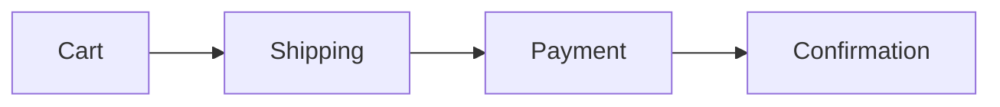

# detect-ux

> Repo-driven UX audit with journeys, pain-points, and heuristic-based findings.

## Context Files

- `$JAAN_LEARN_DIR/jaan-to-detect-ux.learn.md` - Past lessons (loaded in Pre-Execution)
- `$JAAN_CONTEXT_DIR/tech.md` - Tech stack (for framework-aware route detection)
- `$JAAN_TEMPLATES_DIR/jaan-to-detect-ux.template.md` - Output template
- `${CLAUDE_PLUGIN_ROOT}/docs/extending/language-protocol.md` - Language resolution protocol

**Output path**: `$JAAN_OUTPUTS_DIR/detect/ux/` — flat files, overwritten each run (no IDs).

## Input

**Arguments**: $ARGUMENTS — parsed in Step 0.0. Repository path and mode determined there.

---

## Pre-Execution Protocol
**MANDATORY** — Read and execute ALL steps in: `${CLAUDE_PLUGIN_ROOT}/docs/extending/pre-execution-protocol.md`
Skill name: `detect-ux`
Execute: Step 0 (Init Guard) → A (Load Lessons) → B (Resolve Template) → C (Offer Template Seeding)

### Language Settings
Read and apply language protocol: `${CLAUDE_PLUGIN_ROOT}/docs/extending/language-protocol.md`
Override field for this skill: `language_detect-ux`

---

## Standards Reference

> **Reference**: See `${CLAUDE_PLUGIN_ROOT}/docs/extending/detect-shared-reference.md` for Evidence Format (SARIF), Evidence ID Generation, Confidence Levels, Frontmatter Schema, Platform Detection, and Document Structure.

**This skill's namespace**: `E-UX-*` (e.g., E-UX-001, E-UX-WEB-001)
**Tool name in frontmatter**: `detect-ux`

---

# PHASE 1: Detection (Read-Only)

## Step 0.0: Parse Arguments

**Arguments**: $ARGUMENTS

| Argument | Effect |
|----------|--------|
| (none) | **Light mode** (default): Route mapping + user flows, single summary file |
| `[repo]` | Scan specified repo (applies to both modes) |
| `--full` | **Full mode**: All detection steps, 7 output files (current behavior) |

**Mode determination:**
- If `$ARGUMENTS` contains `--full` as a standalone token → set `run_depth = "full"`
- Otherwise → set `run_depth = "light"`

Strip `--full` token from arguments. Set `repo_path` to remaining arguments (or current working directory if empty).

## Thinking Mode

**If `run_depth == "full"`:** ultrathink
**If `run_depth == "light"`:** megathink

Use extended reasoning for:
- Route/screen mapping from framework-specific patterns
- Journey flow construction from navigation patterns
- Nielsen heuristic assessment from code signals
- Pain-point inference from error handling patterns

## Step 0: Detect Platforms

**Purpose**: Auto-detect platform structure and check for UI/TUI presence before UX analysis.

Use **Glob** and **Bash** to identify platform folders (same patterns as detect-dev - see detect-dev Step 0 for full platform patterns and disambiguation rules).

### Platform Detection

1. **Check for monorepo markers**: `pnpm-workspace.yaml`, `lerna.json`, `nx.json`, `turbo.json`
2. **List top-level directories**: Exclude `node_modules`, `.git`, build outputs
3. **Match against platform patterns**: Apply disambiguation rules
4. **Handle detection results**:
   - No platforms → Single-platform: `platforms = [{ name: 'all', path: '.' }]`
   - Platforms detected → Multi-platform: Ask user to select all or specific platforms

### UI/TUI Presence Check (UX Audit Applicability)

For each platform, check for UI or TUI (terminal UI) indicators:

```bash
# Check for UI component files
ui_files=$(find {platform.path} -type f \( -name "*.jsx" -o -name "*.tsx" -o -name "*.vue" -o -name "*.svelte" \) 2>/dev/null | head -n 1)

# Check for TUI libraries (blessed, ink, bubbletea, etc.)
tui_detected=$(grep -r "blessed\|ink\|bubbletea\|charm" {platform.path}/package.json {platform.path}/go.mod 2>/dev/null)

if [ -z "$ui_files" ] && [ -z "$tui_detected" ]; then
  # No UI/TUI files detected - UX analysis not applicable
  platform_has_ui = false
else
  platform_has_ui = true
fi
```

**Platform applicability:**

| Platform Type | UX Expected | If No UI/TUI Found |
|---------------|-------------|---------------------|
| web, mobile, androidtv, ios, android, desktop | Yes | Report as finding (unexpected) |
| backend, api, services | Conditional | Report "Not Applicable" (expected, unless admin UI detected) |
| cli, cmd | Conditional | Full analysis if TUI detected, otherwise "Not Applicable" |

### Analysis Loop

For each platform in platforms:
1. Set `current_platform = platform.name`
2. Set `base_path = platform.path`
3. **Check UI/TUI presence** using the check above
4. If `platform_has_ui == false` and platform is backend/cli:
   - Skip Steps 1-7 (detection steps)
   - Go directly to Step 8 with "Not Applicable" findings
5. If `platform_has_ui == true` or platform is expected to have UI:
   - Run detection steps per `run_depth`:
     - **If `run_depth == "full"`:** Run Steps 1-7 scoped to `base_path`
     - **If `run_depth == "light"`:** Run Steps 1 and 4 only scoped to `base_path` (skip Steps 2, 3, 5, 6, 7)
6. Use platform-specific output paths in Step 9

**"Not Applicable" Findings Structure**:

When a platform has no UI/TUI and UX analysis is not applicable, create minimal output files with this finding:

```yaml
---
findings_summary:
  critical: 0
  high: 0
  medium: 0
  low: 0
  informational: 1
overall_score: 10.0  # Perfect score (nothing to assess)
---

## Executive Summary

No UI/TUI detected for platform '{platform}'. UX audit (route mapping, user flows, heuristic assessment) is not applicable to this platform type.

## Findings

### E-UX-{PLATFORM}-001: No UI/TUI Detected

**Severity**: Informational
**Confidence**: Confirmed (1.0)

**Description**: Platform '{platform}' does not contain UI components (.jsx, .tsx, .vue, .svelte) or TUI libraries. UX analysis (journeys, personas, heuristics, accessibility) is not applicable to this platform type.

**Evidence**:
```yaml
evidence:
  id: E-UX-{PLATFORM}-001
  type: absence
  confidence: 1.0
  method: glob-pattern-match
  description: "No UI/TUI files found in {platform.path}"
```
```

**Note**: If single-platform mode (`platform.name == 'all'`), output paths have NO suffix. If multi-platform mode, output paths include `-{platform}` suffix.

**Precedence**: N/A handling (platform_has_ui checks) always takes priority over run_depth gates. If `platform_has_ui == false`, skip ALL detection steps regardless of run_depth.

## Step 1: Route / Screen Mapping

Detect framework and extract routes:

### Framework-Specific Route Extraction

**React Router**:
- Grep: `useRoutes(`, `<Route`, `<Outlet`, `createBrowserRouter`
- Extract: path, element/component, nested routes, layout routes

**Next.js**:
- Glob: `app/**/page.{tsx,jsx,ts,js}` — app router pages
- Glob: `pages/**/*.{tsx,jsx,ts,js}` — pages router
- Detect dynamic routes: `[slug]`, `[...catchAll]`, `[[...optional]]`
- Detect route groups: `(group)/`
- Detect layouts: `layout.{tsx,jsx}`

**Vue Router**:
- Grep: `routes` array definitions, `<RouterView`, `<router-view`
- Glob: `**/router/**/*.{ts,js}` — router config files

**Angular**:
- Glob: `**/*routing.module.ts`, `**/*-routes.ts`
- Grep: `canActivate`, `canDeactivate` guards
- Extract: path, component, guards, lazy-loaded modules

**Express / API backends**:
- Grep: `app.get(`, `app.post(`, `app.put(`, `app.delete(`
- Grep: `router.get(`, `router.post(`, `router.put(`
- Grep: `@Get(`, `@Post(` — NestJS decorators

### Screen Inventory

For each route/page, extract:
- Route path and name
- Component file location
- Auth requirement (guards, middleware, redirect patterns)
- Layout parent
- Query parameters / dynamic segments

**If `run_depth == "light"`:** Skip Steps 2-3. Proceed to Step 4 (Map User Flows).

## Step 2: Infer User Personas

From route structure and component analysis, infer personas:

- **Authenticated vs unauthenticated** routes -> at least 2 persona types
- **Admin/dashboard routes** -> admin/power user persona
- **Onboarding flows** -> new user persona
- **API-only routes** -> developer/integrator persona
- **Settings/profile routes** -> returning user persona

Mark all personas as **Tentative** confidence — these are inferred from code structure, not validated user research.

## Step 3: Infer Jobs-to-be-Done (JTBD)

From features and flows detected:
- Group related routes into functional areas (auth, billing, content, settings)
- For each area, construct JTBD statement: "When {situation}, I want to {motivation}, so I can {expected outcome}"
- Link to route evidence

Mark all JTBD as **Tentative** — inferred from code, not user research.

## Step 4: Map User Flows

Trace navigation paths through the application:

- Detect navigation components: `<Link`, `<NavLink`, `useNavigate`, `router.push`
- Map which pages link to which other pages
- Identify entry points (landing, login, deep links)
- Identify exit points (logout, external links)
- Detect multi-step flows (wizards, checkout, onboarding)

For multi-step flows, construct Mermaid flow diagrams:


**If `run_depth == "light"`:** Skip Steps 5-7. Proceed directly to Step 8 (Present Detection Summary).

## Step 5: Detect Pain Points

Scan for UX friction signals:

### Error Handling Patterns
- Grep: `<ErrorBoundary`, `ErrorFallback`, `errorElement`
- Check for error states in forms: validation messages, inline errors
- Look for generic error pages vs contextual error handling
- Detect retry patterns: `retry`, `refetch`, `onError`

### Loading Patterns
- Grep: `isLoading`, `isPending`, `<Skeleton`, `<Spinner`, `<Suspense`
- Check for loading states on data-fetching pages
- Detect missing loading states (data fetch without loading indicator)

### Form Complexity
- Count form fields per form component
- Detect multi-step forms vs single-page forms
- Check for form validation: `validate`, `yup`, `zod`, `formik`
- Look for autosave patterns

### Dead Ends
- Routes without navigation back
- Error states without recovery actions
- Empty states without CTAs

## Step 6: Nielsen's 10 Heuristics Assessment

Evaluate each heuristic from code evidence:

| # | Heuristic | Code Signals to Scan |
|---|-----------|---------------------|
| 1 | **Visibility of system status** | `isLoading`, `<Skeleton>`, `<Spinner>`, `<Progress>`, status messages, optimistic updates |
| 2 | **Match between system and real world** | Domain terminology consistency in component names, labels, and copy |
| 3 | **User control and freedom** | Undo patterns, cancel buttons, back navigation, `useNavigate(-1)`, confirmation dialogs |
| 4 | **Consistency and standards** | Component naming conventions, prop patterns, shared UI components, design token usage |
| 5 | **Error prevention** | `<ConfirmDialog>`, `validate()`, type constraints, `disabled` states, `maxLength` |
| 6 | **Recognition rather than recall** | Navigation labels, breadcrumbs, search, autocomplete, recent items, `<Select>` vs text input |
| 7 | **Flexibility and efficiency** | Keyboard shortcuts, customization options, bulk actions, saved preferences |
| 8 | **Aesthetic and minimalist design** | Component complexity (prop count, nesting depth), information density per page |
| 9 | **Error recovery** | Error messages with solutions, retry buttons, "try again" patterns, support links |
| 10 | **Help and documentation** | `<Tooltip>`, `<HelpText>`, documentation links, `?` icons, help pages, FAQ routes |

For each heuristic:
- Scan for positive signals (good practices found)
- Scan for negative signals (violations found)
- Rate: Strong / Adequate / Weak / Unknown
- Cite evidence for each rating

**Important**: Missing code evidence does NOT equal a violation. Mark as "Unknown" when evidence is insufficient.

## Step 7: Accessibility Assessment (Repo-Scoped)

**Scope**: Code-level only. Cannot make runtime behavior claims.

- Grep: ARIA attributes (`aria-label`, `aria-describedby`, `aria-live`, `role=`)
- Check semantic HTML usage
- Detect keyboard navigation patterns: `onKeyDown`, `tabIndex`, focus management
- Look for skip links: `#main-content`, `skipToContent`
- Check for a11y testing: `jest-axe`, `@axe-core`, `cypress-axe`, `pa11y`
- Check for reduced motion: `prefers-reduced-motion`

Mark findings as "Unknown" for runtime behavior that can't be verified from code.

---

# HARD STOP — Detection Summary & User Approval

## Step 8: Present Detection Summary

**If `run_depth == "light"`:**

```
UX DETECTION COMPLETE (Light Mode)
-------------------------------------

PLATFORM: {platform_name or 'all'}
UI/TUI PRESENCE: {Yes/No} {if No, show "(Not Applicable)"}

ROUTES/SCREENS: {n} routes mapped
USER FLOWS: {n} flows mapped

SEVERITY SUMMARY
  Critical: {n}  |  High: {n}  |  Medium: {n}  |  Low: {n}  |  Info: {n}

OVERALL SCORE: {score}/10

OUTPUT FILE (1):
  $JAAN_OUTPUTS_DIR/detect/ux/summary{-platform}.md

Note: Run with --full for persona inference, JTBD mapping, pain point detection,
Nielsen heuristic assessment, and accessibility audit (7 output files).
```

> "Proceed with writing summary to $JAAN_OUTPUTS_DIR/detect/ux/? [y/n]"

**If `run_depth == "full"`:**

```
UX DETECTION COMPLETE
----------------------

PLATFORM: {platform_name or 'all'}
UI/TUI PRESENCE: {Yes/No} {if No, show "(Not Applicable)"}

ROUTES/SCREENS: {n} routes mapped
PERSONAS (inferred): {n} personas
JTBD (inferred): {n} jobs-to-be-done
USER FLOWS: {n} flows mapped

NIELSEN HEURISTICS
  Strong:   {n}/10
  Adequate: {n}/10
  Weak:     {n}/10
  Unknown:  {n}/10

PAIN POINTS: {n} detected
ACCESSIBILITY: {n} findings (repo-scoped)
UX GAPS: {n} identified

SEVERITY SUMMARY
  Critical: {n}  |  High: {n}  |  Medium: {n}  |  Low: {n}  |  Info: {n}

OVERALL SCORE: {score}/10

OUTPUT FILES (7):
  $JAAN_OUTPUTS_DIR/detect/ux/personas{-platform}.md       - Inferred personas
  $JAAN_OUTPUTS_DIR/detect/ux/jtbd{-platform}.md           - Jobs-to-be-done
  $JAAN_OUTPUTS_DIR/detect/ux/flows{-platform}.md          - User flows with diagrams
  $JAAN_OUTPUTS_DIR/detect/ux/pain-points{-platform}.md    - UX friction and pain points
  $JAAN_OUTPUTS_DIR/detect/ux/heuristics{-platform}.md     - Nielsen 10 heuristics assessment
  $JAAN_OUTPUTS_DIR/detect/ux/accessibility{-platform}.md  - A11y findings (repo-scoped)
  $JAAN_OUTPUTS_DIR/detect/ux/gaps{-platform}.md           - UX gaps and recommendations

Note: {-platform} suffix only if multi-platform mode (e.g., -web, -mobile). Single-platform mode has no suffix.
      If UI/TUI presence = No, files contain "Not Applicable" findings.
```

> "Proceed with writing 7 output files to $JAAN_OUTPUTS_DIR/detect/ux/? [y/n]"

**Do NOT proceed to Phase 2 without explicit approval.**

---

# PHASE 2: Write Output Files

## Step 9: Write to $JAAN_OUTPUTS_DIR/detect/ux/

Create directory `$JAAN_OUTPUTS_DIR/detect/ux/` if it does not exist.

> **Reference**: See `${CLAUDE_PLUGIN_ROOT}/docs/extending/detect-shared-reference.md` sections "Output Path Logic" and "Stale File Cleanup" for platform-specific suffix convention and run_depth cleanup rules.

### If `run_depth == "light"`: Write Single Summary File

Write one file: `$JAAN_OUTPUTS_DIR/detect/ux/summary{suffix}.md`

Contents:
1. Universal YAML frontmatter with `platform` field, `findings_summary`, and `overall_score`
2. **Executive Summary** — BLUF of UX findings
3. **Screen Inventory** — routes/screens mapped with auth classification (from Step 1)
4. **Key User Flows** — top flows as Mermaid diagrams (from Step 4)
5. **Top Findings** — up to 5 highest-severity findings with evidence blocks
6. "Run with `--full` for persona inference, JTBD mapping, pain point detection, Nielsen heuristic assessment, and accessibility audit (7 output files)."

### If `run_depth == "full"`: Write 7 Output Files

Write 7 output files:

| File | Content |
|------|---------|
| `$JAAN_OUTPUTS_DIR/detect/ux/personas{suffix}.md` | Inferred personas from route/auth analysis |
| `$JAAN_OUTPUTS_DIR/detect/ux/jtbd{suffix}.md` | Jobs-to-be-done statements linked to features |
| `$JAAN_OUTPUTS_DIR/detect/ux/flows{suffix}.md` | User flows with Mermaid diagrams |
| `$JAAN_OUTPUTS_DIR/detect/ux/pain-points{suffix}.md` | UX friction signals and dead ends |
| `$JAAN_OUTPUTS_DIR/detect/ux/heuristics{suffix}.md` | Nielsen 10 heuristics assessment table |
| `$JAAN_OUTPUTS_DIR/detect/ux/accessibility{suffix}.md` | A11y findings (scoped to repo evidence) |
| `$JAAN_OUTPUTS_DIR/detect/ux/gaps{suffix}.md` | UX gaps and improvement recommendations |

**Note**: `{suffix}` is empty for single-platform mode, or `-{platform}` for multi-platform mode.

**If UI/TUI presence = No** (from Step 0 check), write minimal "Not Applicable" files with:
- Frontmatter: `findings_summary.informational: 1`, `overall_score: 10.0`
- Single finding: "E-UX-{PLATFORM}-001: No UI/TUI Detected" (severity: informational)

Each file MUST include:
1. Universal YAML frontmatter with `platform` field and findings_summary/overall_score
2. Executive Summary
3. Scope and Methodology
4. Findings with evidence blocks (using E-UX-{PLATFORM}-NNN or E-UX-NNN IDs)
5. Recommendations

---

## Step 9a: Seed Reconciliation

> **Reference**: See `${CLAUDE_PLUGIN_ROOT}/docs/extending/seed-reconciliation-reference.md` for comparison rules, discrepancy format, and auto-update protocol.

1. Read domain-relevant seed files: `$JAAN_CONTEXT_DIR/tone-of-voice.template.md`
2. Compare detection results against seed content (UX tone patterns, error message guidelines, empty state copy)
3. If discrepancies found:
   - Display discrepancy table to user
   - Offer auto-updates for non-destructive changes: `[y/n]`
   - Suggest `/jaan-to:learn-add` commands for patterns worth documenting
4. If no discrepancies: display "Seed files are aligned with detection results."

---

## Step 10: Capture Feedback

> "Any feedback on the UX audit? [y/n]"

If yes:
- Run `/jaan-to:learn-add detect-ux "{feedback}"`

---

## Skill Alignment

- Two-phase workflow with HARD STOP for human approval
- Evidence-based findings with confidence scoring
- Fork-isolated execution (`context: fork`)
- Output to standardized `$JAAN_OUTPUTS_DIR` path

## Definition of Done

**If `run_depth == "light"`:**

- [ ] Single summary file written to `$JAAN_OUTPUTS_DIR/detect/ux/summary{suffix}.md`
- [ ] Universal YAML frontmatter with `overall_score`
- [ ] Screen inventory and user flows included with evidence blocks
- [ ] "--full" upsell note included
- [ ] User approved output

**If `run_depth == "full"`:**

- [ ] All 7 output files written to `$JAAN_OUTPUTS_DIR/detect/ux/`
- [ ] Universal YAML frontmatter with `platform` field in every file
- [ ] Every finding has evidence block with correct ID format (E-UX-NNN for single-platform, E-UX-{PLATFORM}-NNN for multi-platform)
- [ ] Routes/screens mapped from framework-specific patterns
- [ ] Personas and JTBD marked as Tentative (inferred)
- [ ] Nielsen heuristics assessed with code evidence
- [ ] Accessibility findings scoped to repo (no runtime claims)
- [ ] Mermaid flow diagrams for multi-step flows
- [ ] Confidence scores assigned to all findings
- [ ] Output filenames match platform suffix convention (no suffix for single-platform, -{platform} suffix for multi-platform)
- [ ] If no UI/TUI detected for platform, minimal "Not Applicable" files created with informational findings
- [ ] User approved output
- [ ] Seed reconciliation check performed (discrepancies reported or alignment confirmed)
