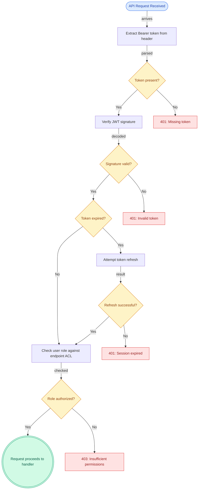
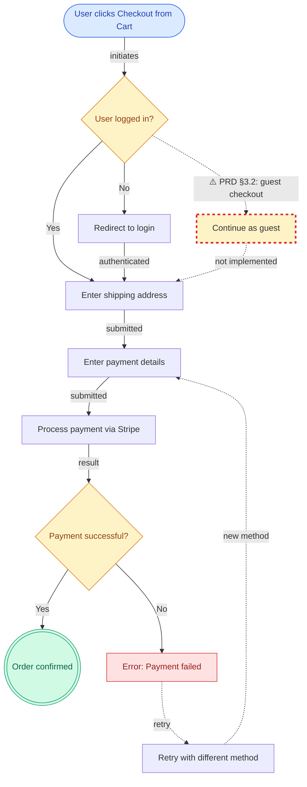

# Building the `/jaan-to:ux-flowchart-generate` skill

**The skill needs three core engines: a Mermaid generator constrained by UX standards and GitHub limits, an evidence mapper that traces every node to PRD sections and code symbols, and a diff engine that detects when diagrams go stale.** This report synthesizes research from 40+ authoritative sources across UX design, Mermaid documentation, requirements traceability standards, and diagram quality engineering to provide implementable heuristics, templates, and quality gates.

The research reveals that no universal flowchart standard exists (ISO 5807 is "largely ignored"), so the skill must encode opinionated-but-defensible conventions. GitHub's Mermaid renderer runs **v11.4.1** with hard limits of **50,000 characters** and **500 edges**, and disables all interactive features. Confidence scoring should adapt NASA's 4-level Credibility Assessment Scale rather than ad-hoc High/Medium/Low labels. The biggest risk is hallucinated diagram nodes — AI systems consistently fabricate components when generating from source code.

---

## 1. Best-practice summary

### A) UX flowchart standards

1. **User flows branch; task flows don't.** A task flow is a single linear path for one task. A user flow shows multiple paths with decision points, often persona-specific. Use task flows for early alignment, user flows for interaction design. [FOUND: NN/g — https://www.nngroup.com/articles/user-journeys-vs-user-flows/]

2. **State diagrams model screen states, not user actions.** Use state diagrams when exhaustively documenting every UI state (loading, empty, error, ideal, partial) and their transitions. [FOUND: Scott Hurff's UI Stack — https://www.oreilly.com/content/scott-hurff-on-designing-at-tinder/]

3. **Every screen must account for 5 UI states: ideal, empty, error, loading, partial.** This is the most widely cited framework for required states. A flowchart missing any of these for data-dependent screens is incomplete. [FOUND: Scott Hurff / O'Reilly — https://www.oreilly.com/content/scott-hurff-on-designing-at-tinder/]

4. **Entry points must be explicit and labeled with source context** (e.g., "from push notification," "from deep link"). Exit points must be terminal nodes. [FOUND: IxDF — https://www.interaction-design.org/literature/topics/user-flows]

5. **Decision diamonds must be binary (Yes/No).** More than 2 outcomes per diamond should be decomposed into multiple decision points. Use Yes/No consistently throughout; keep "Yes" flowing downward/rightward. [FOUND: BreezeTree — https://www.breezetree.com/articles/common-flowchart-mistakes]

6. **Error states must include recovery paths.** Every error node needs at least one outgoing edge showing the retry or fallback mechanism. Infinite loops must be documented with exit conditions. [FOUND: BreezeTree — https://www.breezetree.com/articles/common-flowchart-mistakes]

7. **One page, one level of abstraction.** Don't mix high-level and detailed steps. If the diagram exceeds one logical "page," split into sub-processes using connector nodes. [FOUND: SmartDraw — https://www.smartdraw.com/flowchart/flowchart-tips.htm; AIIM — https://info.aiim.org/aiim-blog/flowcharting-in-business-process-management]

8. **Node labels use verb-noun phrasing** (e.g., "Submit form," "Verify email") — no ALL CAPS, no abbreviations without context. [FOUND: CareerFoundry — https://careerfoundry.com/en/blog/ux-design/how-to-create-a-user-flow/]

9. **Developers need all interaction states and data extremes.** QA needs every possible path plus acceptance criteria at terminal states. Designers need user context at entry and page-level wireflow detail. [FOUND: UXPin — https://www.uxpin.com/studio/blog/design-handoff-checklist/]

### B) Mermaid + GitHub constraints

10. **GitHub runs Mermaid v11.4.1** (confirmed April 2025) with `securityLevel='strict'`. All click events, tooltips, JavaScript callbacks, and FontAwesome icons are disabled. [FOUND: GitHub Community — https://github.com/orgs/community/discussions/70672]

11. **Hard limits: 50,000 characters for diagram text, 500 edges per graph.** These are secure keys — cannot be overridden. [FOUND: Mermaid config schema — https://github.com/mermaid-js/mermaid/blob/develop/packages/mermaid/src/schemas/config.schema.yaml]

12. **ELK layout engine is unavailable on GitHub.** Only Dagre (default) layout works. Complex diagrams may render with overlapping edges. [FOUND: Mermaid docs — https://mermaid.js.org/syntax/flowchart.html]

13. **Markdown strings in labels work** (`"\`**Bold** text\`"`) but HTML tags are stripped by DOMPurify. Emoji may break rendering. [FOUND: GitHub Mermaid gist — https://gist.github.com/ChristopherA/bffddfdf7b1502215e44cec9fb766dfd]

14. **Use semantic node IDs with domain prefixes** (`auth_login`, `pay_confirm`, `err_timeout`) — never sequential letters. This prevents cascading renames in diffs when nodes are added or removed. [INFERRED from community discussion — https://github.com/mermaid-js/mermaid/issues/2650]

15. **Never use `end` as a node ID** (reserved word). Avoid starting node IDs with `o` or `x` adjacent to `---` (creates unintended circle/cross edges). [FOUND: Mermaid docs — https://mermaid.js.org/syntax/flowchart.html]

16. **Format for readable diffs: declare all nodes first, then all edges, one per line.** Separate sections with `%%` comment headers. Use `classDef` instead of inline styles. [INFERRED: DEPT Agency — https://engineering.deptagency.com/diagrams-as-code; Kalle Marjokorpi — https://www.kallemarjokorpi.fi/blog/mastering-diagramming-as-code-essential-mermaid-flowchart-tips-and-tricks-2/]

### C) Evidence mapping + confidence scoring

17. **Bidirectional traceability is the gold standard:** requirement → design → code → test (forward) and reverse. ISO/IEC/IEEE 29148:2018 mandates this. [FOUND: ISO 29148 — https://www.iso.org/standard/72089.html]

18. **Adapt NASA's 4-level Credibility Assessment Scale** for confidence: levels progress from subjective-to-objective and minimal-to-extensive evidence coverage. 4 levels chosen because odd numbers encourage "middle of road" non-decisions. [FOUND: NASA — https://ntrs.nasa.gov/api/citations/20080015742/downloads/20080015742.pdf]

19. **Confidence must be scored on process rigor, not opinion.** A node is "High confidence" because the verification chain is automated and documented, not because someone says it looks right. [FOUND: NASA Credibility Assessment — same source]

20. **No existing tool links Mermaid diagram nodes to requirement IDs and code paths.** This is a gap requiring custom implementation. Closest tools: Doorstop (YAML-based RTM), BMW LOBSTER (code trace tags), OpenFastTrace (CI-ready tracing). [FOUND: https://github.com/doorstop-dev/doorstop; https://github.com/bmw-software-engineering/lobster]

21. **Drift detection should use inline requirement tags in code** (e.g., `// req: PRD-AUTH-001`) combined with CI checks that verify referenced file paths still exist. [INFERRED: LOBSTER pattern — https://github.com/bmw-software-engineering/lobster; Swimm docs — https://docs.swimm.io/new-to-swimm/benefits-of-code-coupled-documentation/]

### D) Quality gates

22. **Mermaid-Sonar provides research-backed complexity thresholds**: max 50 nodes (dense graphs, density >0.3) or 100 nodes (sparse), max 8 parallel branches (Miller's Law), cyclomatic complexity ≤15. [FOUND: Mermaid-Sonar — https://entropicdrift.com/blog/mermaid-sonar-complexity-analyzer/; Kwon et al. 2020 — https://arxiv.org/abs/2008.07944]

23. **go-mermaid is the most complete AST-based linter**: validates `NoUndefinedNodes`, `NoDuplicateNodeIDs`, `ValidDirection`, `NoParenthesesInLabels` — plus full AST parsing for custom rules. [FOUND: https://pkg.go.dev/github.com/sammcj/go-mermaid]

24. **AI-generated diagrams consistently hallucinate components.** Both ChatGPT and Claude fabricated DynamoDB and image compression subsystems when generating diagrams from a codebase that had neither. [FOUND: Ilograph — https://www.ilograph.com/blog/posts/diagrams-ai-can-and-cannot-generate/]

25. **GitLab runs a production Mermaid linter** (`check_mermaid.mjs`) that scans 2,295+ Markdown files in ~2.3 seconds, reporting syntax errors with file:line references. This pattern is directly replicable. [FOUND: GitLab — https://docs.gitlab.com/development/documentation/testing/]

### E) Updating / diffing

26. **Track source dependencies in diagram metadata.** Include `%% @sources: src/routes/*.ts, docs/prd.md#section-4` at diagram top. On each invocation, run `git diff` against those paths to detect staleness. [INFERRED: Swimm code-coupled docs pattern]

27. **Use incremental updates for <30% node changes; full regeneration when >30% affected** or when errors have accumulated. Preserve manual sections using `%% ===== MANUAL (DO NOT AUTO-EDIT) =====` markers. [INFERRED: Combined from code generator protection patterns — https://getcodebricks.com/docs/code/techniques/code-protection]

28. **Highlight changes using classDef styling**: green (`#90EE90`) for added nodes, red dashed for removed, yellow for modified. Generate a "change review" version alongside the canonical diagram. [INFERRED: Mermaid classDef + community patterns]

29. **No Mermaid visual diff tool exists.** GitHub shows text diffs only. The workaround is rendering before/after SVGs via `mermaid-cli` and posting both in PR comments. [UNKNOWN: No dedicated tool found]

30. **Heuristics for "diagram-relevant" code changes**: new API routes, renamed/deleted files referenced in diagram, changed function signatures, modified docker-compose/k8s topology files. Ignore: test-only changes, formatting, dependency bumps. [INFERRED: Swimm classification pattern]

---

## 2. Implementation heuristics

These are the rules the skill should apply when generating flowcharts.

### Diagram type selection

| Input available | Diagram type to generate |
|---|---|
| PRD only (no code) | User flow (`flowchart`) — branches at decision points, multiple entry/exit |
| Codebase only (no PRD) | System flow (`flowchart`) — derived from code structure, API routes, service calls |
| PRD + codebase | Mixed user+system flow — user-facing paths from PRD, system detail from code, mismatch callouts |
| Single component with many states | State diagram (`stateDiagram-v2`) — when >4 distinct states with non-trivial transitions |

### Direction selection (`TD` vs `LR`)

- **Use `TD` (top-down)** as default for user flows with decision trees and hierarchical branching
- **Use `LR` (left-to-right)** when the flow is primarily linear/sequential (pipelines, step-by-step wizards, CI/CD)
- **Use `LR`** when the diagram has >3 parallel branches at the same level (prevents vertical sprawl)
- Subgraphs may override parent direction, but edges crossing subgraph boundaries reset to parent direction

### Grouping strategy

- **Group by user-facing domain** (auth, payment, onboarding) not by technical layer (controller, service, repo)
- Apply subgraphs when diagram has **>15 nodes** — this is the trigger threshold
- Name subgraphs with user-meaningful labels: `subgraph sg_auth [Authentication]` not `subgraph sg_1 [Group 1]`
- Maximum **5 subgraphs** per diagram; more suggests the diagram should be split

### When to split diagrams

Split into "overview + detail" pattern when any of these thresholds are exceeded:

- **>25 nodes** per diagram (skill default — conservative for cross-functional readability)
- **>50 edges** per diagram
- **>15 cyclomatic complexity** (edges − nodes + 2)
- **>8 parallel branches** at any single level
- **>20,000 characters** of Mermaid source (leave headroom below GitHub's 50K limit)

### Node shape conventions

| UX concept | Mermaid shape | Syntax |
|---|---|---|
| Entry point / trigger | Stadium (pill) | `node_id([Label])` |
| User action / process | Rectangle | `node_id[Label]` |
| Decision / condition | Diamond | `node_id{Label?}` |
| Success / completion | Double circle | `node_id(((Label)))` |
| Error state | Rectangle + `err_` prefix + red style | `err_id[Error: Label]:::error` |
| Loading / async wait | Rounded rectangle | `node_id(Label)` |
| External system / API | Subroutine | `node_id[[Label]]` |
| Data store | Cylinder | `node_id[(Label)]` |
| Sub-process reference | Subroutine | `node_id[[See: Detail Diagram]]` |

### Edge conventions

- **Solid arrows** (`-->`) for primary happy path
- **Dotted arrows** (`-.->`) for error/fallback paths
- **Thick arrows** (`==>`) for critical path emphasis (use sparingly — max 1-2 per diagram)
- **All edges must have labels** — even if just "success" or "next"
- Decision edges: always `-->|Yes|` and `-->|No|` (not True/False, not unlabeled)

### Mandatory node checklist for every generated diagram

Every diagram MUST include: at least 1 entry point (stadium shape), at least 1 success terminal (double circle), at least 1 error path from every decision node, loading states for async operations, and permission/auth checks where applicable.

---

## 3. Canonical output spec

The skill should produce a single Markdown file with these exact sections:

```markdown
# UX Flowchart: {Flow Name}

> **Generated by:** `/jaan-to:ux-flowchart-generate`  
> **Source(s):** `{prd_path}` | `{repo_root}`  
> **Generated:** {ISO-8601 timestamp}  
> **Confidence:** {Overall: 🟢 High | 🟡 Medium | 🔴 Low}

## Overview

{1-3 sentence description of what this flow covers, who the primary 
actor is, and what the success outcome looks like.}

## Flow diagram

```mermaid
flowchart {TD|LR}
    %% @generated-by: jaan-to:ux-flowchart-generate
    %% @sources: {comma-separated source file paths}
    %% @version: {semver or date}

    %% === NODES ===
    entry_start([User opens {Feature}])
    step_action[Verb-Noun Label]
    dec_check{Condition?}
    success_done(((Flow Complete)))
    err_failure[Error: Description]:::error

    %% === EDGES: Happy Path ===
    entry_start -->|initiates| step_action
    step_action --> dec_check
    dec_check -->|Yes| success_done

    %% === EDGES: Error Paths ===
    dec_check -->|No| err_failure
    err_failure -.->|retry| step_action

    %% === MANUAL (preserved on regeneration) ===

    %% === STYLES ===
    classDef error fill:#FEE2E2,stroke:#DC2626,color:#991B1B
    classDef success fill:#D1FAE5,stroke:#059669,color:#065F46
    classDef decision fill:#FEF3C7,stroke:#D97706,color:#92400E
    classDef entry fill:#DBEAFE,stroke:#2563EB,color:#1E40AF
    class entry_start entry
    class success_done success
    class dec_check decision
    class err_failure error
```

## Evidence map

| Node ID | Node Label | PRD Reference | Code Path | Test Coverage | Confidence | Notes |
|---|---|---|---|---|---|---|
| `entry_start` | User opens Feature | PRD §2.1 | `src/pages/feature.tsx` | `tests/feature.test.ts` | 🟢 High | Verified in code + tests |
| `dec_check` | Condition? | PRD §2.3 | `src/services/check.ts:42` | — | 🟡 Medium | Code exists, no test |
| `err_failure` | Error: Description | — | — | — | 🔴 Low | Inferred from PRD, not found in code |

### Confidence scoring criteria

| Level | Symbol | Criteria |
|---|---|---|
| High | 🟢 | Node traced to PRD section + code symbol + passing test. Automated verification exists. |
| Medium | 🟡 | Node traced to PRD OR code (not both). Manual verification only. Some links unvalidated. |
| Low | 🔴 | No direct code trace. Inferred from naming conventions, file structure, or PRD language. |
| Unknown | ⚫ | Not yet assessed. New or changed requirement awaiting analysis. |

## Unknowns and gaps

| # | Unknown | Impact | Suggested Resolution |
|---|---|---|---|
| U1 | {Description of what couldn't be determined} | {High/Med/Low} | {What input or investigation is needed} |
| U2 | ... | ... | ... |

## Diagram metadata

- **Node count:** {N} / 25 max
- **Edge count:** {N}
- **Cyclomatic complexity:** {N} (target: ≤15)
- **Subgraph count:** {N}
- **Source files tracked:** {list of files whose changes trigger re-generation}
```

### Evidence map schema (machine-readable)

```yaml
evidence_map:
  - node_id: "entry_start"
    label: "User opens Feature"
    prd_ref: "PRD §2.1"
    code_path: "src/pages/feature.tsx"
    code_symbol: "FeaturePage.render()"
    test_path: "tests/feature.test.ts"
    confidence: "high"
    confidence_reason: "code + test + review verified"
    last_verified: "2026-02-09"
    status: "FOUND"
```

---

## 4. Checklist and quality gates

### Machine-checkable gates (implement as validation pass)

```
[ ] SYNTAX_VALID: mermaid.parse() returns no error
[ ] NODE_CAP: total nodes ≤ 25 (configurable; warn at 20)
[ ] EDGE_CAP: total edges ≤ 50 (hard fail at GitHub's 500)
[ ] TEXT_CAP: total Mermaid text < 40,000 chars (headroom below 50K)
[ ] CYCLOMATIC: (edges - nodes + 2) ≤ 15
[ ] NO_ORPHANS: every defined node appears in ≥1 edge
[ ] DECISION_COMPLETE: every diamond node ({...}) has ≥2 outgoing edges
[ ] ENTRY_EXISTS: ≥1 node with 0 incoming edges (entry point)
[ ] EXIT_EXISTS: ≥1 node with 0 outgoing edges (terminal state)
[ ] ERROR_PATHS: ≥1 edge labeled with error/failure/retry/deny/invalid
[ ] LABELS_PRESENT: every edge has a non-empty label
[ ] SEMANTIC_IDS: all node IDs match pattern [a-z]+_[a-z_]+ (prefix_name)
[ ] NO_RESERVED: no node ID equals "end" (case-insensitive)
[ ] SUBGRAPH_THRESHOLD: if nodes > 15, subgraphs are used
[ ] EVIDENCE_COMPLETE: every node in diagram has a row in evidence map
[ ] NO_UNKNOWN_ONLY: evidence map has ≥1 node with confidence ≠ ⚫
[ ] DIRECTION_SET: diagram declares explicit direction (TD or LR)
[ ] STYLES_DEFINED: classDef for error, success, decision, entry are present
[ ] METADATA_PRESENT: @generated-by, @sources, @version comments exist
```

### Human-review gates (flag for manual inspection)

```
[ ] AUDIENCE_FIT: diagram readable by non-technical stakeholders (no code jargon in labels)
[ ] ABSTRACTION_CONSISTENT: all nodes at same level of abstraction (not mixing "click button" with "database query")
[ ] FLOW_DIRECTION_CONSISTENT: no backward arrows crossing >2 levels (spaghetti indicator)
[ ] COMPLETENESS: all 5 UI states represented for data-dependent screens
[ ] MISMATCH_FLAGGED: any PRD-vs-code discrepancies called out in Unknowns table
```

---

## 5. Example pack

### Example A — PRD-only flow (no codebase available)

```markdown
# UX Flowchart: Password Reset

> **Generated by:** `/jaan-to:ux-flowchart-generate`  
> **Source(s):** `docs/prd-auth.md`  
> **Generated:** 2026-02-09T14:30:00Z  
> **Confidence:** Overall: 🔴 Low (PRD-only, no code verification)

## Overview

Maps the password reset flow from email request through successful 
password change. Primary actor: authenticated or unauthenticated user 
who forgot their password. Success: user logs in with new password.

## Flow diagram
```

````mermaid
flowchart TD
    %% @generated-by: jaan-to:ux-flowchart-generate
    %% @sources: docs/prd-auth.md#section-5
    %% @version: 1.0.0

    %% === NODES ===
    entry_forgot([User clicks Forgot Password])
    step_email[Enter email address]
    dec_registered{Email registered?}
    step_send_link[Send reset link via email]
    step_generic_msg[Show generic confirmation]
    step_click_link[User clicks email link]
    dec_token_valid{Token valid and not expired?}
    step_new_pw[Enter new password]
    dec_pw_valid{Password meets requirements?}
    success_reset(((Password reset complete)))
    err_expired[Error: Link expired]:::error
    err_weak_pw[Error: Password too weak]:::error

    %% === EDGES: Happy Path ===
    entry_forgot -->|initiates| step_email
    step_email -->|submits| dec_registered
    dec_registered -->|Yes| step_send_link
    step_send_link -->|email sent| step_generic_msg
    step_click_link -->|opens link| dec_token_valid
    dec_token_valid -->|Yes| step_new_pw
    step_new_pw -->|submits| dec_pw_valid
    dec_pw_valid -->|Yes| success_reset

    %% === EDGES: Error Paths ===
    dec_registered -->|No| step_generic_msg
    dec_token_valid -->|No| err_expired
    err_expired -.->|request new link| entry_forgot
    dec_pw_valid -->|No| err_weak_pw
    err_weak_pw -.->|retry| step_new_pw

    %% === EDGES: Security (same message for registered/unregistered) ===
    step_generic_msg -->|checks email| step_click_link

    %% === STYLES ===
    classDef error fill:#FEE2E2,stroke:#DC2626,color:#991B1B
    classDef success fill:#D1FAE5,stroke:#059669,color:#065F46
    classDef decision fill:#FEF3C7,stroke:#D97706,color:#92400E
    classDef entry fill:#DBEAFE,stroke:#2563EB,color:#1E40AF
    class entry_forgot entry
    class success_reset success
    class dec_registered,dec_token_valid,dec_pw_valid decision
    class err_expired,err_weak_pw error
````

```markdown
## Evidence map

| Node ID | Node Label | PRD Reference | Code Path | Test | Confidence | Notes |
|---|---|---|---|---|---|---|
| `entry_forgot` | Clicks Forgot Password | PRD §5.1 | — | — | 🔴 Low | PRD only |
| `dec_registered` | Email registered? | PRD §5.2 | — | — | 🔴 Low | PRD only |
| `step_send_link` | Send reset link | PRD §5.3 | — | — | 🔴 Low | PRD only |
| `step_generic_msg` | Generic confirmation | PRD §5.2 (security note) | — | — | 🔴 Low | PRD specifies same msg for both paths |
| `dec_token_valid` | Token valid? | PRD §5.4 | — | — | 🔴 Low | PRD mentions 24hr expiry |
| `dec_pw_valid` | Password meets requirements? | PRD §5.5 | — | — | 🔴 Low | PRD: min 8 chars, 1 uppercase, 1 number |
| `err_expired` | Link expired | PRD §5.4 | — | — | 🔴 Low | PRD only |
| `err_weak_pw` | Password too weak | PRD §5.5 | — | — | 🔴 Low | PRD only |

## Unknowns and gaps

| # | Unknown | Impact | Suggested Resolution |
|---|---|---|---|
| U1 | Rate limiting on reset requests not in PRD | High | Ask product: max requests per email per hour? |
| U2 | Token format (JWT? opaque?) not specified | Medium | Engineering decision needed |
| U3 | Password requirements details incomplete | Medium | PRD §5.5 says "strong" — need exact rules |
| U4 | No code to verify against | High | Re-run after implementation begins |

## Diagram metadata

- **Node count:** 12 / 25 max
- **Edge count:** 13
- **Cyclomatic complexity:** 3
- **Subgraph count:** 0
- **Source files tracked:** docs/prd-auth.md
```

### Example B — Repo-only flow (no PRD available)

````markdown
# UX Flowchart: API Authentication Middleware

> **Generated by:** `/jaan-to:ux-flowchart-generate`  
> **Source(s):** `src/middleware/auth.ts` | `src/services/token.ts`  
> **Generated:** 2026-02-09T14:45:00Z  
> **Confidence:** Overall: 🟡 Medium (code-derived, no PRD to validate intent)

## Overview

System-level flow for the auth middleware derived from code analysis. 
Handles JWT validation, token refresh, and role-based access control. 
Primary actor: any API request hitting protected endpoints.

## Flow diagram



## Evidence map

| Node ID | Node Label | PRD Reference | Code Path | Test | Confidence | Notes |
|---|---|---|---|---|---|---|
| `step_extract` | Extract Bearer token | — | `src/middleware/auth.ts:15` | `tests/auth.test.ts:22` | 🟢 High | Code + test |
| `step_verify` | Verify JWT | — | `src/services/token.ts:44` | `tests/token.test.ts:31` | 🟢 High | Code + test |
| `step_refresh` | Attempt refresh | — | `src/services/token.ts:78` | — | 🟡 Medium | Code exists, no test |
| `step_check_role` | Check role ACL | — | `src/middleware/auth.ts:52` | `tests/auth.test.ts:67` | 🟢 High | Code + test |
| `err_forbidden` | 403 response | — | `src/middleware/auth.ts:61` | — | 🟡 Medium | Code exists, no test |
````

### Example C — Mixed PRD+repo with mismatch callout

````markdown
# UX Flowchart: Checkout Flow

> **Generated by:** `/jaan-to:ux-flowchart-generate`  
> **Source(s):** `docs/prd-checkout.md` | `src/checkout/`  
> **Generated:** 2026-02-09T15:00:00Z  
> **Confidence:** Overall: 🟡 Medium (3 mismatches detected between PRD and code)

## Overview

Checkout flow from cart review through payment confirmation. 
PRD specifies 4 steps; code implements 3 (guest checkout missing). 
Three PRD-vs-code mismatches flagged below.

## Flow diagram



## Evidence map

| Node ID | Node Label | PRD Ref | Code Path | Test | Confidence | Notes |
|---|---|---|---|---|---|---|
| `dec_logged_in` | Logged in? | PRD §3.1 | `src/checkout/index.tsx:28` | `tests/checkout.test.ts:15` | 🟢 High | Match |
| `step_guest` | Continue as guest | PRD §3.2 | — | — | ⚠️ **MISMATCH** | **PRD specifies guest checkout; not found in code** |
| `step_process` | Process via Stripe | PRD §3.4 "payment gateway" | `src/checkout/payment.ts:55` | `tests/payment.test.ts` | 🟡 Medium | PRD says "payment gateway" generically; code uses Stripe specifically |
| `err_payment` | Payment failed | PRD §3.4.1 | `src/checkout/payment.ts:72` | — | 🟡 Medium | Error handling exists but no dedicated test |

## Unknowns and gaps

| # | Unknown | Impact | Suggested Resolution |
|---|---|---|---|
| U1 | **Guest checkout in PRD but not in code** | 🔴 High | Confirm with product: is this descoped, deferred, or a bug? |
| U2 | PRD says "payment gateway" — code hardcodes Stripe | 🟡 Medium | Is Stripe the final choice? Should code abstract the gateway? |
| U3 | No retry limit specified for failed payments | 🟡 Medium | Ask product: max retry attempts before blocking? |
````

---

## 6. Risk and unknown backlog

| # | Risk / Unknown | Category | Severity | Mitigation |
|---|---|---|---|---|
| R1 | GitHub may upgrade Mermaid version without notice, breaking rendered diagrams | B: GitHub | Medium | Pin to known-compatible syntax; avoid bleeding-edge features; test against Mermaid v11.4.1 specifically |
| R2 | No programmatic way to confirm GitHub's current Mermaid version | B: GitHub | Low | Monitor https://github.com/orgs/community/discussions/70672 for community reports |
| R3 | Claude will hallucinate diagram nodes not present in code or PRD | D: Quality | **High** | Require every node to have evidence map entry; flag nodes with 🔴/⚫ confidence; add "hallucination check" gate |
| R4 | Large monorepos may exceed context window before full codebase analysis | D: Quality | High | Chunk by service/module; generate per-service diagrams; use file-tree heuristics to scope relevant code |
| R5 | No standard tool links Mermaid nodes to code symbols | C: Evidence | Medium | Build custom evidence map table as part of output; this is novel tooling |
| R6 | Manual annotations may be lost during regeneration if markers are malformed | E: Diffing | Medium | Strict validation of `%% ===== MANUAL` markers before regeneration; warn if markers missing |
| R7 | Teams may not maintain traceability tags in code (`// req: PRD-XXX`) | C: Evidence | Medium | Degrade gracefully — generate with 🔴 Low confidence and flag; don't block on missing tags |
| R8 | PRD structure varies wildly across teams — no standard section numbering | C: Evidence | Medium | Accept flexible PRD references (section numbers, headings, or free text); normalize during parsing |
| R9 | Stale diagrams may persist if teams don't re-run the skill | E: Diffing | Medium | Include `@sources` metadata; provide a CI check that flags staleness based on git timestamps |
| R10 | Decision on when to use state diagrams vs flowcharts requires human judgment | A: UX | Low | Default to flowchart; suggest state diagram only when ≥5 distinct states detected for a single component |
| R11 | Color styling may not be accessible to colorblind users | A: UX | Medium | Use shape + text labels (not color alone) to convey meaning; ensure all status indicators include emoji + text |
| R12 | Mobile GitHub rendering of Mermaid is unreliable | B: GitHub | Low | Document limitation; recommend desktop review for diagram PRs |
| U1 | User-specific conventions for PRD formatting | — | — | Needs product context per team |
| U2 | Whether teams use monorepo vs polyrepo patterns | — | — | Affects file-path tracking strategy |
| U3 | Whether CI/CD integration is desired (auto-regeneration on PR) | — | — | Needs engineering decision |
| U4 | Preferred confidence threshold for "acceptable" diagrams | — | — | Default to "≥50% nodes at 🟢 High" but make configurable |

---

## 7. Failure modes and mitigations

| Failure Mode | Likelihood | Impact | Detection | Mitigation |
|---|---|---|---|---|
| **Hallucinated nodes** — AI generates steps that don't exist in PRD or code | High | High — misleads all consumers | Evidence map shows 🔴 Low or ⚫ Unknown for fabricated nodes | Require every node to trace to a specific PRD section or code symbol. Flag any node without evidence. Post-generation validation pass checks all `code_path` entries exist via filesystem check. |
| **Missing error paths** — Happy path only, no error branches | High | High — QA can't write negative test cases | Quality gate: `ERROR_PATHS` check — ≥1 error edge required | Force at least one error edge per decision node. If no error info in PRD/code, generate placeholder with ⚫ Unknown confidence. |
| **Spaghetti diagram** — Too many nodes, crossing edges, unreadable | Medium | Medium — diagram ignored by stakeholders | Quality gates: node cap (25), cyclomatic complexity (≤15), branch width (≤8) | Auto-split into overview + detail diagrams when thresholds exceeded. |
| **Stale diagram** — Code or PRD changed but diagram not updated | High | High — decisions made on outdated information | `@sources` metadata + `git diff` timestamp check | Include staleness warning header when source files are newer than diagram generation date. CI check option. |
| **Overly technical labels** — Diagram uses code jargon unintelligible to designers/stakeholders | Medium | Medium — cross-functional value lost | Human review gate: `AUDIENCE_FIT` | Use verb-noun UX phrasing for all node labels. Map technical terms to user-facing language. Include a "Technical Detail" section below the diagram for developer-specific information. |
| **Mixed abstraction levels** — "Click button" alongside "Execute SQL query" in same diagram | Medium | Medium — confusing for all audiences | Human review gate: `ABSTRACTION_CONSISTENT` | Choose diagram type based on audience. User flows use user-language only. System flows use technical language. Never mix in one diagram. |
| **Manual annotations destroyed** — Regeneration overwrites human-added notes | Medium | Medium — loss of tribal knowledge | Parse for `%% ===== MANUAL` markers before regeneration | Abort regeneration if manual markers detected but content between them changed since last auto-generation. Require explicit `--force` flag to overwrite. |
| **GitHub rendering failure** — Diagram too large or uses unsupported syntax | Low | High — broken diagram in README | Validate against known GitHub limits pre-commit: <50K chars, <500 edges, no `click`, no FontAwesome | Pre-render check using `mermaid.parse()`. Character count validation. Feature allowlist (only use syntax confirmed working on GitHub v11.4.1). |
| **Confidence score inflation** — All nodes marked 🟢 High without genuine verification | Medium | Medium — false sense of completeness | Audit: confidence must correlate with evidence columns (code_path + test filled = High, else lower) | Automated confidence derivation: High requires both `code_path` and `test_path` non-empty. Medium requires one. Low requires neither. Prevent manual override to higher than automated derivation. |
| **Drift false positives** — Flagging diagram as stale when only tests or formatting changed | Medium | Low — unnecessary regeneration | Heuristic filter on `git diff` output | Filter out changes to test files, `.prettierrc`, linting configs, comments-only changes. Only flag structural code changes (new exports, renamed functions, deleted files). |

---

## How this all connects to a working skill

The skill's internal architecture should follow a **3-phase pipeline**: (1) **Parse** — ingest PRD text and/or codebase structure, extract entities (screens, actions, decisions, errors), and build an intermediate graph model; (2) **Generate** — serialize the graph to Mermaid syntax following the canonical format, run all machine-checkable quality gates, and auto-split if thresholds are exceeded; (3) **Evidence** — populate the evidence map by cross-referencing graph nodes against PRD sections and code symbols, compute confidence scores using the automated derivation rules, and flag mismatches.

For updates, the skill adds a **Phase 0: Diff** that reads existing diagram metadata (`@sources`, `@version`), runs `git diff` against tracked sources, classifies changes as structural or cosmetic, and decides between incremental update (preserving manual sections) or full regeneration. The output always includes a changelog summary showing added, removed, and modified nodes.

The entire output remains a single Markdown file that renders correctly on GitHub without any external dependencies — the diagram renders via Mermaid code blocks, the evidence map renders as a standard Markdown table, and the metadata renders as readable frontmatter. No JavaScript, no plugins, no external services required.