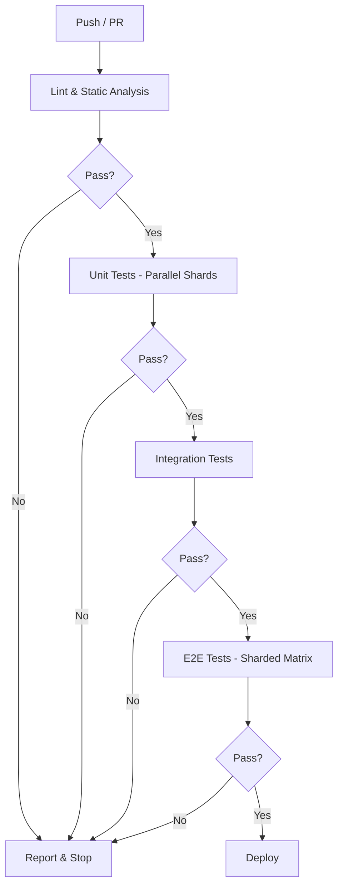
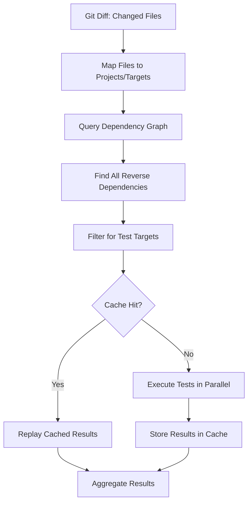
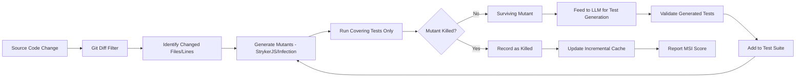

# Optimizing end-to-end QA automation performance across tech stacks

**Test suites that once consumed 45 minutes now complete in under 8 — when teams apply the right combination of parallelization, caching, selective execution, and infrastructure optimization.** This guide synthesizes benchmark data, configuration patterns, and real-world case studies from organizations like Shopify (170,000+ tests), Google (millions of daily test runs), and Airbnb (multi-million-line polyglot monorepos) to provide a concrete, actionable playbook for accelerating QA automation across JavaScript/TypeScript, PHP, Go, and Python ecosystems. The techniques covered span the full pipeline: from individual test runner tuning through CI/CD orchestration to multi-stack coordination at enterprise scale. Every recommendation is grounded in measured performance data, not theory.

---

## 1. Parallel execution slashes test times by 3–10x across every ecosystem

Parallelization delivers the single largest speed improvement available to any test suite. The mechanism differs by ecosystem — worker threads, forked processes, package-level concurrency — but the results are consistent: **3–10x wall-clock reductions** when properly configured.

### JavaScript/TypeScript: Vitest and Playwright

Vitest offers five pool types with measurable performance differences. Internal benchmarks from Tinypool (8 threads, 2,000 rounds) show `worker_threads` completing in **10,371ms versus 12,100ms for `child_process`** — threads run approximately **14% faster** due to lower IPC overhead. The critical optimization lever is `--no-isolate`, which disables per-file isolation for stateless tests and delivers significant speedup:

```typescript
// vitest.config.ts — optimized for speed
import { defineConfig } from 'vitest/config'
export default defineConfig({
  test: {
    pool: 'threads',
    poolOptions: {
      threads: { maxThreads: 8, minThreads: 4 }
    },
    isolate: false,        // Disable for stateless tests
    fileParallelism: true,
    maxConcurrency: 10,    // For .concurrent tests
  },
})
```

Playwright's parallelism operates at the OS-process level. Each worker gets its own browser instance with zero shared state. On a 4-core CI runner, **2–4 workers** is optimal; beyond 8 workers on an 8-core machine, diminishing returns set in. Combining workers with sharding across CI matrix jobs produces compound gains — a **40-minute suite drops to 5–7 minutes** with 4 shards × 4 workers:

```typescript
// playwright.config.ts — CI-optimized
import { defineConfig, devices } from '@playwright/test';
export default defineConfig({
  fullyParallel: true,
  workers: process.env.CI ? 4 : undefined,
  maxFailures: process.env.CI ? 10 : undefined,
  retries: process.env.CI ? 2 : 0,
  use: {
    trace: 'on-first-retry',
    screenshot: 'only-on-failure',
  },
});
```

### PHP: ParaTest transforms sequential suites

PHPUnit runs sequentially in a single process. **ParaTest** adds parallel execution via separate PHP processes. The benchmark data is compelling: a Laravel test suite dropped from **13 seconds to 2 seconds** (5× faster), and a Symfony legacy project went from **20 minutes to 4 minutes** using 8 processes with WrapperRunner:

```bash
vendor/bin/paratest -p8 --runner WrapperRunner
# Laravel: php artisan test --parallel --processes=4
```

### Go: Package-level and intra-package parallelism

Go provides three independent parallelism controls. The `-p` flag controls how many test binaries run simultaneously (default: `GOMAXPROCS`), while `-parallel` controls concurrent `t.Parallel()` tests within each package. Crunchy Data's API package (~200 tests) showed a **35% speedup** on single runs and **3× improvement across 10 consecutive runs** when using `t.Parallel()`:

```go
func TestAPICreate(t *testing.T) {
    t.Parallel() // Mark as parallel-safe
    // I/O-bound test code benefits most
}
```

```bash
go test ./... -parallel 128 -p 16 -count=1
```

**Caution:** For lightweight CPU-bound unit tests, the goroutine scheduling overhead from `t.Parallel()` can actually make them *slower*. Reserve it for I/O-bound and integration tests.

### Python: pytest-xdist load-balancing strategies

pytest-xdist distributes tests across worker processes with four strategies. The `loadscope` strategy groups tests by module to keep expensive fixtures together, while `load` (default) sends tests to any free worker for maximum throughput. The Trail of Bits team reduced PyPI's test suite from **163 seconds to 30 seconds** (81% faster) using xdist parallelization combined with coverage optimization:

```bash
pytest -n auto --dist loadscope  # Group by module
pytest -n 8 --dist load          # Max throughput
```

### Cross-ecosystem parallelization comparison

| Tool | Parallelism Model | Sharding | Selective Execution | Benchmark Speedup |
|------|-------------------|----------|--------------------|--------------------|
| **Vitest** | Worker threads/forks | `--shard=X/Y` | Via Nx/Turborepo | Threads 14% faster than forks |
| **Playwright** | OS-process workers | `--shard=X/Y` + CI matrix | `--grep` tags | 40min → 5–7min (4 shards) |
| **Jest** | Worker processes | `--shard=X/Y` (v28+) | `--changedSince` | ~3x with 4 workers |
| **ParaTest (PHP)** | PHP processes | CI-level only | `@group` annotations | 5× (20min → 4min) |
| **Go test** | Package + intra-package | CI-level only | `-run` regex | 3× (10 consecutive runs) |
| **pytest-xdist** | Worker processes | CI-level only | `-m` markers | 5× with 8 cores |

---

## 2. E2E test performance hinges on auth strategy, mocking, and flakiness control

End-to-end tests are the slowest and most flaky tier. Three patterns deliver the largest improvements: **storageState-based authentication**, **API-first test setup**, and **systematic flaky test quarantine**.

### storageState eliminates redundant login flows

The single most impactful Playwright optimization. Instead of navigating login UI for every test, authenticate once and serialize the browser session. BigBinary reported their authentication flow dropped from **~2 minutes (Cypress) to under 20 seconds** using storageState:

```typescript
// auth.setup.ts — runs once before all tests
import { test as setup } from '@playwright/test';
setup('authenticate', async ({ request }) => {
  await request.post('https://app.example.com/api/login', {
    form: { user: 'testuser', password: 'pass123' },
  });
  await request.storageState({ path: '.auth/user.json' });
});
```

```typescript
// playwright.config.ts — projects with dependencies
projects: [
  { name: 'setup', testMatch: /.*\.setup\.ts/ },
  {
    name: 'chromium',
    dependencies: ['setup'],
    use: { storageState: '.auth/user.json' },
  },
],
```

### Playwright outperforms Cypress by 42% in headless mode

Controlled benchmarks and real-world migrations consistently show Playwright's speed advantage. The architecture difference is fundamental: Cypress runs inside the browser process, while Playwright communicates via the DevTools Protocol from a separate process, enabling true multi-tab and cross-domain testing.

| Metric | Cypress | Playwright | Difference |
|--------|---------|------------|------------|
| Headless execution (same suite) | ~18.8s | ~10.9s | **Playwright 42% faster** |
| Per-action average latency | 420ms | 290ms | **Playwright 31% faster** |
| RAM usage (10 parallel tests) | 3.2 GB | 2.1 GB | **Playwright 34% lighter** |
| Install size | ~500 MB | ~10 MB | **50× smaller** |
| Full suite (BigBinary, with sharding) | 2h 27min | 16 min | **89% reduction** |

BigBinary's migration story is the most thorough public case study: their E2E suite went from **2 hours 27 minutes to 16 minutes** after migrating from Cypress to Playwright with 4 sharded CI machines and 4 workers per shard. The key factors were Playwright's free built-in parallelism (Cypress requires paid Cloud for parallel orchestration), storageState for auth, and smaller install footprint accelerating CI setup.

### Network mocking eliminates external flakiness

Three tiers of network mocking serve different purposes. **MSW (Mock Service Worker)** intercepts at the network level across unit, integration, and E2E tests using shared handlers — 77+ million downloads. **Playwright's `page.route()`** intercepts at the browser level during E2E tests. **WireMock** provides a standalone mock server for backend integration testing:

```typescript
// Playwright route interception — fastest for E2E
await page.route('*/**/api/v1/users', async (route) => {
  await route.fulfill({
    json: [{ id: 1, name: 'Test User' }],
  });
});
```

The recommended strategy: **mock by default** for speed and determinism; run a smaller subset of real-API tests nightly for integration confidence.

### Flaky test management at scale

Google's data provides the clearest picture of flakiness impact: **~1.5% of all test runs** exhibit flaky behavior, but **nearly 16% of tests** are affected. A staggering **84% of observed pass→fail transitions** in post-submit testing involve a flaky test. Shopify processes **400,000+ unit tests** and found that test selection alone saved **25% of compute resources** while only 0.06% of PRs with failing tests merged to main.

The industry-standard flaky test lifecycle:

1. **Detection** — statistical analysis identifying tests that produce different results on the same commit (Buildkite Test Engine, Datadog CI Visibility, Trunk Flaky Tests)
2. **Quarantine** — automatically muting flaky tests so they run but don't block the build
3. **Investigation** — assigning ownership and tracking via ticketing (Jira/Linear integration)
4. **Resolution** — fixing root cause and releasing from quarantine
5. **Prevention** — Playwright's `trace: 'on-first-retry'` captures diagnostic data with zero performance cost during passing runs

**Target flaky rate: <2%.** Above 5%, developers stop trusting automation entirely.

---

## 3. Mutation testing efficiency varies wildly across ecosystems

Mutation testing is computationally expensive by nature — every mutant requires a test suite execution. The gap between optimized and unoptimized runs can be **60× or more**.

### StrykerJS leads with incremental mode and per-test coverage

StrykerJS's `--incremental` flag (v6.2+) stores mutation results in a JSON file and uses Google's diff-match-patch library to reuse results for unchanged mutants. In practice, this means **94% of mutant results are reused** after small changes — only 234 of 3,965 mutants needed re-running in one measured case:

```javascript
// stryker.conf.js — production-optimized
module.exports = {
  testRunner: 'jest',
  jest: { enableFindRelatedTests: true },
  mutate: ['src/**/*.ts', '!src/**/*.spec.ts'],
  checkers: ['typescript'],
  thresholds: { high: 80, low: 60, break: 50 },
  concurrency: 4,
  incremental: true,
  incrementalFile: '.stryker-tmp/incremental.json',
  coverageAnalysis: 'perTest',  // Only run tests covering each mutant
};
```

The CI integration pattern downloads the previous incremental report from the Stryker Dashboard before running:

```bash
curl --silent --create-dirs --output reports/stryker-incremental.json \
  https://dashboard.stryker-mutator.io/api/reports/github.com/my-org/my-repo/main
npx stryker run --incremental
```

### PHP Infection's git-diff integration is CI-practical

PHP Infection provides the most granular git-diff integration of any mutation testing tool. The `--git-diff-lines` flag mutates only touched lines (not even whole files), while `--only-covering-test-cases` runs only the specific tests covering each mutant line. A real-world Symfony project saw execution drop from **4 minutes 18 seconds to 1 minute 19 seconds** (3.3× speedup) with per-test-case targeting:

```bash
vendor/bin/infection --threads=max \
  --git-diff-filter=AM --git-diff-base=main \
  --only-covering-test-cases --min-msi=70
```

### Go mutation testing remains immature

Neither go-mutesting nor Gremlins supports parallelization, caching, or incremental execution. Gremlins explicitly warns it **"doesn't work very well on very big Go modules"** because each mutation requires full recompilation and test suite execution. For Go, mutation testing is feasible only for small modules or microservices.

### Mutation testing tool comparison

| Feature | StrykerJS | PHP Infection | Go (Gremlins) | Python mutmut |
|---------|-----------|--------------|---------------|---------------|
| **Incremental/Cache** | ✅ Built-in | ❌ (git diff filtering) | ❌ | ✅ SQLite cache |
| **Parallelization** | ✅ Fork-based workers | ✅ `--threads=max` | ❌ | ❌ (community fork only) |
| **Git diff integration** | ✅ `--mutate` + script | ✅ `--git-diff-lines` | ❌ | ❌ Manual |
| **Per-test targeting** | ✅ `perTest` analysis | ✅ `--only-covering-test-cases` | ❌ | ❌ |
| **Quality gates** | ✅ `thresholds.break` | ✅ `--min-msi` | ❌ | ❌ |
| **Large project support** | Good (with optimizations) | Good (with threading + diff) | Poor | Poor |

### AI-driven survivor targeting is an emerging force

Research prototypes show **8–28% mutation score improvements** when surviving mutants are fed back to LLMs for targeted test generation. MuTAP achieved **94% mutation score** on HumanEval using zero-shot LLM prompting with surviving mutant feedback, versus 66% for traditional coverage-based generators. The practical workflow: generate initial tests with AI, run mutation testing, feed survivors back to the LLM, repeat until the score plateaus.

---

## 4. CI/CD pipeline design determines whether optimizations compound or cancel out

Individual test speed improvements mean nothing if the CI pipeline wastes time on redundant builds, cache misses, and sequential job execution. The highest-impact CI optimizations are **dependency caching** (40–80% build time reduction), **test result caching** (up to 85% on cache hits), and **fail-fast job orchestration**.

### The test pyramid as a CI pipeline



The `needs:` keyword in GitHub Actions creates this DAG automatically — if unit tests fail, integration and E2E jobs never start, saving all downstream runner minutes:

```yaml
name: Test Pyramid Pipeline
on: [push, pull_request]
concurrency:
  group: '${{ github.workflow }}-${{ github.ref }}'
  cancel-in-progress: true

jobs:
  unit-tests:
    runs-on: ubuntu-latest
    steps:
      - uses: actions/checkout@v4
      - uses: actions/setup-node@v4
        with: { node-version: 20, cache: 'npm' }
      - run: npm ci
      - run: npm run test:unit -- --coverage

  integration-tests:
    needs: unit-tests
    runs-on: ubuntu-latest
    services:
      postgres:
        image: postgres:16
        env: { POSTGRES_PASSWORD: test }
        ports: ['5432:5432']
        options: --health-cmd pg_isready --health-interval 10s
    steps:
      - uses: actions/checkout@v4
      - uses: actions/setup-node@v4
        with: { node-version: 20, cache: 'npm' }
      - run: npm ci && npm run test:integration

  e2e-tests:
    needs: integration-tests
    runs-on: ubuntu-latest
    strategy:
      fail-fast: false
      matrix:
        shardIndex: [1, 2, 3, 4]
        shardTotal: [4]
    steps:
      - uses: actions/checkout@v4
      - uses: actions/setup-node@v4
        with: { node-version: 20, cache: 'npm' }
      - run: npm ci && npx playwright install --with-deps
      - run: npx playwright test --shard=${{ matrix.shardIndex }}/${{ matrix.shardTotal }}
```

### Dependency caching across ecosystems

Caching dependencies is the lowest-effort, highest-impact CI optimization. **Builds taking 15 minutes routinely drop to 3 minutes** with proper lockfile-based cache keys:

```yaml
# Go — setup-go caches by default
- uses: actions/setup-go@v6
  with: { go-version: '1.23' }

# PHP — Composer cache
- id: composer-cache
  run: echo "dir=$(composer config cache-files-dir)" >> $GITHUB_OUTPUT
- uses: actions/cache@v4
  with:
    path: ${{ steps.composer-cache.outputs.dir }}
    key: ${{ runner.os }}-composer-${{ hashFiles('**/composer.lock') }}

# Python — Poetry with setup-python
- uses: actions/setup-python@v5
  with: { python-version: '3.12', cache: 'poetry' }
```

### Monorepo-aware caching transforms CI economics

Nx computation caching and Turborepo remote caching fundamentally change the cost equation. Vercel reports **Next.js publish times dropped by 80%** using Turborepo Remote Caching. Phlo Engineering's React Native monorepo went from **~15 minutes to <5 minutes** (67% reduction) with Nx caching backed by Google Cloud Storage. On cache hits, Turborepo replays test logs and restores coverage files in **127ms versus 1.234s** — a 10× improvement.

### CI platform economics favor different team sizes

| Factor | GitHub Actions | GitLab CI | CircleCI |
|--------|---------------|-----------|----------|
| **Free tier (private)** | 2,000 min/mo | 400 min/mo | ~6,000 min/mo |
| **Linux rate** | ~$0.008/min | ~$0.005/min | ~$0.006/min |
| **macOS multiplier** | 10× | 10× | 9× |
| **Cache limit** | 10 GB/repo | Runner disk | Unlimited |
| **Test splitting** | Manual/3rd-party | `parallel:` keyword | Native timing-based |
| **Best for** | <10 devs, OSS | All-in-one platform | High-volume CI |

**Self-hosted runners deliver the largest cost savings.** The Soda team achieved **87.5% cost reduction** ($24,700 → $3,000/month) and **54% faster CI** by migrating to EC2 spot instances. AWS spot pricing provides **60–90% savings** over on-demand, though teams must watch for hidden NAT Gateway costs that can exceed EC2 costs by 10×.

---

## 5. BDD generation and API contract validation are ripe for AI acceleration

### AI-generated Gherkin achieves 95% acceptance rates

The AutoUAT study at Critical TechWorks found GPT-4 Turbo achieved **95% acceptance rate** for generated Gherkin scenarios and **92% accuracy for executable test scripts** with minor refinements. A comparative study across six LLMs showed Gemini achieving the highest METEOR scores (**0.84**), with GPT-3.5 and GPT-4 producing near-error-free syntax when using few-shot prompting. Few-shot examples reduce syntax errors by **89%** compared to zero-shot.

The most effective prompt pattern combines role-based system instructions with structured acceptance criteria:

```
System: "Act as a principal SDET specializing in BDD. Generate Gherkin 
feature files from user stories using strict Given/When/Then syntax."

User: "User Story: {title}
Acceptance Criteria: {criteria}

Requirements:
- Use concrete examples in domain language
- Include positive, negative, and edge case scenarios  
- Use Scenario Outline with Examples table for parameterized cases
- No implementation details or UI element references
- Output valid Gherkin syntax only"
```

### API contract validation pipeline

Four tools form a complete contract validation pipeline, each serving a distinct purpose:

| Tool | Purpose | Language | Speed | Best For |
|------|---------|----------|-------|----------|
| **Spectral** | OpenAPI linting & style | TypeScript | 2–30s per spec | Design-time governance |
| **oasdiff** | Diff & breaking changes | Go | **<1s** for most specs | CI breaking-change gates |
| **Prism** | Mock server & validation proxy | TypeScript | 1–3s startup | Frontend development |
| **Schemathesis** | Property-based API fuzzing | Python | 30s–15min | Deep edge-case finding |

The incremental validation pattern uses oasdiff to detect changed endpoints, then runs Schemathesis only against those endpoints:

```yaml
# GitHub Actions — incremental API validation
- uses: oasdiff/oasdiff-action/breaking@v0.0.31
  with:
    base: 'origin/${{ github.base_ref }}:openapi.yaml'
    revision: 'HEAD:openapi.yaml'
- uses: schemathesis/action@v2
  with:
    schema: 'http://localhost:8000/openapi.json'
    args: '--max-examples 50 --phases examples,fuzzing --workers 4'
```

---

## 6. Coverage tool choices create 30× performance differences

The coverage provider selection has an outsized impact on test suite speed, particularly in JavaScript and PHP where the gap between tools is enormous.

### JavaScript: V8 coverage runs 30× faster than Istanbul

V8's native coverage uses the engine's built-in block-level tracking with **~10% overhead**, while Istanbul instruments source code via Babel transformation, adding **~300% overhead** (3–4× slowdown). Vitest v3.2.0+ improved V8 accuracy with AST-based remapping, making it comparable to Istanbul for most use cases:

```typescript
// vitest.config.ts — V8 provider (recommended)
test: {
  coverage: {
    provider: 'v8',
    reporter: ['text', 'json', 'html', 'clover'],
    include: ['src/**/*.{ts,tsx}'],
    thresholds: { lines: 80, branches: 80, functions: 80, statements: 80 }
  },
}
```

### PHP: PCOV is 2.8× faster than Xdebug for line coverage

Sebastian Bergmann's December 2025 benchmarks on PHP 8.5.0 provide definitive numbers. **PCOV completes in 18.9 seconds versus Xdebug's 53.5 seconds** (2.8× faster). Xdebug path coverage balloons to **146.8 seconds** (10.5× baseline). PCOV supports only line coverage — no branch or path analysis — making it ideal for CI where speed matters most:

| Driver | Time | Overhead vs Baseline |
|--------|------|---------------------|
| No coverage | 14.0s | 1.0× |
| PCOV line coverage | **18.9s** | **1.3×** |
| Xdebug line coverage | 53.5s | 3.8× |
| Xdebug path coverage | 146.8s | 10.5× |

### Go: Near-zero overhead with native tooling

Go's built-in `go test -cover` rewrites source at compile time, resulting in **<1% overhead** for `set` mode and **~3–5% for `atomic` mode** (required for parallel tests). Go 1.20+ introduced coverage for compiled binaries via `GOCOVERDIR`, enabling combined unit + integration coverage without test framework changes.

### Python: coverage.py adds 2–5× overhead depending on workload

Line coverage adds **~2–3× overhead** on compute-heavy code, while branch coverage can reach **5×**. Python 3.14+ introduces `sys.monitoring` as the default measurement backend, which is measurably faster than the legacy `sys.settrace` approach. For CI, the `diff-cover` tool computes coverage only for changed lines — Open edX used it to increase coverage from **<50% to 87%** in 10 months.

### Coverage overhead quick reference

| Ecosystem | Tool | Overhead | Notes |
|-----------|------|----------|-------|
| JS/TS | V8 (Vitest) | ~10% | Block-level, no instrumentation |
| JS/TS | Istanbul | ~300% | Babel instrumentation |
| PHP | PCOV | ~34% | Line coverage only |
| PHP | Xdebug 3 | ~280% | Also supports debugging/profiling |
| Go | `go test -cover` | <1–5% | Compile-time rewriting |
| Python | coverage.py | ~200–500% | Workload-dependent |

---

## 7. Multi-stack coordination requires the right orchestration tier

The choice between Nx, Turborepo, Bazel, Pants, and Makefiles depends on language diversity, team size, and the required granularity of dependency tracking.

### Dependency graph-based test selection architecture



### Build system comparison for polyglot repos

| Feature | Nx | Turborepo | Bazel | Buck2 | Pants |
|---------|-----|-----------|-------|-------|-------|
| **Language support** | JS/TS (extensible) | JS/TS only | All | All | Python, Go, Java |
| **Dep detection** | Source analysis | package.json | Explicit BUILD | Explicit BUCK | Import inference |
| **Granularity** | Project-level | Package-level | Target-level | Target-level | Target-level |
| **Remote caching** | Nx Cloud | Vercel RC | BuildBarn/EngFlow | RE API | Yes |
| **Learning curve** | Low-Medium | Low | High | High | Medium |
| **Notable users** | Many JS shops | Vercel | Google, Airbnb, Stripe | Meta | Klaviyo |

For **JS frontend + Go/PHP backend** monorepos, the practical recommendation is Nx with its Project Graph Plugin API for non-JS languages, or Bazel for organizations willing to invest in the steeper learning curve. For Python + Go combinations, **Pants** provides the best out-of-box experience with automatic dependency inference from imports.

### How Airbnb, Meta, and Google coordinate multi-stack testing

**Airbnb** migrated their JVM monorepo from Gradle to Bazel over 4.5 years, then extended Bazel to their 11M+ line TypeScript web monorepo. Results: TypeScript type checking **34% faster**, ESLint **35% faster**, Jest unit tests **42% faster** on incremental runs. They built automated BUILD file generators (inspired by Gazelle) so developers never maintain build configurations manually.

**Meta** runs Buck2 internally with **millions of builds per day** across C++, Python, Rust, Kotlin, Swift, and OCaml. Buck2 (rewritten in Rust) is **2× faster** than its predecessor. The system enforces hermetic builds with sandboxing and always-on remote execution.

**Google's Blaze/Bazel** processes billions of lines of code. Tests are categorized by size (small/medium/large) with strict time limits. Only affected tests run on presubmit; the full suite runs continuously on postsubmit. Their testing infrastructure handles an estimated **4.2 million tests per day** across the monorepo.

**Contract testing** bridges the gap between stacks. Pact's consumer-driven approach lets a JS frontend define expected API interactions, publish contracts to a Pact Broker, and have the Go/PHP backend verify compliance — each team writes tests in their own language while sharing machine-readable contracts:

```yaml
# docker-compose.test.yml — cross-stack integration environment
services:
  frontend:
    build: ./frontend
    depends_on:
      api: { condition: service_healthy }
  api:
    build: ./backend/go
    healthcheck:
      test: ["CMD", "curl", "-f", "http://localhost:8080/health"]
      interval: 5s
  e2e-runner:
    build: ./e2e
    depends_on: [frontend]
    command: npx playwright test
    environment:
      - BASE_URL=http://frontend:3000
```

---

## 8. Mutation testing feedback loop connects testing to quality improvement



This feedback loop — from surviving mutants through AI-assisted test generation back to improved test suites — represents the frontier of automated quality improvement. Organizations like Sentry Engineering run complete mutation testing on all SDK packages in **under 1 hour** using per-test coverage analysis, `ignoreStatic`, and selective test running.

---

## Conclusion: The compounding effect of layered optimization

The largest gains come not from any single technique but from **layering optimizations that compound**. Shopify's CI team reduced p95 pipeline time from **45 minutes to 18 minutes** by combining selective test execution (25% compute savings), dependency caching (skip rebuilds when lockfiles unchanged), and parallelized agent preparation. Their 2023 year-end stats showed **50% faster CI using 35% less compute**.

The most important insight from this research is that **test infrastructure is an engineering discipline, not a DevOps afterthought**. Google employs dedicated test infrastructure teams. Shopify's Test Infrastructure group treats CI performance as a product with SLOs. Airbnb invested 4.5 years migrating to Bazel — and measured 34–42% improvements across every metric.

Three principles emerge consistently across all ecosystems and scales. First, **never run what hasn't changed** — Nx affected, Turborepo filters, `--git-diff-lines`, and `--changedSince` all exploit the same insight that most commits touch a small fraction of code. Second, **cache everything deterministic** — dependency installs, build outputs, test results, mutation results, and coverage data are all cacheable with content-hash keys. Third, **fail fast and fail cheap** — the test pyramid exists to catch bugs at the lowest-cost tier, and CI job dependencies should enforce this strictly.

The concrete target: a well-optimized multi-stack CI pipeline should deliver **unit test feedback in under 2 minutes**, **integration results in under 5 minutes**, and **full E2E confirmation in under 10 minutes** — regardless of total test count, through aggressive use of caching, parallelization, and selective execution.