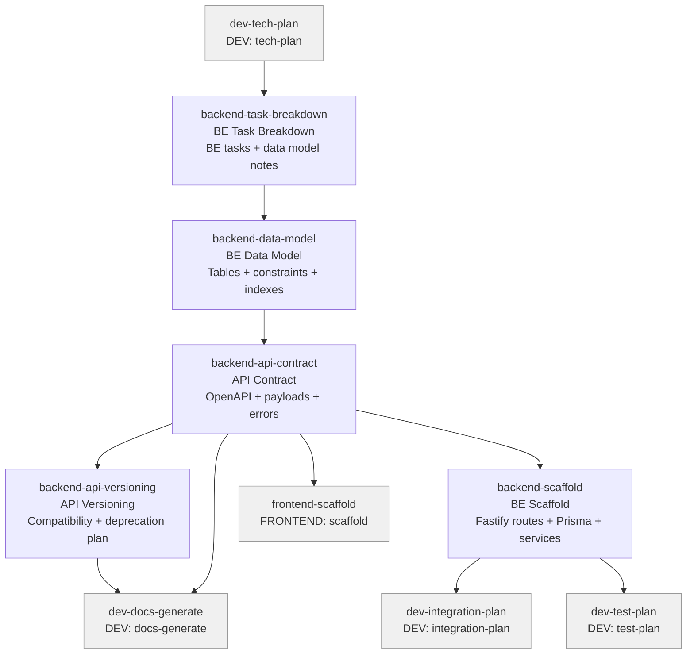

# BACKEND Skills (5)

> Part of [Role Skills Catalog](../role-skills.md) | Phase 4 + Phase 6

**Chains**: Task Breakdown → Data Model → API Contract → API Versioning + Scaffold

## Userflow Schema

**Legend**: Solid = internal | Dashed = cross-role exit | Gray nodes = other roles

### ✅ /jaan-to:backend-task-breakdown

- **Logical**: `backend-task-breakdown`
- **Description**: BE tasks list, data model notes, reliability considerations
- **Reference**: [Backend Task Breakdown Skill: Complete Research Guide/jaan-to/outputs/research/52-backend-task-breakdown.md)
- **Quick Win**: Yes
- **Key Points**:
  - Data model constraints first (unique, indexes, retention)
  - Idempotency + retries for safety
  - Clear error taxonomy
- **→ Next**: `backend-data-model`
- **MCP Required**: None
- **Input**: [prd]
- **Output**: `$JAAN_OUTPUTS_DIR/backend/task-breakdown/{id}-{slug}/{id}-{slug}.md`

### ✅ /jaan-to:backend-data-model

- **Logical**: `backend-data-model`
- **Description**: Tables/collections + fields, constraints + indexes, retention + migration notes
- **Quick Win**: Yes
- **Key Points**:
  - Data model constraints first (unique, indexes, retention)
  - Idempotency + retries for safety
  - Clear error taxonomy
- **→ Next**: `backend-api-contract`
- **MCP Required**: None
- **Input**: [entities]
- **Output**: `$JAAN_OUTPUTS_DIR/backend/data-model/{id}-{slug}/{id}-{slug}.md`
- **Reference**: [`60-backend-data-model.md`](https://github.com/parhumm/jaan-to/blob/main/jaan-to/outputs/research/60-backend-data-model.md)

### ✅ /jaan-to:backend-api-contract

- **Logical**: `backend-api-contract`
- **Description**: OpenAPI contract with payloads, errors, versioning, example requests/responses
- **Quick Win**: No - needs OpenAPI MCP
- **Key Points**:
  - Define schemas with examples
  - Versioning + deprecation strategy
  - Ownership: who maintains, who consumes
- **→ Next**: `backend-api-versioning`, `dev-docs-generate`
- **MCP Required**: OpenAPI/Swagger, Postman (optional)
- **Input**: [entities]
- **Output**: `$JAAN_OUTPUTS_DIR/backend/api-contract/{id}-{slug}/api.yaml`
- **Reference**: [`59-backend-api-contract.md`](https://github.com/parhumm/jaan-to/blob/main/jaan-to/outputs/research/59-backend-api-contract.md)

### /jaan-to:backend-scaffold

- **Logical**: `backend-scaffold`
- **Description**: Generate production-ready backend code from specifications: Fastify routes, Prisma schema, service layer, middleware, validation
- **Quick Win**: Yes
- **Key Points**:
  - Map OpenAPI operations to Fastify v4+ route handlers (TypeScript)
  - Generate Prisma models from data model with relations and indexes
  - Include validation schemas (Zod) derived from API contract
  - Generate error handling middleware matching RFC 9457
  - Output includes setup README
- **→ Next**: `dev-integration-plan`, `dev-test-plan`
- **MCP Required**: None
- **Input**: [api-contract, task-breakdown, data-model]
- **Output**: `$JAAN_OUTPUTS_DIR/backend/scaffold/{id}-{slug}/`
- **Reference**: [`63-dev-scaffolds.md`](https://github.com/parhumm/jaan-to/blob/main/jaan-to/outputs/research/63-dev-scaffolds.md)
- **Plan**: [dev-scaffold-skills.md](../plans/dev-scaffold-skills.md)

### /jaan-to:backend-api-versioning

- **Logical**: `backend-api-versioning`
- **Description**: Compatibility strategy, migration notes + timeline, deprecation communication plan
- **Quick Win**: Yes
- **Key Points**:
  - Define schemas with examples
  - Versioning + deprecation strategy
  - Ownership: who maintains, who consumes
- **→ Next**: `dev-docs-generate`
- **MCP Required**: None
- **Input**: [api]
- **Output**: `$JAAN_OUTPUTS_DIR/backend/api-versioning/{id}-{slug}/{id}-{slug}.md`
