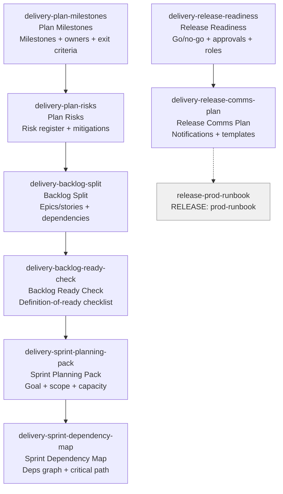

# DELIVERY Skills (8)

> Part of [Role Skills Catalog](../role-skills.md) | Phase 4 + Phase 6

**Chains**: Plan → Risks → Backlog → Ready → Sprint → Deps | Readiness → Comms

## Userflow Schema

**Legend**: Solid = internal | Dashed = cross-role exit | Gray nodes = other roles

### /jaan-to-delivery-plan-milestones

- **Logical**: `delivery-plan-milestones`
- **Description**: Milestone plan + owners, exit criteria per milestone, dependency notes
- **Quick Win**: Yes
- **Key Points**:
  - Define milestones with owners and exit criteria
  - Track dependencies explicitly
  - Maintain a risk register
- **→ Next**: `delivery-plan-risks`
- **MCP Required**: None
- **Input**: [initiative]
- **Output**: `$JAAN_OUTPUTS_DIR/delivery/plan/{slug}/milestones.md`

### /jaan-to-delivery-plan-risks

- **Logical**: `delivery-plan-risks`
- **Description**: Risk register + mitigations, early warning signals, escalation suggestions
- **Quick Win**: Yes
- **Key Points**:
  - Define milestones with owners and exit criteria
  - Track dependencies explicitly
  - Maintain a risk register
- **→ Next**: `delivery-backlog-split`
- **MCP Required**: None
- **Input**: [plan]
- **Output**: `$JAAN_OUTPUTS_DIR/delivery/plan/{slug}/risks.md`

### /jaan-to-delivery-backlog-split

- **Logical**: `delivery-backlog-split`
- **Description**: Epics/stories/tasks, dependencies + sequencing, unknowns and spikes
- **Quick Win**: Yes
- **Key Points**:
  - Split into epics/stories with acceptance criteria
  - Mark dependencies and sequencing
  - Ensure "definition of ready"
- **→ Next**: `delivery-backlog-ready-check`
- **MCP Required**: None
- **Input**: [prd]
- **Output**: `$JAAN_OUTPUTS_DIR/delivery/backlog/{slug}/split.md`

### /jaan-to-delivery-backlog-ready-check

- **Logical**: `delivery-backlog-ready-check`
- **Description**: Definition-of-ready checklist, missing details/questions, risk flags
- **Quick Win**: Yes
- **Key Points**:
  - Split into epics/stories with acceptance criteria
  - Mark dependencies and sequencing
  - Ensure "definition of ready"
- **→ Next**: `delivery-sprint-planning-pack`
- **MCP Required**: None
- **Input**: [story]
- **Output**: `$JAAN_OUTPUTS_DIR/delivery/backlog/{slug}/ready-check.md`

### /jaan-to-delivery-sprint-planning-pack

- **Logical**: `delivery-sprint-planning-pack`
- **Description**: Sprint goal + selected scope, capacity notes, risks + contingency items
- **Quick Win**: Yes
- **Key Points**:
  - Set one sprint goal tied to outcome
  - Account for capacity and planned interrupts
  - Call out dependency risks
- **→ Next**: `delivery-sprint-dependency-map`
- **MCP Required**: None
- **Input**: [backlog]
- **Output**: `$JAAN_OUTPUTS_DIR/delivery/sprint/{slug}/planning-pack.md`

### /jaan-to-delivery-sprint-dependency-map

- **Logical**: `delivery-sprint-dependency-map`
- **Description**: Dependency list/graph, critical path callouts, suggested ordering
- **Quick Win**: Yes
- **Key Points**:
  - Set one sprint goal tied to outcome
  - Account for capacity and planned interrupts
  - Call out dependency risks
- **→ Next**: —
- **MCP Required**: None
- **Input**: [items]
- **Output**: `$JAAN_OUTPUTS_DIR/delivery/sprint/{slug}/dependency-map.md`

### /jaan-to-delivery-release-readiness

- **Logical**: `delivery-release-readiness`
- **Description**: Go/no-go checklist, required approvals, launch-day roles
- **Quick Win**: Yes
- **Key Points**:
  - Go/no-go checklist with owners
  - Comms plan across teams
  - Monitoring and rollback readiness
- **→ Next**: `delivery-release-comms-plan`
- **MCP Required**: None
- **Input**: [release]
- **Output**: `$JAAN_OUTPUTS_DIR/delivery/release/{slug}/readiness.md`

### /jaan-to-delivery-release-comms-plan

- **Logical**: `delivery-release-comms-plan`
- **Description**: Who to notify + when, templates (Slack/email snippets), support/CS readiness prompts
- **Quick Win**: Yes
- **Key Points**:
  - Go/no-go checklist with owners
  - Comms plan across teams
  - Monitoring and rollback readiness
- **→ Next**: `release-prod-runbook`
- **MCP Required**: None
- **Input**: [release]
- **Output**: `$JAAN_OUTPUTS_DIR/delivery/release/{slug}/comms-plan.md`
