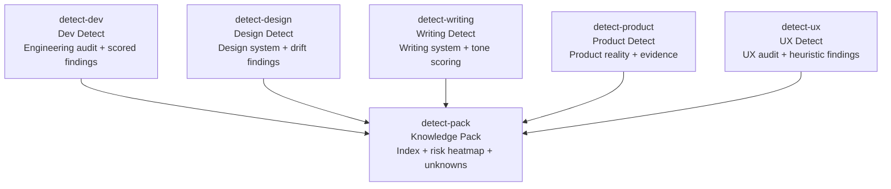

# DETECT Skills (6)

> Part of [Role Skills Catalog](../role-skills.md) | Phase 5

**Chains**: detect-dev + detect-design + detect-writing + detect-product + detect-ux → detect-pack

**Reference**: [Repo-analysis output & content detection standards](61-detect-pack.md)

## Userflow Schema

**Legend**: Solid = internal | All detect skills converge into detect-pack

### /jaan-to:detect-dev

- **Logical**: `detect-dev`
- **Description**: Repo engineering audit that outputs machine-parseable + human-readable markdown with frontmatter, Findings (ID/severity/confidence/evidence blocks), and a score summary.
- **Quick Win**: Yes
- **Key Points**:
  - Every claim MUST be evidence-backed with SARIF-like locations (uri, startLine/endLine, snippet) + evidence IDs (E001…); "absence" findings allowed but confidence must be low
  - Use 4-level confidence (Confirmed/Firm/Tentative/Uncertain) mapped to numeric ranges; downgrade/upgrade rules documented
  - Output structure uses Diátaxis-style sections: Executive Summary → Scope/Methodology → Findings → Recommendations → Appendices
  - Include findings_summary buckets + overall_score (0–10, OpenSSF-style) and lifecycle_phase (CycloneDX vocabulary) in frontmatter
  - CI/CD security checks explicitly cover secrets boundaries, runner trust, permissions, and supply-chain signals (pinning/provenance/SBOM "SLSA-ish")
- **→ Next**: `detect-pack`
- **MCP Required**: None (v2 optional: SBOM/provenance/monitoring MCP)
- **Input**: [repo]
- **Output**: `$JAAN_OUTPUTS_DIR/detect/dev/{stack,architecture,standards,testing,cicd,deployment,security,observability,risks}.md` — each doc MUST include standardized YAML frontmatter + Findings blocks (ID/severity/confidence/evidence)

### /jaan-to:detect-design

- **Logical**: `detect-design`
- **Description**: Detect real design system in code (brand/tokens/components/patterns/a11y) with drift findings and evidence blocks.
- **Quick Win**: Yes
- **Key Points**:
  - Tokens/components evidence must include exact file locations; "drift" requires two evidences (token definition + conflicting usage)
  - Each finding includes: Severity, Confidence (4-level), Evidence blocks; no raw tool dumps without triage
  - Accessibility findings must be written as scoped findings (no scope-exceeding claims), and use "Unknown" when repo-only evidence is insufficient
  - Governance detection: owners/process/versioning signals (e.g., Storybook/docs conventions, token maintenance indicators)
- **→ Next**: `detect-pack`
- **MCP Required**: None (v2 optional: Figma MCP for true drift detection)
- **Input**: [repo]
- **Output**: `$JAAN_OUTPUTS_DIR/detect/design/{brand,tokens,components,patterns,accessibility,governance}.md`

### /jaan-to:detect-writing

- **Logical**: `detect-writing`
- **Description**: Detect the current writing system using multi-signal extraction (glob discovery + string classification + heuristic/NLP scoring) and output a canonical writing-system spec.
- **Quick Win**: Yes
- **Key Points**:
  - Produce a primary writing-system.md using the canonical structure: Voice definition, Tone spectrum, Glossary, UI copy patterns, Plain language, i18n maturity, Recommendations
  - Compute and report NNg tone dimensions (Formality/Humor/Respectfulness/Enthusiasm) + optional extended dimensions; report variance (consistency score) as a key finding
  - UI copy detection MUST classify strings into 8 categories (Buttons, Errors, Empty states, Confirm dialogs, Toasts, Onboarding, Labels/helper, Loading) using component-name patterns + prop extraction rules
  - Error messages scored with a weighted rubric (Clarity/Specificity/Actionability/Tone/A11y) and flagged by automated heuristics (length, blame language, jargon, codes)
  - i18n maturity MUST be rated 0–5 using glob patterns + ICU/RTL/hardcoded-string signals + governance signals (CODEOWNERS/content linting/CI checks)
  - Glossary MUST use ISO-704-ish statuses (preferred/admitted/deprecated/forbidden) with occurrences + file evidence
- **→ Next**: `detect-pack`
- **MCP Required**: None (v2 optional: CMS/helpdesk/email MCP)
- **Input**: [repo]
- **Output**:
  - `$JAAN_OUTPUTS_DIR/detect/writing/writing-system.md` (primary)
  - Optional split: `$JAAN_OUTPUTS_DIR/detect/writing/{glossary,ui-copy,error-messages,localization,samples}.md`

### /jaan-to:detect-product

- **Logical**: `detect-product`
- **Description**: Evidence-based "product reality" extraction: features, value proposition signals, monetization/entitlements, instrumentation reality, constraints + scored risks.
- **Quick Win**: Yes
- **Key Points**:
  - "Feature exists" requires evidence linking to surface + copy + code path; otherwise mark Inferred/Unknown
  - Monetization findings must distinguish "pricing copy" vs "enforcement"—gates must be proven by code locations; absence becomes an "absence" evidence item
  - Instrumentation outputs must report taxonomy/consistency signals and clearly label heuristic conclusions as Tentative unless strongly evidenced
  - Follow the same standardized frontmatter + Findings block format to keep all audits interoperable
- **→ Next**: `detect-pack`
- **MCP Required**: None (v2 optional: analytics/billing MCP)
- **Input**: [repo]
- **Output**: `$JAAN_OUTPUTS_DIR/detect/product/{overview,features,value-prop,monetization,entitlements,metrics,constraints}.md`

### /jaan-to:detect-ux

- **Logical**: `detect-ux`
- **Description**: Repo-driven UX audit with journeys/pains + heuristic-based findings, aligned to the same evidence/confidence system as other audits.
- **Quick Win**: Yes
- **Key Points**:
  - Map journeys from actual routes/screens and state components; missing proof MUST become Unknown, not a claim
  - Heuristic findings must be written as triaged findings (no raw dumps), each with severity + confidence + evidence blocks
  - Accessibility findings must stay within repo evidence scope; otherwise mark as Uncertain/Unknown
  - Use consistent doc structure (Exec Summary, Scope/Methodology, Findings, Recommendations, Appendices)
- **→ Next**: `detect-pack`
- **MCP Required**: None (v2 optional: session replay/support/monitoring MCP)
- **Input**: [repo]
- **Output**: `$JAAN_OUTPUTS_DIR/detect/ux/{personas,jtbd,flows,pain-points,heuristics,accessibility,gaps}.md`

### /jaan-to:detect-pack

- **Logical**: `detect-pack`
- **Description**: Consolidates all detect outputs into an index with standardized metadata, severity buckets, confidence distribution, and a prioritized Unknowns backlog.
- **Quick Win**: Yes
- **Key Points**:
  - Enforce the universal frontmatter across all outputs (target commit, tool version, rules_version, confidence_scheme, findings_summary, overall_score, lifecycle_phase)
  - Aggregate Findings into a single repo-wide scoreboard (severity buckets + overall score) and a risk heatmap summary (markdown)
  - Publish a strict Evidence Index: evidence IDs must resolve back to file locations; "absence" evidence allowed but must be low confidence
  - Produce an Unknowns backlog with "how to confirm" steps and explicit scope boundaries (avoid scope-exceeding claims)
- **→ Next**: —
- **MCP Required**: None (v2 optional: Jira/Linear MCP to create backlog tickets)
- **Input**: [repo]
- **Output**: `$JAAN_OUTPUTS_DIR/detect/{README,risk-heatmap,unknowns-backlog,source-map}.md`
