# DEV Skills (11)

> Part of [Role Skills Catalog](../role-skills.md) | Phase 4 + Phase 6

**Chains**: Discovery → Architecture → Plan → Integration → Test → Observability → Ship

## Userflow Schema

```mermaid
flowchart TD
    jaan-to-dev-feasibility-check["dev-feasibility-check<br>Feasibility Check<br>Risks + deps + complexity"] --> jaan-to-dev-arch-proposal["dev-arch-proposal<br>Arch Proposal<br>Architecture + tradeoffs + data flow"]
    jaan-to-dev-arch-proposal["dev-arch-proposal<br>Arch Proposal<br>Architecture + tradeoffs + data flow"] --> jaan-to-dev-tech-plan["dev-tech-plan<br>Tech Plan<br>Approach + rollout/rollback"]
    jaan-to-dev-tech-plan["dev-tech-plan<br>Tech Plan<br>Approach + rollout/rollback"] --> backend-task-breakdown["backend-task-breakdown<br>BACKEND: task-breakdown"]
    jaan-to-dev-tech-plan["dev-tech-plan<br>Tech Plan<br>Approach + rollout/rollback"] --> frontend-task-breakdown["frontend-task-breakdown<br>FRONTEND: task-breakdown"]
    jaan-to-backend-scaffold["backend-scaffold<br>BACKEND: scaffold"] --> jaan-to-dev-integration-plan["dev-integration-plan<br>Integration Plan<br>API sequence + retry + failures"]
    jaan-to-frontend-scaffold["frontend-scaffold<br>FRONTEND: scaffold"] --> jaan-to-dev-integration-plan["dev-integration-plan<br>Integration Plan<br>API sequence + retry + failures"]
    jaan-to-backend-scaffold["backend-scaffold<br>BACKEND: scaffold"] --> jaan-to-dev-test-plan["dev-test-plan<br>Test Plan<br>Unit/integration/e2e scope"]
    jaan-to-frontend-scaffold["frontend-scaffold<br>FRONTEND: scaffold"] --> jaan-to-dev-test-plan["dev-test-plan<br>Test Plan<br>Unit/integration/e2e scope"]
    jaan-to-frontend-state-machine["frontend-state-machine<br>FRONTEND: state-machine"] --> jaan-to-dev-test-plan["dev-test-plan<br>Test Plan<br>Unit/integration/e2e scope"]
    jaan-to-dev-integration-plan["dev-integration-plan<br>Integration Plan<br>API sequence + retry + failures"] --> jaan-to-dev-integration-mock-stubs["dev-integration-mock-stubs<br>Integration Mock Stubs<br>Stub interfaces + fake responses"]
    jaan-to-dev-integration-mock-stubs["dev-integration-mock-stubs<br>Integration Mock Stubs<br>Stub interfaces + fake responses"] --> jaan-to-dev-test-plan["dev-test-plan<br>Test Plan<br>Unit/integration/e2e scope"]
    jaan-to-dev-test-plan["dev-test-plan<br>Test Plan<br>Unit/integration/e2e scope"] -.-> qa-test-cases["qa-test-cases<br>QA: test-cases"]
    jaan-to-backend-api-versioning["backend-api-versioning<br>BACKEND: api-versioning"] --> jaan-to-dev-docs-generate["dev-docs-generate<br>Docs Generate<br>README + API docs + runbooks"]
    jaan-to-backend-api-contract["backend-api-contract<br>BACKEND: api-contract"] --> jaan-to-dev-docs-generate["dev-docs-generate<br>Docs Generate<br>README + API docs + runbooks"]
    jaan-to-dev-observability-events["dev-observability-events<br>Observability Events<br>Log fields + metrics + traces"] --> jaan-to-dev-observability-alerts["dev-observability-alerts<br>Observability Alerts<br>Thresholds + severity + noise"]
    jaan-to-dev-observability-alerts["dev-observability-alerts<br>Observability Alerts<br>Thresholds + severity + noise"] -.-> jaan-to-sre-slo-setup["sre-slo-setup<br>SRE: slo-setup"]
    jaan-to-dev-ship-check["dev-ship-check<br>Ship Check<br>Flags + migrations + Go/No-Go"] -.-> jaan-to-release-prod-runbook["release-prod-runbook<br>RELEASE: prod-runbook"]
    jaan-to-dev-ship-check["dev-ship-check<br>Ship Check<br>Flags + migrations + Go/No-Go"] -.-> jaan-to-qa-release-signoff["qa-release-signoff<br>QA: release-signoff"]

    style backend-task-breakdown fill:#f0f0f0,stroke:#999
    style frontend-task-breakdown fill:#f0f0f0,stroke:#999
    style jaan-to-backend-scaffold fill:#f0f0f0,stroke:#999
    style jaan-to-frontend-scaffold fill:#f0f0f0,stroke:#999
    style jaan-to-frontend-state-machine fill:#f0f0f0,stroke:#999
    style jaan-to-backend-api-versioning fill:#f0f0f0,stroke:#999
    style jaan-to-backend-api-contract fill:#f0f0f0,stroke:#999
    style qa-test-cases fill:#f0f0f0,stroke:#999
    style jaan-to-sre-slo-setup fill:#f0f0f0,stroke:#999
    style jaan-to-release-prod-runbook fill:#f0f0f0,stroke:#999
    style jaan-to-qa-release-signoff fill:#f0f0f0,stroke:#999
```

**Legend**: Solid = internal | Dashed = cross-role exit | Gray nodes = other roles

### /jaan-to:dev-feasibility-check

- **Logical**: `dev-feasibility-check`
- **Description**: Risks + dependencies, unknowns + spike recommendations, rough complexity estimate
- **Quick Win**: Yes
- **Key Points**:
  - Identify dependencies and "unknown unknowns"
  - Call out risky assumptions early
  - Produce options, not just one path
- **→ Next**: `dev-arch-proposal`
- **MCP Required**: None
- **Input**: [prd]
- **Output**: `$JAAN_OUTPUTS_DIR/dev/discovery/{id}-{slug}/{id}-{slug}.md`

### /jaan-to:dev-arch-proposal

- **Logical**: `dev-arch-proposal`
- **Description**: Architecture outline, key choices + tradeoffs, data flow + failure modes
- **Quick Win**: Yes
- **Key Points**:
  - Identify dependencies and "unknown unknowns"
  - Call out risky assumptions early
  - Produce options, not just one path
- **→ Next**: `dev-tech-plan`
- **MCP Required**: None
- **Input**: [feature]
- **Output**: `$JAAN_OUTPUTS_DIR/dev/discovery/{id}-{slug}/{id}-{slug}.md`

### /jaan-to:dev-tech-plan

- **Logical**: `dev-tech-plan`
- **Description**: Tech approach with architecture, tradeoffs, risks, rollout/rollback, unknowns
- **Quick Win**: Yes - extends existing pattern
- **Key Points**:
  - Identify dependencies and "unknown unknowns"
  - Call out risky assumptions early
  - Produce options, not just one path
- **→ Next**: `frontend-task-breakdown`, `backend-task-breakdown`
- **MCP Required**: GitLab (modules/flags), Figma (optional constraints)
- **Input**: [initiative]
- **Output**: `$JAAN_OUTPUTS_DIR/dev/plan/{id}-{slug}/{id}-{slug}.md`

### /jaan-to:dev-integration-plan

- **Logical**: `dev-integration-plan`
- **Description**: API call sequence, retry policy + failure modes, observability events
- **Quick Win**: Yes
- **Key Points**:
  - Define retries + backoff + idempotency
  - Plan for partial failures and timeouts
  - Provide mocks/stubs for local dev
- **→ Next**: `dev-integration-mock-stubs`
- **MCP Required**: None
- **Input**: [provider] [use-case]
- **Output**: `$JAAN_OUTPUTS_DIR/dev/integration/{id}-{slug}/{id}-{slug}.md`

### /jaan-to:dev-integration-mock-stubs

- **Logical**: `dev-integration-mock-stubs`
- **Description**: Stub interfaces, fake responses (success/fail), test harness guidance
- **Quick Win**: Yes
- **Key Points**:
  - Define retries + backoff + idempotency
  - Plan for partial failures and timeouts
  - Provide mocks/stubs for local dev
- **→ Next**: `dev-test-plan`
- **MCP Required**: None
- **Input**: [provider]
- **Output**: `$JAAN_OUTPUTS_DIR/dev/integration/{id}-{slug}/{id}-{slug}-stubs.md`

### /jaan-to:dev-test-plan

- **Logical**: `dev-test-plan`
- **Description**: Dev-owned test plan: unit/integration/e2e scope, fixtures, mocks, highest-risk scenarios
- **Quick Win**: Yes - simple test plan
- **Key Points**:
  - Identify dependencies and "unknown unknowns"
  - Call out risky assumptions early
  - Produce options, not just one path
- **→ Next**: `qa-test-cases`
- **MCP Required**: GitLab (diff impact)
- **Input**: [initiative]
- **Output**: `$JAAN_OUTPUTS_DIR/dev/test/{id}-{slug}/{id}-{slug}.md`

### /jaan-to:dev-observability-events

- **Logical**: `dev-observability-events`
- **Description**: Log fields + metric names, trace spans suggestions, dashboard checklist
- **Quick Win**: Yes
- **Key Points**:
  - Define structured logs and consistent fields
  - Metrics for latency/error/throughput
  - Alerts should map to user impact
- **→ Next**: `dev-observability-alerts`
- **MCP Required**: None
- **Input**: [feature]
- **Output**: `$JAAN_OUTPUTS_DIR/dev/observability/{id}-{slug}/{id}-{slug}.md`

### /jaan-to:dev-observability-alerts

- **Logical**: `dev-observability-alerts`
- **Description**: Suggested alerts + thresholds, severity levels, noise reduction ideas
- **Quick Win**: Yes
- **Key Points**:
  - Define structured logs and consistent fields
  - Metrics for latency/error/throughput
  - Alerts should map to user impact
- **→ Next**: `sre-slo-setup`
- **MCP Required**: None
- **Input**: [service]
- **Output**: `$JAAN_OUTPUTS_DIR/dev/observability/{id}-{slug}/{id}-{slug}-alerts.md`

### /jaan-to:dev-docs-generate

- **Logical**: `dev-docs-generate`
- **Description**: Technical documentation: README files, API docs, runbooks, architecture decisions
- **Reference**: [Building a Production-Ready Documentation Generation Framework](https://github.com/parhumm/jaan-to/blob/main/jaan-to/outputs/research/48-dev-docs-generate.md)
- **Quick Win**: Yes - draft generation, format standardization
- **AI Score**: 5 | **Rank**: #14
- **Key Points**:
  - Define schemas with examples
  - Versioning + deprecation strategy
  - Ownership: who maintains, who consumes
- **→ Next**: —
- **MCP Required**: GitLab (code context, optional)
- **Input**: [component] [doc_type]
- **Output**: `$JAAN_OUTPUTS_DIR/dev/docs/{id}-{slug}/{id}-{slug}.md`
- **Failure Modes**: Documentation stale; inconsistent formatting; missing context
- **Quality Gates**: Up-to-date with code; follows style guide; onboarding-friendly

### ✅ /jaan-to:dev-pr-review

- **Logical**: `dev-pr-review`
- **Description**: PR review pack: summary, risky files, security/perf hints, missing tests, CI failures
- **Reference**: [Building a Production-Ready PR/MR Code Review Skill/jaan-to/outputs/research/53-dev-pr-review.md)
- **Quick Win**: No - needs GitLab MCP
- **Key Points**:
  - Define schemas with examples
  - Versioning + deprecation strategy
  - Ownership: who maintains, who consumes
- **→ Next**: —
- **MCP Required**: GitLab (MR + pipeline), Sentry (optional regressions)
- **Input**: [pr-link-or-branch]
- **Output**: `$JAAN_OUTPUTS_DIR/dev/review/{id}-{slug}/{id}-{slug}.md`

### ✅ /jaan-to:dev-project-assemble

- **Logical**: `dev-project-assemble`
- **Description**: Wire scaffold outputs into runnable project structure with configs and entry points
- **Quick Win**: No - multi-artifact assembly
- **Key Points**:
  - Wires backend + frontend scaffold outputs into working project
  - Supports monorepo (Turborepo/Nx) and separate project layouts
  - Auto-detects stack from tech.md
- **→ Next**: `devops-infra-scaffold`
- **MCP Required**: None
- **Input**: [backend-scaffold] [frontend-scaffold] [target-dir]
- **Output**: `$JAAN_OUTPUTS_DIR/dev/project-assemble/{id}-{slug}/`

### /jaan-to:dev-ship-check

- **Logical**: `dev-ship-check`
- **Description**: Pre-ship checklist: flags, migrations, monitoring, rollback, Go/No-Go recommendation
- **Quick Win**: No - needs multiple MCPs
- **Key Points**:
  - Feature flags with targeting and kill switch
  - Gradual rollout with monitoring gates
  - Data migrations planned for rollback
- **→ Next**: `release-prod-runbook`, `qa-release-signoff`
- **MCP Required**: GitLab (pipelines), Sentry (health)
- **Input**: [initiative]
- **Output**: `$JAAN_OUTPUTS_DIR/dev/release/{id}-{slug}/{id}-{slug}.md`
