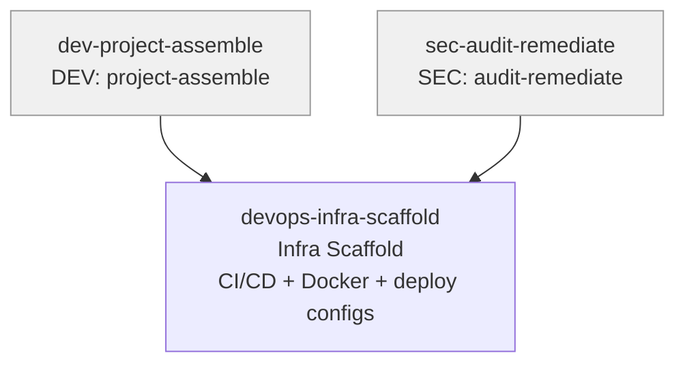

# DEVOPS Skills (1)

> Part of [Role Skills Catalog](../role-skills.md) | Phase 4

**Chain**: project-assemble + sec-audit-remediate --> infra-scaffold

## Userflow Schema

**Legend**: Solid = internal | Dashed = cross-role exit | Gray nodes = other roles

### ✅ /devops-infra-scaffold

- **Logical**: `devops-infra-scaffold`
- **Description**: Generate CI/CD workflows, Dockerfiles, and deployment configs from tech stack
- **Quick Win**: Yes - structured config generation
- **Key Points**:
  - CI/CD pipelines (GitHub Actions / GitLab CI) with lint, test, build, deploy stages
  - Multi-stage Dockerfiles per stack (Node.js, PHP, Go)
  - docker-compose for local dev, platform-specific deployment configs
- **→ Next**: —
- **MCP Required**: None
- **Input**: [tech.md] or interactive
- **Output**: `$JAAN_OUTPUTS_DIR/devops/infra-scaffold/{id}-{slug}/`
