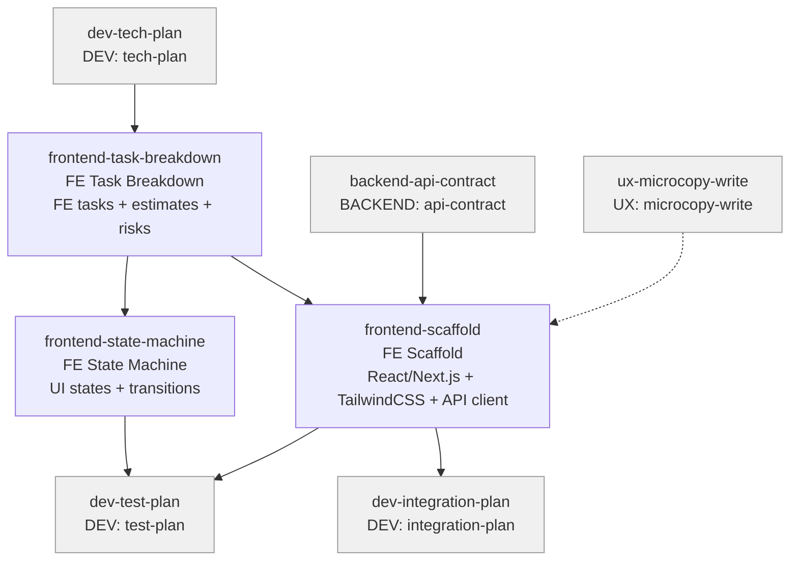

# FRONTEND Skills (3)

> Part of [Role Skills Catalog](../role-skills.md) | Phase 4 + Phase 6

**Chains**: Task Breakdown → State Machine + Scaffold

## Userflow Schema

**Legend**: Solid = internal | Dashed = cross-role exit | Gray nodes = other roles

### ✅ /frontend-task-breakdown

- **Logical**: `frontend-task-breakdown`
- **Description**: FE tasks list (components, screens, states), estimate bands, risks + dependencies
- **Reference**: [Frontend Task Breakdown Skill: Complete Framework Research](https://github.com/parhumm/jaan-to/blob/main/jaan-to/outputs/research/51-frontend-task-breakdown.md)
- **Quick Win**: Yes
- **Key Points**:
  - Explicit state machine prevents "UI glitches"
  - Define caching/loading strategies
  - Performance budgets where needed
- **→ Next**: `frontend-state-machine`
- **MCP Required**: None
- **Input**: [ux-handoff]
- **Output**: `$JAAN_OUTPUTS_DIR/frontend/task-breakdown/{id}-{slug}/`

### /frontend-state-machine

- **Logical**: `frontend-state-machine`
- **Description**: UI states + transitions, events that trigger transitions, edge-case behavior
- **Quick Win**: Yes
- **Key Points**:
  - Explicit state machine prevents "UI glitches"
  - Define caching/loading strategies
  - Performance budgets where needed
- **→ Next**: `dev-test-plan`
- **MCP Required**: None
- **Input**: [screen]
- **Output**: `$JAAN_OUTPUTS_DIR/frontend/state-machine/{id}-{slug}/`

### /frontend-scaffold

- **Logical**: `frontend-scaffold`
- **Description**: Convert HTML design previews to React v19 / Next.js v15 components with TailwindCSS v4, TypeScript, and state management
- **Quick Win**: Yes
- **Key Points**:
  - Extract semantic HTML structure and preserve accessibility
  - Convert to TailwindCSS v4 utility classes
  - Generate TypeScript interfaces from API contract schemas
  - Create composable component hierarchy with loading/error/empty states
  - Generate typed API client hooks
- **→ Next**: `dev-integration-plan`, `dev-test-plan`
- **MCP Required**: None
- **Input**: [frontend-design, frontend-task-breakdown, api-contract]
- **Output**: `$JAAN_OUTPUTS_DIR/frontend/scaffold/{id}-{slug}/`
- **Reference**: [`63-dev-scaffolds.md`](https://github.com/parhumm/jaan-to/blob/main/jaan-to/outputs/research/63-dev-scaffolds.md)
- **Plan**: [dev-scaffold-skills.md](../plans/dev-scaffold-skills.md)
