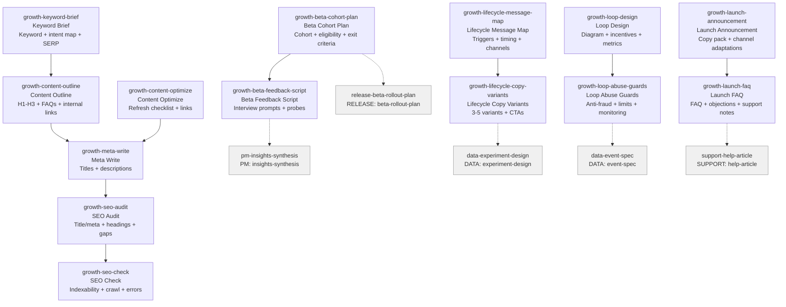

# GROWTH Skills (15)

> Part of [Role Skills Catalog](../role-skills.md) | Phase 4 + Phase 6

**Chains**: SEO: Keyword → Outline → Meta → Audit → Check | Beta → Feedback | Lifecycle → Variants | Loop → Guards | Launch → FAQ

## Userflow Schema

**Legend**: Solid = internal | Dashed = cross-role exit | Gray nodes = other roles

### /jaan-to-growth-keyword-brief

- **Logical**: `growth-keyword-brief`
- **Description**: Keyword + intent map with primary/secondary targets, SERP notes, content angle, internal linking
- **Quick Win**: No - needs GSC MCP
- **Key Points**:
  - Cluster keywords by intent, not volume only
  - Briefs should include SERP intent and CTA
  - Coordinate with tech SEO basics
- **→ Next**: `growth-content-outline`
- **MCP Required**: GSC (queries/pages)
- **Input**: [topic]
- **Output**: `$JAAN_OUTPUTS_DIR/growth/seo/{slug}/keyword-brief.md`

### /jaan-to-growth-content-outline

- **Logical**: `growth-content-outline`
- **Description**: Writing-ready outline: H1-H3, FAQs, entities, internal links, intent matching
- **Quick Win**: Yes - content structure
- **Key Points**:
  - Cluster keywords by intent, not volume only
  - Briefs should include SERP intent and CTA
  - Coordinate with tech SEO basics
- **→ Next**: `growth-meta-write`
- **MCP Required**: GSC (opportunity pages + queries)
- **Input**: [page]
- **Output**: `$JAAN_OUTPUTS_DIR/growth/content/{slug}/outline.md`

### /jaan-to-growth-meta-write

- **Logical**: `growth-meta-write`
- **Description**: Meta titles (<60 chars) and descriptions (<155 chars) with A/B variations
- **Quick Win**: Yes - structured output, character limits
- **AI Score**: 5 | **Rank**: #12
- **Key Points**:
  - Cluster keywords by intent, not volume only
  - Briefs should include SERP intent and CTA
  - Coordinate with tech SEO basics
- **→ Next**: `growth-seo-audit`
- **MCP Required**: None (target keyword provided)
- **Input**: [page_url] [target_keyword]
- **Output**: `$JAAN_OUTPUTS_DIR/growth/meta/{slug}/meta-tags.md`
- **Failure Modes**: Truncation; keyword stuffing; generic descriptions
- **Quality Gates**: Primary keyword included; compelling; proper length

### /jaan-to-growth-content-optimize

- **Logical**: `growth-content-optimize`
- **Description**: Existing content optimization checklist with updated sections and internal links
- **Quick Win**: No - needs traffic analysis
- **AI Score**: 5 | **Rank**: #18
- **Key Points**:
  - Cluster keywords by intent, not volume only
  - Briefs should include SERP intent and CTA
  - Coordinate with tech SEO basics
- **→ Next**: `growth-meta-write`
- **MCP Required**: GSC (traffic decline reports), GA4 (engagement)
- **Input**: [page_url]
- **Output**: `$JAAN_OUTPUTS_DIR/growth/optimization/{slug}/content-refresh.md`
- **Failure Modes**: Surface-level changes; breaking existing rankings
- **Quality Gates**: Matches current intent; competitive depth; tracked 30/60/90 days

### /jaan-to-growth-seo-audit

- **Logical**: `growth-seo-audit`
- **Description**: On-page checklist: title/meta, headings, content gaps, internal links, schema opportunities
- **Quick Win**: No - needs GSC MCP
- **Key Points**:
  - Cluster keywords by intent, not volume only
  - Briefs should include SERP intent and CTA
  - Coordinate with tech SEO basics
- **→ Next**: `growth-seo-check`
- **MCP Required**: GSC (page CTR/impressions), GitLab (optional route ownership)
- **Input**: [url_or_route] [target_keyword]
- **Output**: `$JAAN_OUTPUTS_DIR/growth/seo/{slug}/seo-audit.md`

### /jaan-to-growth-seo-check

- **Logical**: `growth-seo-check`
- **Description**: Technical audit: indexability, crawl signals, critical errors, remediation plan
- **Quick Win**: No - technical checklist
- **Key Points**:
  - Cluster keywords by intent, not volume only
  - Briefs should include SERP intent and CTA
  - Coordinate with tech SEO basics
- **→ Next**: —
- **MCP Required**: GSC (coverage/index diagnostics)
- **Input**: [site_or_app] [scope]
- **Output**: `$JAAN_OUTPUTS_DIR/growth/seo/{slug}/seo-check.md`

### /jaan-to-growth-beta-cohort-plan

- **Logical**: `growth-beta-cohort-plan`
- **Description**: Target cohort + rollout steps, eligibility rules, exit criteria
- **Quick Win**: Yes
- **Key Points**:
  - Define cohort criteria and exit conditions
  - Create feedback loops and comms
  - Monitor support load
- **→ Next**: `growth-beta-feedback-script`, `release-beta-rollout-plan`
- **MCP Required**: None
- **Input**: [criteria]
- **Output**: `$JAAN_OUTPUTS_DIR/growth/beta/{slug}/cohort-plan.md`

### /jaan-to-growth-beta-feedback-script

- **Logical**: `growth-beta-feedback-script`
- **Description**: Interview/survey prompts, success/failure probes, follow-up sequencing
- **Quick Win**: Yes
- **Key Points**:
  - Define cohort criteria and exit conditions
  - Create feedback loops and comms
  - Monitor support load
- **→ Next**: `pm-insights-synthesis`
- **MCP Required**: None
- **Input**: [feature]
- **Output**: `$JAAN_OUTPUTS_DIR/growth/beta/{slug}/feedback-script.md`

### /jaan-to-growth-lifecycle-message-map

- **Logical**: `growth-lifecycle-message-map`
- **Description**: Triggers + messages + timing, channel selection guidance, guardrails (fatigue limits)
- **Quick Win**: Yes
- **Key Points**:
  - Triggers must be event-based (behavioral)
  - Keep copy consistent with tone rules
  - Test variants and measure outcomes
- **→ Next**: `growth-lifecycle-copy-variants`
- **MCP Required**: None
- **Input**: [journey]
- **Output**: `$JAAN_OUTPUTS_DIR/growth/lifecycle/{slug}/message-map.md`

### /jaan-to-growth-lifecycle-copy-variants

- **Logical**: `growth-lifecycle-copy-variants`
- **Description**: 3–5 variants, tone + CTA options, personalization fields list
- **Quick Win**: Yes
- **Key Points**:
  - Triggers must be event-based (behavioral)
  - Keep copy consistent with tone rules
  - Test variants and measure outcomes
- **→ Next**: `data-experiment-design`
- **MCP Required**: None
- **Input**: [message]
- **Output**: `$JAAN_OUTPUTS_DIR/growth/lifecycle/{slug}/copy-variants.md`

### /jaan-to-growth-loop-design

- **Logical**: `growth-loop-design`
- **Description**: Loop diagram + steps, incentives + risks, metrics per step
- **Quick Win**: Yes
- **Key Points**:
  - Identify incentive + friction points
  - Add abuse and fraud protections
  - Measure loop conversion at each step
- **→ Next**: `growth-loop-abuse-guards`
- **MCP Required**: None
- **Input**: [mechanic]
- **Output**: `$JAAN_OUTPUTS_DIR/growth/loop/{slug}/loop-design.md`

### /jaan-to-growth-loop-abuse-guards

- **Logical**: `growth-loop-abuse-guards`
- **Description**: Anti-fraud checks, limits and cooldowns, monitoring signals
- **Quick Win**: Yes
- **Key Points**:
  - Identify incentive + friction points
  - Add abuse and fraud protections
  - Measure loop conversion at each step
- **→ Next**: `data-event-spec`
- **MCP Required**: None
- **Input**: [loop]
- **Output**: `$JAAN_OUTPUTS_DIR/growth/loop/{slug}/abuse-guards.md`

### /jaan-to-growth-launch-announcement

- **Logical**: `growth-launch-announcement`
- **Description**: Announcement copy pack (short/long), channel adaptations (email/in-app), key benefits bullets
- **Quick Win**: Yes
- **Key Points**:
  - Anchor on benefit and audience
  - Anticipate objections
  - Provide support-ready FAQ
- **→ Next**: `growth-launch-faq`
- **MCP Required**: None
- **Input**: [release]
- **Output**: `$JAAN_OUTPUTS_DIR/growth/launch/{slug}/announcement.md`

### /jaan-to-growth-launch-faq

- **Logical**: `growth-launch-faq`
- **Description**: FAQ + objection handling, known limits + workarounds, support escalation notes
- **Quick Win**: Yes
- **Key Points**:
  - Anchor on benefit and audience
  - Anticipate objections
  - Provide support-ready FAQ
- **→ Next**: `support-help-article`
- **MCP Required**: None
- **Input**: [feature]
- **Output**: `$JAAN_OUTPUTS_DIR/growth/launch/{slug}/faq.md`

### /jaan-to-growth-weekly-report

- **Logical**: `growth-weekly-report`
- **Description**: Weekly wins/losses, top pages/queries, actions + owners, next experiments
- **Quick Win**: No - needs multiple MCPs
- **Key Points**:
  - Cluster keywords by intent, not volume only
  - Briefs should include SERP intent and CTA
  - Coordinate with tech SEO basics
- **→ Next**: —
- **MCP Required**: GA4 (deltas), GSC (deltas)
- **Input**: [period]
- **Output**: `$JAAN_OUTPUTS_DIR/growth/reports/{slug}/weekly-report.md`
