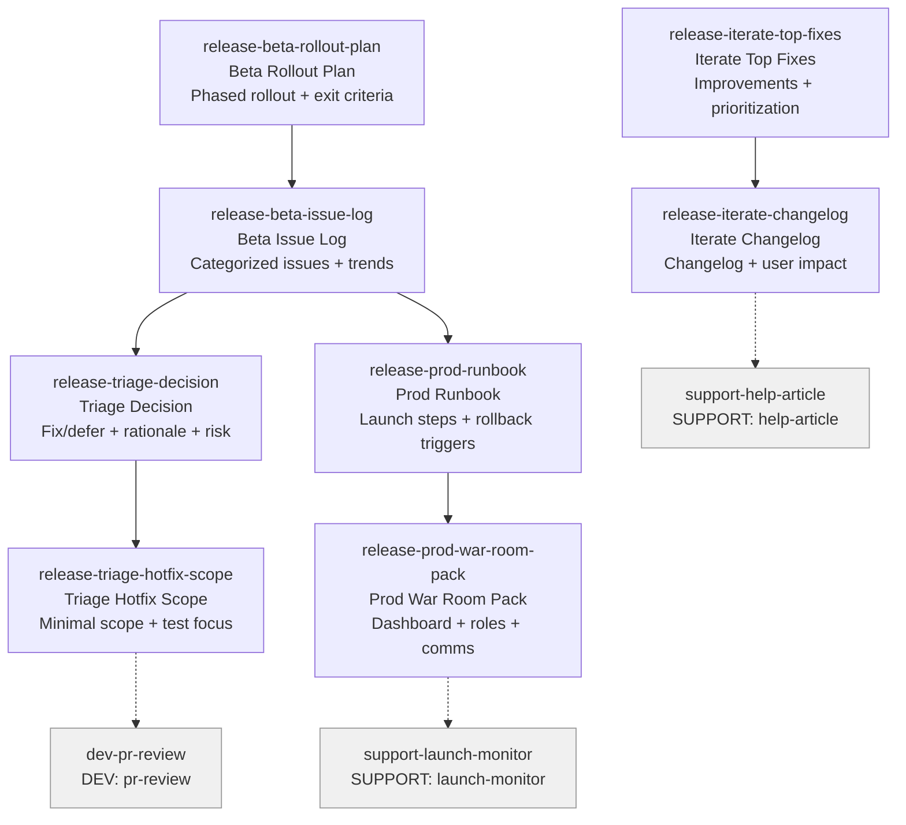

# RELEASE Skills (8)

> Part of [Role Skills Catalog](../role-skills.md) | Phase 4 + Phase 6

**Chains**: Beta Rollout → Issue Log → Triage → Hotfix | Prod Runbook → War Room | Iterate → Changelog

## Userflow Schema

**Legend**: Solid = internal | Dashed = cross-role exit | Gray nodes = other roles

### /jaan-to-release-beta-rollout-plan

- **Logical**: `release-beta-rollout-plan`
- **Description**: Phased rollout plan, exit criteria per phase, targeting + monitoring notes
- **Quick Win**: Yes
- **Key Points**:
  - Phase gates + exit criteria
  - Track issues by category/owner
  - Prepare rollback triggers
- **→ Next**: `release-beta-issue-log`
- **MCP Required**: None
- **Input**: [feature]
- **Output**: `$JAAN_OUTPUTS_DIR/release/beta/{slug}/rollout-plan.md`

### /jaan-to-release-beta-issue-log

- **Logical**: `release-beta-issue-log`
- **Description**: Categorized issues + owners, trend summary, "stop the line" triggers
- **Quick Win**: Yes
- **Key Points**:
  - Phase gates + exit criteria
  - Track issues by category/owner
  - Prepare rollback triggers
- **→ Next**: `release-triage-decision`, `release-prod-runbook`
- **MCP Required**: None
- **Input**: [reports]
- **Output**: `$JAAN_OUTPUTS_DIR/release/beta/{slug}/issue-log.md`

### /jaan-to-release-prod-runbook

- **Logical**: `release-prod-runbook`
- **Description**: Launch steps + rollback triggers, verification checklist, dependencies + comms notes
- **Quick Win**: Yes
- **Key Points**:
  - Runbook with explicit steps
  - War room roles and timing
  - Monitoring dashboard links and thresholds
- **→ Next**: `release-prod-war-room-pack`
- **MCP Required**: None
- **Input**: [feature]
- **Output**: `$JAAN_OUTPUTS_DIR/release/prod/{slug}/runbook.md`

### /jaan-to-release-prod-war-room-pack

- **Logical**: `release-prod-war-room-pack`
- **Description**: Dashboard links + roles + schedule, incident comms templates, decision log structure
- **Quick Win**: Yes
- **Key Points**:
  - Runbook with explicit steps
  - War room roles and timing
  - Monitoring dashboard links and thresholds
- **→ Next**: `support-launch-monitor`
- **MCP Required**: None
- **Input**: [release]
- **Output**: `$JAAN_OUTPUTS_DIR/release/prod/{slug}/war-room-pack.md`

### /jaan-to-release-triage-decision

- **Logical**: `release-triage-decision`
- **Description**: Fix/defer decision + rationale, risk notes, suggested comms
- **Quick Win**: Yes
- **Key Points**:
  - Tie decisions to user impact and risk
  - Define minimal hotfix scope
  - Document rationale
- **→ Next**: `release-triage-hotfix-scope`
- **MCP Required**: None
- **Input**: [bug]
- **Output**: `$JAAN_OUTPUTS_DIR/release/triage/{slug}/decision.md`

### /jaan-to-release-triage-hotfix-scope

- **Logical**: `release-triage-hotfix-scope`
- **Description**: Minimal hotfix scope, test focus areas, rollback considerations
- **Quick Win**: Yes
- **Key Points**:
  - Tie decisions to user impact and risk
  - Define minimal hotfix scope
  - Document rationale
- **→ Next**: `dev-pr-review`
- **MCP Required**: None
- **Input**: [bugs]
- **Output**: `$JAAN_OUTPUTS_DIR/release/triage/{slug}/hotfix-scope.md`

### /jaan-to-release-iterate-top-fixes

- **Logical**: `release-iterate-top-fixes`
- **Description**: Next sprint improvements list, prioritization rationale, owners suggestions
- **Quick Win**: Yes
- **Key Points**:
  - Prioritize by impact + confidence
  - Keep changelog user-facing
  - Track whether fixes moved the metric
- **→ Next**: `release-iterate-changelog`
- **MCP Required**: None
- **Input**: [insights]
- **Output**: `$JAAN_OUTPUTS_DIR/release/iterate/{slug}/top-fixes.md`

### /jaan-to-release-iterate-changelog

- **Logical**: `release-iterate-changelog`
- **Description**: Changelog + user impact notes, internal notes (optional), support guidance
- **Quick Win**: Yes
- **Key Points**:
  - Prioritize by impact + confidence
  - Keep changelog user-facing
  - Track whether fixes moved the metric
- **→ Next**: `support-help-article`
- **MCP Required**: None
- **Input**: [changes]
- **Output**: `$JAAN_OUTPUTS_DIR/release/iterate/{slug}/changelog.md`
