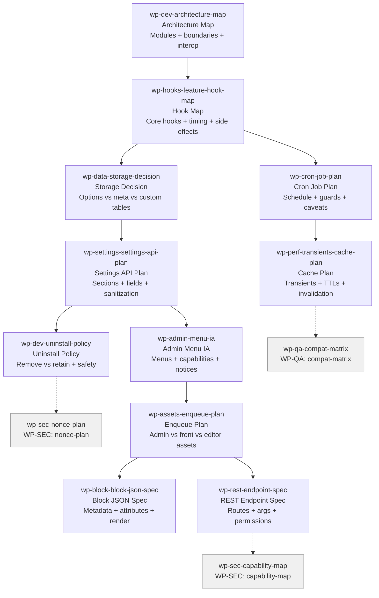

# WP-DEV Skills (11)

> Part of [WP Role Skills Catalog](../roles-wp-skills.md) | Phase 4 + Phase 6

**Chain**: Architecture → Hooks → Data → Settings → Uninstall → Admin Menu → Assets → Block → REST → Cron → Cache

**Research**:
- [WordPress Plugin Development: Complete Role-Based Skills Guide](https://github.com/parhumm/jaan-to/blob/main/jaan-to/outputs/research/54-roles-wp-details.md) - PM, Engineering, Admin UX, Integrations, Security, QA, Release
- [WordPress Analytics Plugin Development](https://github.com/parhumm/jaan-to/blob/main/jaan-to/outputs/research/58-role-wp-dev.md) - Privacy-compliant tracking, database patterns, competitor analysis, JavaScript beacons

## Userflow Schema

**Legend**: Solid = internal | Dashed = cross-role exit | Gray nodes = other roles

### /jaan-to-wp-dev-architecture-map

- **Logical**: `wp-dev:architecture-map`
- **Description**: Plugin structure plan (modules, responsibilities, boundaries) + interop conventions
- **Quick Win**: Yes
- **Cross-ref**: Extends [dev-arch-proposal](../role-skills/dev.md#jaan-to-dev-arch-proposal) with WP action/filter design + collision prevention
- **Key Points**:
  - Design around WordPress APIs and extension points (actions/filters)
  - Prevent collisions (prefixing, avoiding globals, safe handles)
  - Keep admin/front/integrations separated to reduce regressions
- **→ Next**: `wp-hooks-feature-hook-map`
- **MCP Required**: None
- **Input**: [plugin-type] [features]
- **Output**: `$JAAN_OUTPUTS_DIR/wp/dev/{slug}/architecture-map.md`
- **Reference**: Plugin best practices (interop + naming collisions)

### /jaan-to-wp-hooks-feature-hook-map

- **Logical**: `wp-hooks:feature-hook-map`
- **Description**: Hook map per feature (core hooks, execution timing, arguments, side effects) + compatibility notes
- **Quick Win**: Yes
- **Cross-ref**: Extends [dev-integration-plan](../role-skills/dev.md#jaan-to-dev-integration-plan) with WP action/filter specifics
- **Key Points**:
  - Use actions/filters as primary integration mechanism (WP way)
  - Document hook timing + risks (performance, recursion, priority conflicts)
  - Define where you expose your own extension hooks (public API)
- **→ Next**: `wp-data-storage-decision`, `wp-cron-job-plan`
- **MCP Required**: None
- **Input**: [feature]
- **Output**: `$JAAN_OUTPUTS_DIR/wp/dev/{slug}/hooks/{feature}/hook-map.md`
- **Reference**: REST routes/args validation pattern is analogous for "explicit contracts" mindset

### /jaan-to-wp-data-storage-decision

- **Logical**: `wp-data:storage-decision`
- **Description**: Storage strategy per entity (options vs meta vs custom tables) + multisite scope + retention policy
- **Quick Win**: Yes
- **Cross-ref**: Extends [dev-be-data-model](../role-skills/dev.md#jaan-to-dev-be-data-model) with WP persistence layers + multisite scope
- **Key Points**:
  - Pick the smallest viable persistence layer (avoid tables unless justified)
  - Define network-wide vs per-site behavior up front
  - Include migration triggers and "uninstall cleanup" stance
- **→ Next**: `wp-settings-settings-api-plan`
- **MCP Required**: None
- **Input**: [entities] [multisite-mode]
- **Output**: `$JAAN_OUTPUTS_DIR/wp/dev/{slug}/data/storage-decision.md`
- **Reference**: Plugin uninstall expectations (cleanup belongs in uninstall, not deactivation)

### /jaan-to-wp-settings-settings-api-plan

- **Logical**: `wp-settings:settings-api-plan`
- **Description**: Settings design (sections/fields, defaults) + validation/sanitization responsibilities + admin UX notes
- **Quick Win**: Yes
- **Key Points**:
  - Validate early; sanitize consistently; reject invalid states
  - Define defaults and "safe" initial configuration (reduces support load)
  - Document capability gating for settings screens
- **→ Next**: `wp-dev-uninstall-policy`, `wp-admin-menu-ia`
- **MCP Required**: None
- **Input**: [settings]
- **Output**: `$JAAN_OUTPUTS_DIR/wp/dev/{slug}/settings/settings-api-plan.md`
- **Reference**: Data validation principles

### /jaan-to-wp-dev-uninstall-policy

- **Logical**: `wp-dev:uninstall-policy`
- **Description**: Uninstall behavior specification (what is removed, what is retained, user choice) + safety checklist
- **Quick Win**: Yes
- **Key Points**:
  - Separate deactivate vs uninstall responsibilities
  - Require explicit policy for deleting user data
  - Include safeguards against direct access
- **→ Next**: `wp-sec-nonce-plan`
- **MCP Required**: None
- **Input**: [data-types] [retain-or-remove]
- **Output**: `$JAAN_OUTPUTS_DIR/wp/dev/{slug}/lifecycle/uninstall-policy.md`
- **Reference**: Uninstall methods guidance

### /jaan-to-wp-admin-menu-ia

- **Logical**: `wp-admin:menu-ia`
- **Description**: Admin information architecture (menus/pages) + capability model + navigation clarity
- **Quick Win**: Yes
- **Cross-ref**: Extends [ux-sitemap](../role-skills/ux.md#jaan-to-ux-sitemap) with WP admin menu conventions + capability gating
- **Key Points**:
  - Minimize admin clutter; place items where users expect
  - Define capability requirements per page/action
  - Plan notices (errors/warnings/success) as part of UX
- **→ Next**: `wp-assets-enqueue-plan`
- **MCP Required**: None
- **Input**: [pages] [capability]
- **Output**: `$JAAN_OUTPUTS_DIR/wp/admin/{slug}/menu-ia.md`

### /jaan-to-wp-assets-enqueue-plan

- **Logical**: `wp-assets:enqueue-plan`
- **Description**: Asset loading map (admin vs frontend vs editor) + dependencies + conditional loading + versioning rules
- **Quick Win**: Yes
- **Key Points**:
  - Conditional loading prevents global slowdowns
  - Dependencies and load strategy should be explicit (avoid conflicts)
  - Separate editor assets from frontend assets
- **→ Next**: `wp-block-block-json-spec`, `wp-rest-endpoint-spec`
- **MCP Required**: None
- **Input**: [scripts] [styles] [surfaces]
- **Output**: `$JAAN_OUTPUTS_DIR/wp/dev/{slug}/assets/enqueue-plan.md`
- **Reference**: wp_enqueue_script() behavior and loading strategy

### /jaan-to-wp-block-block-json-spec

- **Logical**: `wp-block:block-json-spec`
- **Description**: Block definition spec (metadata, attributes, render strategy, surfaces) using block.json conventions
- **Quick Win**: No
- **Key Points**:
  - Treat block.json as the single source of truth for block registration metadata
  - Define attributes schema + defaults to avoid editor/front mismatch
  - Decide dynamic vs static rendering approach as an explicit contract
- **→ Next**: —
- **MCP Required**: None
- **Input**: [block]
- **Output**: `$JAAN_OUTPUTS_DIR/wp/blocks/{slug}/{block}/block-spec.md`
- **Reference**: Block Editor block.json fundamentals

### /jaan-to-wp-rest-endpoint-spec

- **Logical**: `wp-rest:endpoint-spec`
- **Description**: REST routes spec (namespace, methods, args schema, validation/sanitization, permission model) + error contract
- **Quick Win**: Yes
- **Cross-ref**: Extends [dev-api-contract](../role-skills/dev.md#jaan-to-dev-api-contract) with WP register_rest_route patterns + permission callbacks
- **Key Points**:
  - Every endpoint must define a permission strategy (public vs authenticated)
  - Args should include validation + sanitization callbacks for predictable behavior
  - Document responses and errors as a stable contract for consumers
- **→ Next**: `wp-sec-capability-map`
- **MCP Required**: None
- **Input**: [routes]
- **Output**: `$JAAN_OUTPUTS_DIR/wp/dev/{slug}/rest/endpoints.md`
- **Reference**: Adding custom REST endpoints (permissions + args schema)

### /jaan-to-wp-cron-job-plan

- **Logical**: `wp-cron:job-plan`
- **Description**: WP-Cron job spec (schedule, duplication guards, triggers, operational caveats)
- **Quick Win**: No
- **Key Points**:
  - Avoid scheduling duplicates; define idempotency expectations
  - Document operational caveats (WP-Cron runs on visits; reliability assumptions)
  - Define retry/failure behavior and observability signals
- **→ Next**: `wp-perf-transients-cache-plan`
- **MCP Required**: None
- **Input**: [job] [recurrence]
- **Output**: `$JAAN_OUTPUTS_DIR/wp/dev/{slug}/cron/{job}/cron-plan.md`
- **Reference**: Scheduling WP-Cron events + duplication guard guidance

### /jaan-to-wp-perf-transients-cache-plan

- **Logical**: `wp-perf:cache-plan`
- **Description**: Caching plan using Transients (what to cache, TTLs, invalidation triggers, fallbacks)
- **Quick Win**: Yes
- **Key Points**:
  - Cache expensive computations and external calls with explicit invalidation
  - Document TTL rationale and "stale acceptable?" decisions
  - Ensure cache keys follow namespace strategy to prevent collisions
- **→ Next**: `wp-qa-compat-matrix`
- **MCP Required**: None
- **Input**: [features]
- **Output**: `$JAAN_OUTPUTS_DIR/wp/perf/{slug}/transients-cache-plan.md`
- **Reference**: Transients API overview
