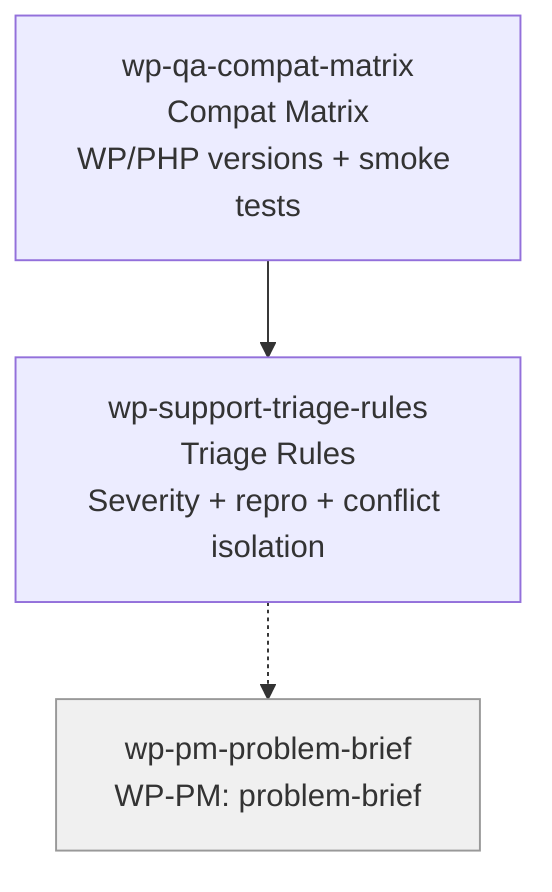

# WP-QA Skills (2)

> Part of [WP Role Skills Catalog](../roles-wp-skills.md) | Phase 4

**Chain**: Compat Matrix → Support Triage Rules

## Userflow Schema

**Legend**: Solid = internal | Dashed = cross-role exit | Gray nodes = other roles

### /jaan-to-wp-qa-compat-matrix

- **Logical**: `wp-qa:compat-matrix`
- **Description**: Compatibility & test target matrix (WP/PHP versions, multisite mode, key themes/plugins) + smoke test checklist
- **Quick Win**: Yes
- **Cross-ref**: Extends [qa-test-matrix](../role-skills/qa.md#jaan-to-qa-test-matrix) with WP/PHP version targets + plugin conflict testing
- **Key Points**:
  - Define minimum supported WP/PHP and justify based on hosting reality
  - Identify "must test" integrations (cache plugins, security plugins, block themes if relevant)
  - Include install/activate/settings/uninstall smoke flows
- **→ Next**: `wp-support-triage-rules`
- **MCP Required**: None
- **Input**: [wp] [php] [targets]
- **Output**: `$JAAN_OUTPUTS_DIR/wp/qa/{id}-{slug}/{id}-{slug}.md`

### /jaan-to-wp-support-triage-rules

- **Logical**: `wp-support:triage-rules`
- **Description**: Support triage rubric (severity, reproduction requirements, conflict isolation, hotfix policy)
- **Quick Win**: Yes
- **Cross-ref**: Extends [support-triage-priority](../role-skills/support.md#jaan-to-support-triage-priority) with WP/PHP env diagnostics + plugin conflict isolation
- **Key Points**:
  - Require repro steps + environment info (WP/PHP + active plugins/theme)
  - Separate "bug" vs "conflict" vs "feature request" with clear routing
  - Define hotfix triggers and communication expectations (changelog + notices)
- **→ Next**: `wp-pm-problem-brief`
- **MCP Required**: None
- **Input**: [reports]
- **Output**: `$JAAN_OUTPUTS_DIR/wp/support/{id}-{slug}/{id}-{slug}.md`
- **Reference**: Plugin Handbook (general best practices + interoperability mindset)
