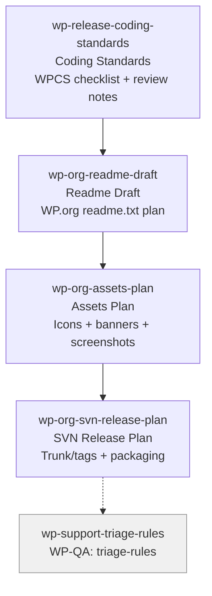

# WP-RELEASE Skills (4)

> Part of [WP Role Skills Catalog](../roles-wp-skills.md) | Phase 4 + Phase 6

**Chain**: Coding Standards → Readme Draft → Assets Plan → SVN Release

## Userflow Schema

**Legend**: Solid = internal | Dashed = cross-role exit | Gray nodes = other roles

### /jaan-to-wp-release-coding-standards

- **Logical**: `wp-release:coding-standards`
- **Description**: Coding standards checklist + review readiness notes (consistency, maintainability expectations)
- **Quick Win**: Yes
- **Key Points**:
  - Adopt WordPress Coding Standards as a baseline for reviews
  - Define formatting/documentation expectations to reduce future maintenance cost
  - Capture "no-go" anti-patterns that frequently cause issues
- **→ Next**: `wp-org-readme-draft`
- **MCP Required**: None
- **Input**: [repo]
- **Output**: `$JAAN_OUTPUTS_DIR/wp/release/{id}-{slug}/{id}-{slug}.md`
- **Reference**: WordPress Coding Standards handbook

### /jaan-to-wp-org-readme-draft

- **Logical**: `wp-org:readme-draft`
- **Description**: WordPress.org readme.txt content plan (sections, FAQs, screenshots mapping, changelog discipline)
- **Quick Win**: Yes
- **Key Points**:
  - Follow the directory readme standard so listing renders correctly
  - Use clear upgrade notes and changelog entries to reduce support burden
  - Map screenshots to features users actually need to understand
- **→ Next**: `wp-org-assets-plan`
- **MCP Required**: None
- **Input**: [slug]
- **Output**: `$JAAN_OUTPUTS_DIR/wp/org/{id}-{slug}/{id}-{slug}.md`
- **Reference**: How readme.txt works in the plugin directory

### /jaan-to-wp-org-assets-plan

- **Logical**: `wp-org:assets-plan`
- **Description**: WordPress.org assets checklist (icons, banners, screenshots) + naming + placement rules
- **Quick Win**: Yes
- **Key Points**:
  - Use the top-level /assets directory in SVN (not inside trunk/tags)
  - Define which screens to capture for screenshots (aligned with UX and features)
  - Keep assets consistent with branding and avoid outdated UI
- **→ Next**: `wp-org-svn-release-plan`
- **MCP Required**: None
- **Input**: [slug]
- **Output**: `$JAAN_OUTPUTS_DIR/wp/org/{id}-{slug}/{id}-{slug}.md`
- **Reference**: How plugin assets work in WordPress.org SVN

### /jaan-to-wp-org-svn-release-plan

- **Logical**: `wp-org:svn-release-plan`
- **Description**: Release flow for WordPress.org SVN (trunk/tags discipline, packaging expectations, version alignment)
- **Quick Win**: No
- **Key Points**:
  - Keep main plugin file in trunk root to avoid download issues
  - Tag releases consistently; align stable tag expectations with release notes
  - Document the repeatable release checklist (preflight → tag → verify listing)
- **→ Next**: `wp-support-triage-rules`
- **MCP Required**: None
- **Input**: [version]
- **Output**: `$JAAN_OUTPUTS_DIR/wp/org/{id}-{slug}/{id}-{slug}.md`
- **Reference**: Using Subversion for WordPress.org plugins
