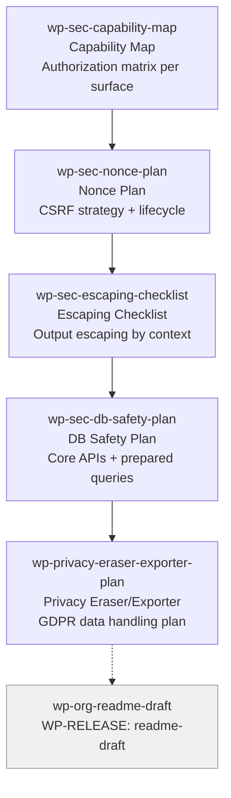

# WP-SEC Skills (5)

> Part of [WP Role Skills Catalog](../roles-wp-skills.md) | Phase 4 + Phase 6

**Chain**: Capability Map → Nonce Plan → Escaping → DB Safety → Privacy Eraser/Exporter

## Userflow Schema

**Legend**: Solid = internal | Dashed = cross-role exit | Gray nodes = other roles

### /jaan-to-wp-sec-capability-map

- **Logical**: `wp-sec:capability-map`
- **Description**: Authorization matrix (who can do what) across admin actions, AJAX, REST, and destructive operations
- **Quick Win**: Yes
- **Cross-ref**: Extends [sec-threat-model-lite](../role-skills/sec.md#jaan-to-sec-threat-model-lite) with WP capabilities system + meta-capabilities
- **Key Points**:
  - Prefer capability checks over role checks
  - Use meta-capabilities where object context matters
  - Align capability requirements with admin UX (hide vs disable vs error)
- **→ Next**: `wp-sec-nonce-plan`
- **MCP Required**: None
- **Input**: [features]
- **Output**: `$JAAN_OUTPUTS_DIR/wp/security/{id}-{slug}/{id}-{slug}.md`
- **Reference**: current_user_can() capability checks

### /jaan-to-wp-sec-nonce-plan

- **Logical**: `wp-sec:nonce-plan`
- **Description**: Nonce strategy for forms/links/AJAX + lifecycle notes + guest considerations
- **Quick Win**: Yes
- **Key Points**:
  - Use nonces for state-changing actions (CSRF protection)
  - Document where nonces live (hidden fields, localized data, URLs)
  - Note session sensitivity and validity caveats
- **→ Next**: `wp-sec-escaping-checklist`
- **MCP Required**: None
- **Input**: [surfaces]
- **Output**: `$JAAN_OUTPUTS_DIR/wp/security/{id}-{slug}/{id}-{slug}.md`
- **Reference**: Nonces guidance

### /jaan-to-wp-sec-escaping-checklist

- **Logical**: `wp-sec:escaping-checklist`
- **Description**: Output-escaping checklist by UI context (HTML/attr/URL) + safe rendering rules
- **Quick Win**: Yes
- **Key Points**:
  - Escape on output (late), validate/sanitize on input (early)
  - Use context-appropriate escaping rules per surface
  - Document any "trusted output" exceptions explicitly
- **→ Next**: `wp-sec-db-safety-plan`
- **MCP Required**: None
- **Input**: [screens]
- **Output**: `$JAAN_OUTPUTS_DIR/wp/security/{id}-{slug}/{id}-{slug}.md`
- **Reference**: Escaping data guidance

### /jaan-to-wp-sec-db-safety-plan

- **Logical**: `wp-sec:db-safety-plan`
- **Description**: Database safety plan (core APIs first, prepared queries when needed) + query risk review checklist
- **Quick Win**: Yes
- **Key Points**:
  - Prefer WordPress APIs; use prepared queries for custom SQL
  - Enforce placeholder discipline for safe SQL
  - Include performance notes (indexes, query frequency, caching opportunities)
- **→ Next**: `wp-privacy-eraser-exporter-plan`
- **MCP Required**: None
- **Input**: [queries]
- **Output**: `$JAAN_OUTPUTS_DIR/wp/security/{id}-{slug}/{id}-{slug}.md`
- **Reference**: wpdb::prepare() safe query preparation rules

### /jaan-to-wp-privacy-eraser-exporter-plan

- **Logical**: `wp-privacy:eraser-exporter-plan`
- **Description**: Personal data handling plan (inventory, export/erase integration, retention stance) for GDPR-style workflows
- **Quick Win**: No
- **Key Points**:
  - Inventory personal data (where stored, why, retention, third-parties)
  - Add erase/export support when plugin stores personal data
  - Document what cannot be erased automatically (third-party systems) and user messaging
- **→ Next**: `wp-org-readme-draft`
- **MCP Required**: None
- **Input**: [data-stores]
- **Output**: `$JAAN_OUTPUTS_DIR/wp/privacy/{id}-{slug}/{id}-{slug}.md`
- **Reference**: Adding the Personal Data Eraser to your plugin
