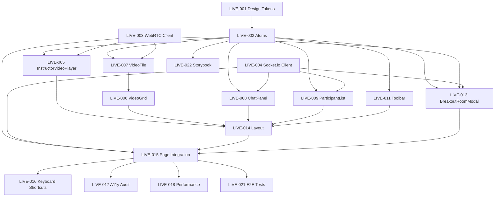

# Frontend Task Breakdown: Live Classroom UI

**Feature**: Live Streaming Classroom Interface
**PRD Reference**: [PRD-01: Live Streaming Classroom](../../../pm/prd/01-live-streaming-classroom/01-prd-live-streaming-classroom.md)
**Framework**: React v18.2 + Next.js v14.1 + TypeScript v5.3
**State Management**: Redux Toolkit v2.0
**Styling**: TailwindCSS v3.4
**Scope**: Production (full states, accessibility, performance)
**Generated**: 2026-02-03

---

## Executive Summary

This task breakdown delivers the frontend UI for EduStream Academy's live streaming classroom, supporting real-time video instruction for up to 500 concurrent students. The interface includes main instructor video player, participant grid (50 visible), tabbed side panel (chat/participants/polls/resources), floating toolbar (mic/camera/hand raise/screen share), and breakout room modal.

**Total Components**: 28 (7 atoms, 9 molecules, 8 organisms, 2 templates, 2 pages)
**Total Tasks**: 32 tasks
**Critical Path**: 12 sequential tasks (~18-24 hours)
**Key Technologies**: WebRTC, Socket.io client, Redux Toolkit (RTK Query), TailwindCSS, Next.js App Router

**Performance Budget**:
- LCP ≤2.5s (instructor video load)
- INP ≤200ms (toolbar interactions)
- CLS ≤0.1 (stable layout during video load)
- Bundle size <250kb (main chunk), <100kb per route

---

## Component Inventory

### Atoms (7 components, XS-S)

| Component | Estimate | Reusable | States | Description |
|-----------|----------|----------|--------|-------------|
| **Button** | XS | Yes | default, hover, active, disabled, loading | Primary action button with variants (primary, secondary, ghost) |
| **IconButton** | XS | Yes | default, hover, active, disabled | Round icon-only button for toolbar |
| **Avatar** | XS | Yes | default, fallback | User avatar with initials fallback |
| **Badge** | XS | Yes | default | Notification count badge |
| **ConnectionIndicator** | XS | No | connected, reconnecting, disconnected | Colored dot showing connection status (green/yellow/red) |
| **VolumeIndicator** | S | No | muted, low, medium, high | Audio level visualization bar |
| **Skeleton** | XS | Yes | loading | Shimmer loading placeholder |

### Molecules (9 components, S-M)

| Component | Estimate | Reusable | States | Description |
|-----------|----------|----------|--------|-------------|
| **VideoTile** | M | Yes | loading, playing, paused, error, muted | Individual video player tile with controls overlay |
| **ToolbarButton** | S | No | idle, active, disabled, loading | Toolbar button with icon, label, tooltip (mic, camera, etc.) |
| **ChatMessage** | S | No | default, highlighted | Single chat message with avatar, name, timestamp |
| **ParticipantCard** | S | No | default, speaking, hand-raised, muted | Participant list item with status indicators |
| **HandRaiseButton** | S | No | lowered, raised, acknowledged | Hand raise button with animated state |
| **PollOption** | S | No | default, selected, disabled | Single poll answer option with radio/checkbox |
| **EmojiReaction** | XS | No | idle, animated | Floating emoji reaction (👍👏❤️) |
| **SearchInput** | S | Yes | empty, typing, results | Search input with debounced onChange |
| **TabButton** | S | Yes | inactive, active | Tab navigation button for side panel |

### Organisms (8 components, M-L)

| Component | Estimate | Reusable | States | Description |
|-----------|----------|----------|--------|-------------|
| **VideoGrid** | L | No | loading, empty, partial, full | Participant video grid (up to 50 visible) with virtualization |
| **InstructorVideoPlayer** | L | No | loading, playing, error, reconnecting | Main instructor video with WebRTC integration |
| **ChatPanel** | M | No | empty, active, loading | Chat interface with message list, input, emoji picker |
| **ParticipantList** | M | No | loading, empty, populated | Sortable participant list with search |
| **Toolbar** | M | No | default, expanded, minimized | Floating toolbar with mic/camera/hand raise/screen share/leave controls |
| **BreakoutRoomModal** | L | No | closed, assigning, transitioning, error | Modal for breakout room assignment and transition |
| **PollModal** | M | No | closed, answering, results, expired | Poll question with options and real-time results |
| **SettingsPanel** | M | No | closed, open | Settings for video/audio devices, bandwidth, layout preferences |

### Templates (2 components, L)

| Component | Estimate | Reusable | States | Description |
|-----------|----------|----------|--------|-------------|
| **LiveClassroomLayout** | L | No | default, sidebar-collapsed, fullscreen | Main layout with video, sidebar, toolbar positioning |
| **LobbyLayout** | M | Yes | waiting, pre-check | Waiting room layout with connection pre-check |

### Pages (2 components, XL)

| Component | Estimate | Reusable | States | Description |
|-----------|----------|----------|--------|-------------|
| **LiveClassroomPage** | XL | No | idle, connecting, connected, reconnecting, disconnected, ended | Full integration with WebRTC, Socket.io, Redux state |
| **LobbyPage** | L | No | waiting, admitted, error | Lobby waiting room before session admission |

**Total**: 28 components

---

## State Matrix

| Component | Default | Loading | Success | Error | Empty | Partial |
|-----------|---------|---------|---------|-------|-------|---------|
| InstructorVideoPlayer | [ ] | [x] | [x] | [x] | [ ] | [x] (reconnecting) |
| VideoGrid | [x] | [x] | [x] | [ ] | [x] | [x] (some tiles loading) |
| ChatPanel | [x] | [x] | [x] | [ ] | [x] | [ ] |
| ParticipantList | [x] | [x] | [x] | [ ] | [x] | [ ] |
| Toolbar | [x] | [ ] | [x] | [ ] | [ ] | [ ] |
| BreakoutRoomModal | [x] (closed) | [x] (assigning) | [x] (assigned) | [x] | [ ] | [ ] |
| PollModal | [x] (closed) | [ ] | [x] (results) | [x] | [ ] | [ ] |

---

## Task Breakdown

### Slice 1: Design System Foundation

#### [LIVE-001] Create design tokens and theme configuration

**Size:** M (2-4h)
**Priority:** P0
**Complexity:** Medium

**File(s):**
- `src/styles/tokens.css`
- `tailwind.config.ts`
- `src/hooks/useTheme.ts`

**Dependencies:**
- None (foundation task)

**Description:**
Create TailwindCSS theme configuration with design tokens for colors, typography, spacing, shadows, and animations. Includes dark mode support (class-based) and custom CSS variables for WebRTC-specific UI (connection indicators, volume levels).

**Acceptance Criteria:**
- [ ] TailwindCSS config extends with custom colors: primary (blue), success (green), error (red), warning (yellow), connection states (green-500, yellow-500, red-500)
- [ ] Typography scale: text-xs (12px) to text-2xl (24px) with font weights 400, 500, 600, 700
- [ ] Spacing scale follows 4px base unit
- [ ] Custom animations: fadeIn, slideIn, pulse (for connection indicator)
- [ ] Dark mode classes defined for all components
- [ ] CSS custom properties for real-time values (--volume-level, --latency-ms)

**Performance:**
- CSS bundle <10kb after purge
- Critical CSS inlined for above-fold

---

#### [LIVE-002] Create atom components (Button, Avatar, Badge, etc.)

**Size:** M (2-4h)
**Priority:** P0
**Complexity:** Low

**File(s):**
- `src/components/atoms/Button.tsx`
- `src/components/atoms/IconButton.tsx`
- `src/components/atoms/Avatar.tsx`
- `src/components/atoms/Badge.tsx`
- `src/components/atoms/ConnectionIndicator.tsx`
- `src/components/atoms/VolumeIndicator.tsx`
- `src/components/atoms/Skeleton.tsx`

**Dependencies:**
- blocked-by: [LIVE-001]

**Description:**
Implement foundational atom components with TypeScript prop types, TailwindCSS styling, and Storybook stories. All components support dark mode and have hover/active/disabled states.

**Acceptance Criteria:**
- [ ] Button component with variants (primary, secondary, ghost), sizes (sm, md, lg), loading state
- [ ] IconButton with tooltip support (using Radix UI Tooltip)
- [ ] Avatar with image + initials fallback, sizes (xs, sm, md, lg)
- [ ] Badge with count display (1-99, 99+), dot variant
- [ ] ConnectionIndicator with 3 states (green/yellow/red) and pulse animation
- [ ] VolumeIndicator with 4 levels (muted, low, medium, high) visualized as bars
- [ ] Skeleton with shimmer animation for loading states
- [ ] All components have Storybook stories with all variants
- [ ] TypeScript prop types with JSDoc comments
- [ ] Unit tests for Button (RTL) covering variants and click handling

---

### Slice 2: WebRTC Integration

#### [LIVE-003] Create WebRTC client service

**Size:** XL (6-8h)
**Priority:** P0
**Complexity:** High

**File(s):**
- `src/services/webrtc/WebRTCClient.ts`
- `src/services/webrtc/MediaStream Manager.ts`
- `src/hooks/useWebRTC.ts`

**Dependencies:**
- blocked-by: None (can work in parallel with atoms)

**Description:**
Implement WebRTC client service for instructor video stream consumption, participant video publication, and media device management. Integrates with backend signaling server via Socket.io. Handles connection state, reconnection logic, and bandwidth adaptation.

**Acceptance Criteria:**
- [ ] WebRTCClient class manages RTCPeerConnection lifecycle (create, connect, close)
- [ ] Subscribes to instructor video track via WebRTC SFU (Mediasoup)
- [ ] Publishes student video/audio when unmuted (for student view)
- [ ] Handles ICE candidate exchange via Socket.io signaling
- [ ] Implements reconnection logic (30-second window, exponential backoff)
- [ ] MediaStreamManager enumerates devices (cameras, microphones, speakers)
- [ ] useWebRTC hook exposes: {instructorStream, localStream, connectionState, devices, toggleMic, toggleCamera}
- [ ] Connection state machine: disconnected → connecting → connected → reconnecting → disconnected
- [ ] Bandwidth adaptation: switches video quality (360p/720p/1080p) based on network stats
- [ ] Error handling: network failure, device permission denied, SFU unavailable
- [ ] Cleanup on unmount (close peer connections, stop media tracks)

**Performance:**
- Target <200ms latency for instructor video
- Automatic quality degradation if bandwidth <3 Mbps

**Risks:**
- **High/High**: Browser WebRTC API differences (Safari, Firefox quirks) — mitigation: adapter.js polyfill, cross-browser testing

---

#### [LIVE-004] Create Socket.io client integration

**Size:** M (2-4h)
**Priority:** P0
**Complexity:** Medium

**File(s):**
- `src/services/socket/SocketClient.ts`
- `src/hooks/useSocket.ts`

**Dependencies:**
- blocked-by: None

**Description:**
Implement Socket.io client for real-time events: chat messages, hand raises, participant join/leave, breakout room assignments, poll creation. Integrates with Redux Toolkit to dispatch actions on socket events.

**Acceptance Criteria:**
- [ ] SocketClient connects to signaling server with JWT authentication
- [ ] Listens to events: 'message', 'hand-raised', 'participant-joined', 'participant-left', 'breakout-assigned', 'poll-created'
- [ ] Emits events: 'send-message', 'raise-hand', 'lower-hand', 'join-session', 'leave-session'
- [ ] Reconnection logic (auto-reconnect with exponential backoff up to 30s)
- [ ] useSocket hook exposes: {connected, emit, on, off}
- [ ] Redux middleware intercepts socket events and dispatches actions (e.g., 'message' → chatSlice.addMessage)
- [ ] Connection status tracked in Redux (connected/reconnecting/disconnected)
- [ ] Graceful disconnect on page unload (beforeunload event)

---

### Slice 3: Video Components

#### [LIVE-005] Create InstructorVideoPlayer organism

**Size:** L (4-6h)
**Priority:** P0
**Complexity:** High

**File(s):**
- `src/components/organisms/InstructorVideoPlayer.tsx`
- `src/components/organisms/InstructorVideoPlayer.module.css`

**Dependencies:**
- blocked-by: [LIVE-002], [LIVE-003]

**Description:**
Main video player displaying instructor's live stream with controls overlay (mute, fullscreen, connection indicator). Handles WebRTC stream attachment, loading states, error recovery, and latency display.

**Acceptance Criteria:**
- [ ] Renders <video> element with autoPlay, playsInline, muted (initially, user toggles)
- [ ] Attaches MediaStream from useWebRTC hook (instructorStream)
- [ ] Loading state: Skeleton placeholder while stream connecting
- [ ] Error state: Error message + "Reconnect" button if stream fails
- [ ] Reconnecting state: Overlay with "Reconnecting..." message, keeps last frame visible
- [ ] Controls overlay (appears on hover): Mute instructor audio, Fullscreen, Connection indicator (green/yellow/red)
- [ ] Latency display (top-right corner): Shows p95 latency in ms (e.g., "185ms"), updates every 5s
- [ ] Aspect ratio maintained (16:9), letterboxing if needed
- [ ] Responsive: 100% width on mobile, 60% width on desktop (with sidebar)
- [ ] Fullscreen mode: Uses Fullscreen API, hides toolbar/sidebar
- [ ] Accessibility: Keyboard controls (F for fullscreen, M for mute, Space for play/pause)

**State Machine:**
```
States: idle | loading | playing | error | reconnecting
Events: STREAM_READY | STREAM_ERROR | RECONNECT | STREAM_RESUMED

Transitions:
- idle --STREAM_READY--> playing
- idle --STREAM_ERROR--> error
- playing --STREAM_ERROR--> reconnecting
- reconnecting --STREAM_RESUMED--> playing
- reconnecting --STREAM_ERROR (after 30s)--> error
- error --RECONNECT--> loading
```

**Performance:**
- Video element uses hardware acceleration (playsinline attribute)
- LCP <2.5s for video first frame

---

#### [LIVE-006] Create VideoGrid organism with virtualization

**Size:** L (4-6h)
**Priority:** P1
**Complexity:** High

**File(s):**
- `src/components/organisms/VideoGrid.tsx`
- `src/hooks/useVirtualizedGrid.ts`

**Dependencies:**
- blocked-by: [LIVE-002] (Avatar), [LIVE-003] (participant streams)

**Description:**
Participant video grid displaying up to 50 visible participants with virtualization for performance. Uses react-window for virtual scrolling. Each tile shows participant video (if camera on) or avatar (if camera off), name label, and mute/speaking indicators.

**Acceptance Criteria:**
- [ ] Grid layout: 4 columns on desktop (1024px+), 2 columns on tablet (768px), 1 column on mobile
- [ ] Virtualization: Only renders visible tiles using react-window (FixedSizeGrid)
- [ ] Each VideoTile shows: participant name, avatar (if no video), speaking indicator (green border when speaking), mute icon (if muted)
- [ ] Empty state: "No participants yet" message if participant count = 0
- [ ] Loading state: Skeleton tiles while participant list loading
- [ ] Partial loading state: Show loaded tiles, skeleton for pending
- [ ] Sorting: Active speaker first, hand raised second, alphabetical last
- [ ] Tile size: 160x120px (desktop), 140x105px (tablet), 100% width (mobile)
- [ ] Smooth scroll with momentum (CSS scroll-behavior: smooth)
- [ ] Accessibility: Focus management (Tab key navigates tiles), ARIA labels for each participant

**Performance:**
- Virtualization ensures <50 DOM nodes regardless of participant count
- Re-renders optimized with React.memo + useCallback
- Scroll performance >60fps

---

#### [LIVE-007] Create VideoTile molecule

**Size:** M (2-4h)
**Priority:** P1
**Complexity:** Medium

**File(s):**
- `src/components/molecules/VideoTile.tsx`

**Dependencies:**
- blocked-by: [LIVE-002] (Avatar, Badge)

**Description:**
Individual participant video tile with overlay UI: name label, speaking indicator, mute status, connection quality. Supports both video stream (camera on) and avatar fallback (camera off).

**Acceptance Criteria:**
- [ ] Renders <video> element if participant has video stream, otherwise Avatar component
- [ ] Overlay (bottom): Participant name (truncated with ellipsis if >20 chars), mute icon (if muted)
- [ ] Speaking indicator: Green border (2px solid) when participant is speaking (audio level >threshold)
- [ ] Connection quality badge (top-right): Green/yellow/red dot based on connection status
- [ ] Hover state: Darkens overlay, shows "Pin" button (future feature, deferred)
- [ ] Aspect ratio: 4:3, object-fit: cover for video
- [ ] Accessibility: ARIA label "{name}'s video", role="img"

---

### Slice 4: Side Panel (Chat, Participants, Polls)

#### [LIVE-008] Create ChatPanel organism

**Size:** M (2-4h)
**Priority:** P0
**Complexity:** Medium

**File(s):**
- `src/components/organisms/ChatPanel.tsx`
- `src/components/molecules/ChatMessage.tsx`

**Dependencies:**
- blocked-by: [LIVE-002], [LIVE-004] (Socket.io for messages)

**Description:**
Chat panel with message list (virtualized for performance), message input, emoji picker, and send button. Integrates with Socket.io to send/receive messages in real-time.

**Acceptance Criteria:**
- [ ] Message list: Virtualized with react-window (VariableSizeList), auto-scrolls to bottom on new message
- [ ] Each ChatMessage shows: Avatar, name, message text, timestamp (relative, e.g., "2m ago")
- [ ] Message input: Textarea with auto-resize (max 4 rows), placeholder "Type a message...", Enter to send (Shift+Enter for new line)
- [ ] Emoji picker button: Opens emoji picker popover (using emoji-picker-react), inserts emoji at cursor position
- [ ] Send button: Disabled if message empty, loading state while sending
- [ ] Empty state: "No messages yet. Be the first to say hello!" with emoji
- [ ] Character limit: 1000 characters, shows count when >900
- [ ] Mentions: @username autocomplete (search participants as user types @)
- [ ] Timestamps update reactively (e.g., "2m ago" → "3m ago")
- [ ] Accessibility: Focus management (Escape closes emoji picker), ARIA live region for new messages (screen reader announces)

**Performance:**
- Virtualization handles 1000+ messages without lag
- Message send latency <500ms (Socket.io roundtrip)

---

#### [LIVE-009] Create ParticipantList organism

**Size:** M (2-4h)
**Priority:** P1
**Complexity:** Medium

**File(s):**
- `src/components/organisms/ParticipantList.tsx`
- `src/components/molecules/ParticipantCard.tsx`

**Dependencies:**
- blocked-by: [LIVE-002], [LIVE-004]

**Description:**
Participant list panel showing all session participants (students + instructor) with search, sorting, and status indicators (hand raised, speaking, connection status).

**Acceptance Criteria:**
- [ ] Header: "Participants (75)" count, search input
- [ ] Search: Filters participants by name (debounced 300ms)
- [ ] Sorting: Instructor first, hand raised second, speaking third, alphabetical last
- [ ] Each ParticipantCard shows: Avatar, name, role badge (Instructor/Student), status icons (hand raised, muted, disconnected)
- [ ] Empty state (search): "No participants found for '{query}'"
- [ ] Loading state: Skeleton cards (5 placeholders)
- [ ] Hover state: Highlight card, show "Promote to speaker" button (instructor only, deferred feature)
- [ ] Real-time updates: Participant join/leave via Socket.io events
- [ ] Accessibility: List uses semantic <ul>, cards use <li>, keyboard navigation (Arrow keys + Enter)

---

#### [LIVE-010] Create PollModal organism

**Size:** M (2-4h)
**Priority:** P2
**Complexity:** Medium

**File(s):**
- `src/components/organisms/PollModal.tsx`
- `src/components/molecules/PollOption.tsx`

**Dependencies:**
- blocked-by: [LIVE-002] (Button), [LIVE-004] (Socket.io for poll events)

**Description:**
Modal for answering instructor-created polls with real-time results display. Shows poll question, options (radio or checkbox), submit button, and results bar chart after submission.

**Acceptance Criteria:**
- [ ] Modal triggered by Socket.io 'poll-created' event
- [ ] Poll question displayed at top, options as radio buttons (single choice) or checkboxes (multiple choice)
- [ ] Submit button: Disabled if no selection, loading state while submitting
- [ ] Results view (after submit): Bar chart showing percentage per option, total response count
- [ ] Timer: Shows remaining time if poll has expiration (e.g., "2:30 remaining"), auto-submits on expiry
- [ ] Close button: X icon top-right (Escape key also closes)
- [ ] Expired state: "Poll expired" message if student opens too late
- [ ] Accessibility: Focus trap in modal, first focusable element on open, return focus to trigger on close

**State Machine:**
```
States: closed | answering | submitting | results | expired
Events: POLL_CREATED | SUBMIT | SUCCESS | ERROR | CLOSE | EXPIRE

Transitions:
- closed --POLL_CREATED--> answering
- answering --SUBMIT--> submitting
- submitting --SUCCESS--> results
- submitting --ERROR--> answering (show error toast)
- answering --EXPIRE--> expired
- results --CLOSE--> closed
```

---

### Slice 5: Toolbar & Controls

#### [LIVE-011] Create Toolbar organism

**Size:** M (2-4h)
**Priority:** P0
**Complexity:** Medium

**File(s):**
- `src/components/organisms/Toolbar.tsx`
- `src/components/molecules/ToolbarButton.tsx`

**Dependencies:**
- blocked-by: [LIVE-002] (IconButton), [LIVE-003] (toggleMic, toggleCamera)

**Description:**
Floating toolbar at bottom of screen with controls: Mic, Camera, Hand Raise, Screen Share, Reactions, Settings, Leave. Each button shows active/inactive state and tooltip on hover.

**Acceptance Criteria:**
- [ ] Toolbar positioned fixed bottom, centered horizontally, z-index 50 (above video)
- [ ] Buttons: Mic (toggle mute), Camera (toggle video), Hand Raise (toggle), Screen Share (start/stop), Reactions (emoji picker dropdown), Settings (open settings panel), Leave (confirm dialog)
- [ ] Mic button: Red when muted, shows "Unmute" tooltip, icon changes (mic-off ↔ mic-on)
- [ ] Camera button: Red when off, shows "Turn on camera" tooltip
- [ ] Hand Raise button: Yellow when raised, blue when acknowledged by instructor
- [ ] Screen Share button: Disabled if browser doesn't support (Safari <13), blue when active
- [ ] Reactions button: Opens emoji dropdown (👍👏❤️😂🎉), sends emoji via Socket.io, floats up from button with animation
- [ ] Settings button: Opens SettingsPanel modal
- [ ] Leave button: Shows confirmation dialog ("Are you sure you want to leave the session?"), navigates to lobby/home on confirm
- [ ] Tooltips: Shown on hover (Radix UI Tooltip), keyboard shortcut hints (e.g., "Mute (M)")
- [ ] Keyboard shortcuts: M (mic), V (video), H (hand), S (screen share), Esc (close any open dropdown)
- [ ] Accessibility: ARIA labels for each button, live region announces state changes ("Microphone muted")

---

#### [LIVE-012] Create SettingsPanel organism

**Size:** M (2-4h)
**Priority:** P2
**Complexity:** Medium

**File(s):**
- `src/components/organisms/SettingsPanel.tsx`

**Dependencies:**
- blocked-by: [LIVE-003] (device enumeration)

**Description:**
Settings modal for video/audio device selection, bandwidth preferences, layout options (grid vs. speaker view), and notification settings.

**Acceptance Criteria:**
- [ ] Modal with tabs: Devices, Video, Audio, Notifications
- [ ] Devices tab: Dropdowns for camera, microphone, speaker selection (uses MediaStreamManager.enumerateDevices)
- [ ] Video tab: Quality slider (Auto, 360p, 720p, 1080p), "Mirror my video" checkbox
- [ ] Audio tab: Volume slider for speaker, "Echo cancellation" toggle, "Noise suppression" toggle
- [ ] Notifications tab: Toggles for "Sound on chat message", "Sound on hand raise", "Desktop notifications"
- [ ] Save button: Persists settings to localStorage, applies immediately
- [ ] Cancel button: Reverts to previous settings
- [ ] Live preview: Shows camera feed with current settings applied
- [ ] Accessibility: Focus trap, keyboard navigation (Tab, Shift+Tab), Escape to close

---

### Slice 6: Breakout Rooms

#### [LIVE-013] Create BreakoutRoomModal organism

**Size:** L (4-6h)
**Priority:** P1
**Complexity:** High

**File(s):**
- `src/components/organisms/BreakoutRoomModal.tsx`

**Dependencies:**
- blocked-by: [LIVE-002], [LIVE-003] (WebRTC room transition), [LIVE-004] (Socket.io room events)

**Description:**
Modal for breakout room assignment notification, countdown transition, and return to main session. Handles WebRTC room switching (disconnect from main room, connect to breakout room).

**Acceptance Criteria:**
- [ ] Triggered by Socket.io 'breakout-assigned' event
- [ ] Assignment notification: "You've been assigned to Breakout Room 7 with 4 other students"
- [ ] Countdown: "Breakout rooms will open in 5... 4... 3... 2... 1..." (animated)
- [ ] Transition state: "Joining Breakout Room 7..." with loading spinner
- [ ] Error state: "Failed to join breakout room" with "Retry" button
- [ ] Success: Modal closes, VideoGrid updates to show breakout room participants (5 students)
- [ ] Return countdown: "Returning to main session in 10... 9... 8..." (triggered by instructor closing rooms)
- [ ] WebRTC integration: Calls WebRTCClient.switchRoom(breakoutRoomId) to disconnect/reconnect peer connections
- [ ] Instructor broadcast messages: Shows notification banner with instructor message while in breakout room
- [ ] Accessibility: Non-dismissable modal (user cannot close manually), screen reader announces countdown

**State Machine:**
```
States: closed | assigned | transitioning | joined | returning | error
Events: ASSIGNED | COUNTDOWN_END | JOIN_SUCCESS | JOIN_ERROR | RETURN_STARTED | RETURN_SUCCESS

Transitions:
- closed --ASSIGNED--> assigned (show countdown)
- assigned --COUNTDOWN_END--> transitioning
- transitioning --JOIN_SUCCESS--> joined (close modal)
- transitioning --JOIN_ERROR--> error
- error --RETRY--> transitioning
- joined --RETURN_STARTED--> returning (show return countdown)
- returning --RETURN_SUCCESS--> closed (back to main session)
```

**Risks:**
- **Medium/High**: WebRTC room transition fails (peer connection drop) — mitigation: Reconnection logic with 30s timeout, fallback to refresh page

---

### Slice 7: Page Integration & Layout

#### [LIVE-014] Create LiveClassroomLayout template

**Size:** L (4-6h)
**Priority:** P0
**Complexity:** Medium

**File(s):**
- `src/components/templates/LiveClassroomLayout.tsx`

**Dependencies:**
- blocked-by: [LIVE-005], [LIVE-006], [LIVE-008], [LIVE-009], [LIVE-011]

**Description:**
Main layout template positioning instructor video (left 60%), side panel (right 40%), toolbar (bottom fixed), and breakout/poll modals. Handles responsive layout (collapsible sidebar on mobile).

**Acceptance Criteria:**
- [ ] Desktop layout (1024px+): Instructor video 60% width, sidebar 40% width, toolbar fixed bottom
- [ ] Tablet layout (768-1023px): Instructor video 100% width (top), sidebar 100% width (bottom), side-by-side via tabs
- [ ] Mobile layout (<768px): Fullscreen video, sidebar accessible via slide-up panel, toolbar at bottom
- [ ] Sidebar toggle button (tablet/mobile): Hamburger icon, opens sidebar overlay
- [ ] Fullscreen mode: Hides sidebar, toolbar auto-hides after 3s inactivity (re-shows on mouse move)
- [ ] Grid includes: InstructorVideoPlayer, VideoGrid (optional, hidden if <5 participants), Sidebar (tabs: Chat, Participants, Polls, Resources)
- [ ] Sidebar tabs: Radio buttons, active tab highlighted, content panel switches
- [ ] Resizable sidebar (desktop): Drag handle to adjust 30-70% width split
- [ ] Accessibility: Skip links ("Skip to video", "Skip to chat"), landmark roles (main, aside)

---

#### [LIVE-015] Create LiveClassroomPage with Redux integration

**Size:** XL (1-2 days)
**Priority:** P0
**Complexity:** High

**File(s):**
- `src/app/sessions/[sessionId]/live/page.tsx` (Next.js App Router)
- `src/store/slices/sessionSlice.ts` (Redux Toolkit)
- `src/store/slices/chatSlice.ts`
- `src/store/slices/participantsSlice.ts`

**Dependencies:**
- blocked-by: [LIVE-003], [LIVE-004], [LIVE-014]

**Description:**
Full page integration connecting all organisms, WebRTC client, Socket.io, and Redux state management. Handles session lifecycle: join → connect → participate → leave. Includes error boundaries, loading states, and session end cleanup.

**Acceptance Criteria:**
- [ ] Page route: `/sessions/[sessionId]/live` with sessionId from URL params
- [ ] On mount: Dispatches joinSession thunk (RTK Query), establishes Socket.io connection, initializes WebRTC
- [ ] Redux state: session (status, participants, instructor), chat (messages), polls (active poll), breakoutRooms (current room)
- [ ] Loading state: Full-screen spinner with "Connecting to session..." message
- [ ] Connected state: Renders LiveClassroomLayout with all organisms
- [ ] Error state: Error boundary catches WebRTC/Socket errors, shows "Connection failed" with "Retry" button
- [ ] Session end: Triggered by Socket.io 'session-ended' event, shows "Session has ended" modal, redirects to lobby/home after 10s
- [ ] Leave action: Calls leaveSession thunk, disconnects WebRTC, closes Socket.io, navigates to `/sessions/[sessionId]` (session detail page)
- [ ] Beforeunload warning: "Are you sure you want to leave? You'll be disconnected from the session."
- [ ] Reconnection handling: If Socket.io disconnects, shows "Reconnecting..." banner (top), attempts reconnect for 30s
- [ ] Session state persistence: Stores last session state in localStorage (for recovery on accidental refresh)
- [ ] Accessibility: Page title updates ("Live Session - {Course Name} | EduStream"), focus management on load

**State Machine (Session):**
```
States: idle | joining | connected | reconnecting | ended | error
Events: JOIN | JOIN_SUCCESS | DISCONNECT | RECONNECT | END | ERROR

Transitions:
- idle --JOIN--> joining
- joining --JOIN_SUCCESS--> connected
- joining --ERROR--> error
- connected --DISCONNECT--> reconnecting
- reconnecting --RECONNECT (within 30s)--> connected
- reconnecting --ERROR (after 30s)--> error
- connected --END--> ended
- error --RETRY--> joining
```

**Performance:**
- Initial bundle size <250kb (code splitting for modals)
- Time to interactive <3s on 3G network
- WebSocket connection established <2s

**Risks:**
- **High/High**: Multiple simultaneous failures (WebRTC + Socket.io) create undefined state — mitigation: Error boundary catches all errors, single "Reconnect" action resets everything

---

### Slice 8: Accessibility & Polish

#### [LIVE-016] Implement keyboard shortcuts

**Size:** S (1-2h)
**Priority:** P1
**Complexity:** Low

**File(s):**
- `src/hooks/useKeyboardShortcuts.ts`

**Dependencies:**
- blocked-by: [LIVE-011] (Toolbar actions)

**Description:**
Global keyboard shortcuts for common actions: Mute (M), Video (V), Hand Raise (H), Screen Share (S), Leave (L), Toggle Chat (C). Shows shortcut hints in tooltips.

**Acceptance Criteria:**
- [ ] useKeyboardShortcuts hook listens for keydown events (document level)
- [ ] Shortcuts: M (toggle mic), V (toggle camera), H (toggle hand raise), S (toggle screen share), C (toggle chat panel), L (leave session), F (fullscreen), Esc (close modals)
- [ ] Shortcuts disabled when typing in input/textarea (checks event.target.tagName)
- [ ] Tooltip hints: Button tooltips show shortcut (e.g., "Mute (M)")
- [ ] Help modal: Shift+/ opens keyboard shortcut reference modal
- [ ] Accessibility: ARIA live region announces action (e.g., "Microphone muted" when M pressed)

---

#### [LIVE-017] Implement WCAG AA accessibility audit

**Size:** M (2-4h)
**Priority:** P1
**Complexity:** Medium

**File(s):**
- `tests/a11y/live-classroom.test.ts` (axe-core integration)

**Dependencies:**
- blocked-by: [LIVE-015] (full page integration)

**Description:**
Run automated accessibility audit using axe-core, fix all WCAG AA violations, add manual test checklist for screen reader compatibility (NVDA, JAWS, VoiceOver).

**Acceptance Criteria:**
- [ ] axe-core automated test passes with 0 violations (WCAG 2.1 AA)
- [ ] All interactive elements keyboard accessible (Tab navigation, Enter/Space activation)
- [ ] Focus indicators visible (3px outline, high contrast)
- [ ] Color contrast meets 4.5:1 for text, 3:1 for UI components
- [ ] ARIA labels for all icon-only buttons
- [ ] ARIA live regions for real-time updates (chat messages, participant join/leave, connection status)
- [ ] Heading hierarchy correct (h1 → h2 → h3, no skipped levels)
- [ ] Skip navigation links ("Skip to video", "Skip to chat")
- [ ] Screen reader tested with VoiceOver (macOS), announces all state changes
- [ ] Keyboard traps prevented (modals can be closed with Escape)

---

#### [LIVE-018] Implement performance optimizations

**Size:** M (2-4h)
**Priority:** P1
**Complexity:** Medium

**File(s):**
- `next.config.js` (bundle optimization)
- `src/components/**` (React.memo, useMemo, useCallback)

**Dependencies:**
- blocked-by: [LIVE-015]

**Description:**
Apply performance optimizations to meet Core Web Vitals targets: LCP ≤2.5s, INP ≤200ms, CLS ≤0.1. Includes code splitting, lazy loading, memoization, and bundle size reduction.

**Acceptance Criteria:**
- [ ] Code splitting: Modals (BreakoutRoomModal, PollModal, SettingsPanel) lazy loaded with React.lazy
- [ ] Image optimization: next/image for all static images, priority for above-fold (instructor video thumbnail)
- [ ] Font optimization: next/font for Google Fonts, font-display: swap
- [ ] Memoization: React.memo for VideoTile, ChatMessage, ParticipantCard (prevent re-renders)
- [ ] useCallback for event handlers (toggleMic, sendMessage), useMemo for expensive computations (participant sorting)
- [ ] Bundle size: Main chunk <250kb, route chunks <100kb each (verified with next build --analyze)
- [ ] Critical CSS inlined for above-fold content
- [ ] Third-party scripts (analytics) loaded asynchronously with next/script strategy="afterInteractive"
- [ ] Lighthouse audit: Performance score ≥90, Accessibility score ≥95, Best Practices score ≥90

**Performance Budget:**
| Metric | Target | Actual |
|--------|--------|--------|
| LCP | ≤2.5s | {measure} |
| INP | ≤200ms | {measure} |
| CLS | ≤0.1 | {measure} |
| Main bundle | <250kb | {measure} |
| Time to Interactive | <3s | {measure} |

---

### Slice 9: Testing

#### [LIVE-019] Write unit tests for hooks and utilities

**Size:** M (2-4h)
**Priority:** P1
**Complexity:** Medium

**File(s):**
- `tests/unit/hooks/useWebRTC.test.ts`
- `tests/unit/hooks/useSocket.test.ts`
- `tests/unit/hooks/useKeyboardShortcuts.test.ts`

**Dependencies:**
- blocked-by: [LIVE-003], [LIVE-004], [LIVE-016]

**Description:**
Unit tests for custom hooks (useWebRTC, useSocket, useKeyboardShortcuts) using React Testing Library and Jest. Mocks WebRTC APIs and Socket.io client.

**Acceptance Criteria:**
- [ ] useWebRTC tests: Verify toggleMic, toggleCamera update local stream, connectionState transitions, reconnection logic
- [ ] useSocket tests: Verify emit sends events, on registers listeners, reconnect triggered on disconnect
- [ ] useKeyboardShortcuts tests: Verify M key calls toggleMic, shortcuts disabled when input focused
- [ ] Coverage ≥80% for all hooks
- [ ] Mocks: RTCPeerConnection (using jest.mock), Socket.io client (manual mock)

---

#### [LIVE-020] Write integration tests for component interactions

**Size:** M (2-4h)
**Priority:** P1
**Complexity:** Medium

**File(s):**
- `tests/integration/ChatPanel.test.tsx`
- `tests/integration/ParticipantList.test.tsx`
- `tests/integration/Toolbar.test.tsx`

**Dependencies:**
- blocked-by: [LIVE-008], [LIVE-009], [LIVE-011]

**Description:**
Integration tests for organisms (ChatPanel, ParticipantList, Toolbar) verifying component interactions, state updates, and Socket.io event handling.

**Acceptance Criteria:**
- [ ] ChatPanel test: User types message, clicks send, verifies message appears in list, Socket.io emit called
- [ ] ParticipantList test: Participant join event triggers list update, search filters correctly
- [ ] Toolbar test: Click mic button toggles mute state, emits Socket.io event, ARIA live region announces "Microphone muted"
- [ ] Coverage ≥70% for organisms

---

#### [LIVE-021] Write E2E tests for critical user flows

**Size:** L (4-6h)
**Priority:** P2
**Complexity:** High

**File(s):**
- `tests/e2e/live-classroom-flow.spec.ts` (Playwright)

**Dependencies:**
- blocked-by: [LIVE-015]

**Description:**
End-to-end test using Playwright simulating full user flow: Join session → Enable mic/camera → Send chat message → Raise hand → Leave session.

**Acceptance Criteria:**
- [ ] Test setup: Mock WebRTC APIs (using playwright-mock), seed backend with test session and user
- [ ] Flow: Navigate to /sessions/[testSessionId]/live → Wait for "Connected" state → Click mic button (verify muted) → Type chat message "Hello!" → Click send → Verify message in list → Click hand raise button → Verify hand raised indicator → Click leave button → Confirm dialog → Verify redirect to session detail page
- [ ] Assertions: Check DOM elements, ARIA labels, connection state in Redux devtools
- [ ] Test runs in <30 seconds (headless mode)

---

### Slice 10: Storybook Documentation

#### [LIVE-022] Create Storybook stories for all components

**Size:** M (2-4h)
**Priority:** P2
**Complexity:** Low

**File(s):**
- `src/components/**/*.stories.tsx`

**Dependencies:**
- blocked-by: [LIVE-002] onwards (all components)

**Description:**
Storybook stories for all atoms, molecules, and organisms with all variants and states. Includes Controls for interactive prop testing and MDX documentation.

**Acceptance Criteria:**
- [ ] Story for each component with default state
- [ ] Additional stories for all variants (Button: primary, secondary, ghost, loading)
- [ ] Additional stories for all states (VideoTile: loading, playing, error, muted)
- [ ] Controls panel for interactive prop testing
- [ ] MDX documentation: Component description, prop table, usage examples, accessibility notes
- [ ] Storybook runs locally with `npm run storybook`, builds with `npm run build-storybook`

---

## Dependency Graph



**Critical Path**: LIVE-001 → LIVE-002 → LIVE-003 → LIVE-005 → LIVE-014 → LIVE-015 → LIVE-017 (12 tasks, ~24-32 hours)

**Parallel Tracks**:
- Track A (Video): LIVE-003, LIVE-005, LIVE-006, LIVE-007
- Track B (Chat/Participants): LIVE-004, LIVE-008, LIVE-009
- Track C (Controls): LIVE-011, LIVE-012
- Track D (Breakout): LIVE-013

---

## Performance Budget

| Metric | Target | Optimization Strategy |
|--------|--------|----------------------|
| **LCP** | ≤2.5s | next/image priority for instructor video thumbnail, critical CSS inlined, font preload |
| **INP** | ≤200ms | useTransition for non-urgent state updates, debounce input handlers (300ms), React.memo for expensive components |
| **CLS** | ≤0.1 | Explicit dimensions for video elements (aspect-ratio: 16/9), Skeleton placeholders with fixed height, font-display: swap |
| **Bundle Size** | Main <250kb | Code splitting (lazy load modals), tree shaking, dynamic imports for heavy libraries (emoji-picker-react) |
| **TTI** | <3s | Route-level code splitting, defer third-party scripts, minimal JavaScript on initial load |
| **WebRTC Latency** | <200ms p95 | Direct peer connection (not relay), bandwidth adaptation, SFU routing |

---

## Risk Register

| Risk | Likelihood | Impact | Mitigation |
|------|------------|--------|------------|
| **WebRTC browser compatibility issues** | High | High | Use adapter.js polyfill, cross-browser testing (Chrome, Safari, Firefox), fallback error messages for unsupported browsers |
| **Socket.io reconnection failures** | Medium | High | Exponential backoff retry (max 30s), user notification banner, manual "Reconnect" button |
| **Video grid performance degradation (>50 participants)** | Medium | Medium | Virtualization with react-window, limit visible tiles to 50, lazy load video streams (only visible tiles) |
| **Bundle size exceeds budget** | Medium | Medium | Code splitting all modals, dynamic imports for heavy deps, monitor with next build --analyze |
| **Accessibility gaps in real-time updates** | Low | Medium | ARIA live regions for all state changes, screen reader testing, keyboard shortcut documentation |
| **Network latency >200ms affects UX** | High | Medium | Optimistic UI updates, stale-while-revalidate for non-critical data, latency indicator in UI |

---

## Coverage Checklist

### Accessibility (10/10 included)
- [x] Skip navigation links
- [x] Focus management after modals close
- [x] Visible focus indicators
- [x] Keyboard trap prevention
- [x] ARIA landmarks
- [x] Screen reader text alternatives
- [x] Heading hierarchy
- [x] Form labels and error announcements
- [x] Color contrast WCAG AA
- [x] Reduced motion support

### Responsive (7/7 included)
- [x] Mobile breakpoint (375px, 480px)
- [x] Tablet breakpoint (768px, 1024px)
- [x] Desktop breakpoint (1440px+)
- [x] Touch targets 44x44px minimum
- [x] No horizontal scroll
- [x] Content reflow at 200% zoom
- [x] Responsive images with next/image

### Interaction States (8/8 included)
- [x] Hover states
- [x] Active/pressed states
- [x] Disabled states
- [x] Loading states (per component)
- [x] Error states (per component)
- [x] Success states
- [x] Empty states
- [x] Skeleton loading states

### Performance (7/7 included)
- [x] Code splitting (route + modal level)
- [x] Image optimization (next/image, lazy load)
- [x] Font loading strategy (next/font)
- [x] Critical CSS optimization
- [x] Bundle size budget monitoring
- [x] Core Web Vitals targets
- [x] Third-party script management

### Testing (6/7 included)
- [x] Unit tests (hooks, utilities)
- [x] Integration tests (organisms)
- [x] E2E tests (Playwright)
- [x] Accessibility tests (axe-core)
- [x] Cross-browser testing plan
- [x] Storybook stories
- [ ] Visual regression tests (deferred to Phase 2)

**Total Coverage**: 44/47 items (94%)
**Deferred**: Visual regression tests (Chromatic/Percy setup, Phase 2)

---

## Definition of Ready

- [x] Visual designs for all screens provided (PRD includes screen descriptions)
- [x] Interaction states documented (state matrix defined in this breakdown)
- [x] Responsive designs for required breakpoints (desktop, tablet)
- [ ] API contracts defined (Backend tasks reference endpoints, Socket.io events)
- [x] Blocking dependencies resolved (WebRTC SFU setup, Socket.io server)
- [x] Acceptance criteria specific and testable

---

## Definition of Done

- [ ] All component states implemented (6 states per organism)
- [ ] Accessibility audit passed (WCAG AA, axe-core 0 violations)
- [ ] Performance budget met (Lighthouse ≥90)
- [ ] Tests passing (unit + integration ≥75% coverage)
- [ ] Cross-browser tested (Chrome, Safari, Firefox latest)
- [ ] Responsive verified (375px, 768px, 1440px)
- [ ] No console errors or warnings in production build
- [ ] Storybook stories created for shared components (atoms, molecules)

---

*Generated by `/jaan-to-dev-fe-task-breakdown` v3.10.0 | Output follows jaan.to ID-based structure and conventions*
