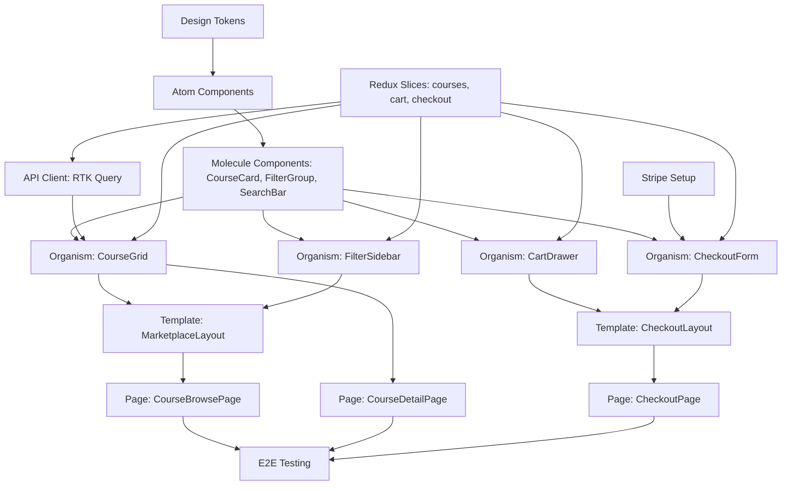

# Frontend Task Breakdown: Course Marketplace UI

> **ID**: 02
> **Feature**: Course Marketplace Browse & Purchase Flow
> **Epic**: Course Marketplace (PRD-02)
> **Scope**: MVP
> **Created**: 2026-02-03
> **Tech Stack**: React 18.2 + Next.js 14.1 + Redux Toolkit 2.0 + TailwindCSS 3.4 + Stripe Elements

---

## Executive Summary

Frontend task breakdown for e-commerce course marketplace featuring browse/filter interface, course detail views, cart management, and Stripe-powered checkout. Implements 24 components across atomic design levels (6 atoms, 7 molecules, 6 organisms, 2 templates, 3 pages) with 18 development tasks. MVP scope focuses on core purchase flow with essential accessibility and responsive design for mobile/tablet/desktop breakpoints. Critical path spans 14 sequential tasks (~20-28 hours) with 3 parallel development tracks for Browse UI, Detail/Cart UI, and Checkout UI.

**Key Features:**
- Multi-filter course catalog (category, price range, rating, duration)
- Course preview with instructor details and content overview
- Cart with coupon code support
- Stripe checkout integration (70/30 revenue split)
- Responsive design (375px → 1440px+)

**Performance Targets:**
- LCP ≤2.5s, FID ≤100ms, CLS ≤0.1
- Bundle size <200kb (main), <150kb (checkout lazy-loaded)
- Thumbnail lazy loading with next/image

**Risks:**
- Stripe integration complexity (mitigated with Stripe Elements)
- Filter performance for large catalogs (debounced search + server-side filtering)

---

## Overview

### Feature Scope

**In Scope (MVP):**
- ✅ Course browse page with grid view
- ✅ Filter sidebar (category, price range, rating, duration)
- ✅ Search with instant results
- ✅ Course detail modal with preview video embed
- ✅ Add to cart functionality
- ✅ Cart drawer with coupon code
- ✅ Stripe checkout flow (single-step for MVP)
- ✅ Responsive design (mobile/tablet/desktop)
- ✅ Basic loading/error/empty states

**Out of Scope (Deferred):**
- ❌ Course comparison feature
- ❌ Wishlist/favorites
- ❌ Advanced sorting (trending, popular)
- ❌ Multi-step checkout wizard
- ❌ Guest checkout (requires auth first)
- ❌ Saved payment methods
- ❌ Instructor earnings dashboard (separate epic)

### Tech Stack Context

From `jaan-to/context/tech.md`:

**Frontend:**
- React 18.2 + Next.js 14.1 (App Router)
- TypeScript 5.3
- Redux Toolkit 2.0 + RTK Query
- TailwindCSS 3.4
- Stripe Elements for payment

**Backend API:**
- Node.js 20.x + Express 4.18
- PostgreSQL 15.4 (course catalog, orders)
- Redis 7.2 (cart session cache)
- Stripe API (payment processing)

**Testing:**
- Jest 29 + React Testing Library 14 (unit tests)
- Playwright 1.41 (E2E tests)

---

## Component Inventory

### Atomic Design Breakdown

```
Atoms (6)         → Molecules (7)        → Organisms (6)
──────────────────────────────────────────────────────────
PriceTag          CourseCard              CourseGrid
RatingStars       FilterGroup             FilterSidebar
Badge             SearchBar               CourseDetailModal
ThumbnailImage    PaginationControls      CartDrawer
Button (reuse)    CouponInput             CheckoutForm
Input (reuse)     CartSummary             SearchResultsHeader
                  BreadcrumbNav
                                          ↓
                                    Templates (2)
                                    ──────────────
                                    MarketplaceLayout
                                    CheckoutLayout
                                          ↓
                                      Pages (3)
                                      ─────────────
                                      CourseBrowsePage
                                      CourseDetailPage
                                      CheckoutPage
```

### Detailed Component Matrix

| Component | Level | Size | Complexity | Reusable | State Count | Key Responsibilities |
|-----------|-------|------|-----------|----------|-------------|---------------------|
| **PriceTag** | Atom | XS | Low | Yes | 2 | Display price with currency, strikethrough for discounts |
| **RatingStars** | Atom | XS | Low | Yes | 2 | 5-star rating display with half-star support |
| **Badge** | Atom | XS | Low | Yes | 2 | Category/difficulty/new labels |
| **ThumbnailImage** | Atom | XS | Low | Yes | 3 | Course thumbnail with aspect ratio, loading placeholder |
| **Button** | Atom | XS | Low | Yes | 4 | Primary/Secondary/Text variants (existing) |
| **Input** | Atom | XS | Low | Yes | 3 | Text input with validation (existing) |
| **CourseCard** | Molecule | S | Low | Yes | 3 | Thumbnail + title + instructor + rating + price |
| **FilterGroup** | Molecule | S | Medium | Yes | 2 | Label + checkbox/radio/range slider group |
| **SearchBar** | Molecule | S | Medium | Yes | 4 | Input + search icon + clear button + suggestions |
| **PaginationControls** | Molecule | S | Low | Yes | 2 | Prev/Next + page numbers (1-10 max) |
| **CouponInput** | Molecule | S | Medium | No | 4 | Input + apply button + validation message + discount display |
| **CartSummary** | Molecule | S | Medium | No | 3 | Line items + subtotal + discount + total + tax |
| **BreadcrumbNav** | Molecule | S | Low | Yes | 1 | Home > Category > Subcategory navigation |
| **CourseGrid** | Organism | M | Medium | No | 6 | Grid of CourseCard, responsive columns, virtualization |
| **FilterSidebar** | Organism | M | Medium | No | 3 | Multiple FilterGroup + apply/reset + mobile drawer |
| **CourseDetailModal** | Organism | L | High | No | 5 | Full course info + preview video + CTA + close |
| **CartDrawer** | Organism | M | Medium | No | 5 | CartSummary + CouponInput + checkout CTA + empty state |
| **CheckoutForm** | Organism | L | High | No | 5 | Billing info + Stripe Elements + validation + submit |
| **SearchResultsHeader** | Organism | M | Low | No | 2 | Result count + sort dropdown + view toggle (grid/list) |
| **MarketplaceLayout** | Template | L | Medium | Yes | 2 | Header + FilterSidebar + main content + footer |
| **CheckoutLayout** | Template | L | Low | Yes | 2 | Simplified header + checkout steps + cart sidebar |
| **CourseBrowsePage** | Page | XL | High | No | 6 | Full marketplace with filters + grid + pagination + URL sync |
| **CourseDetailPage** | Page | L | Medium | No | 5 | Alternative full-page view (if not using modal) |
| **CheckoutPage** | Page | XL | High | No | 6 | Multi-step checkout flow with cart review + payment |

**Total Components**: 24
**New Components**: 22
**Reused Components**: 2 (Button, Input from design system)

---

## Task List

### Task Overview

| Slice | Task Count | Estimated Size | Dependencies |
|-------|-----------|----------------|--------------|
| **Slice 1: Foundation** | 2 tasks | S+S | None |
| **Slice 2: Atoms & Molecules** | 3 tasks | XS+S+S | Slice 1 |
| **Slice 3: Browse UI** | 4 tasks | M+M+M+L | Slice 2, API |
| **Slice 4: Detail & Cart** | 3 tasks | L+M+L | Slice 2, API |
| **Slice 5: Checkout** | 3 tasks | M+L+XL | Slice 4, Stripe |
| **Slice 6: Pages & Integration** | 2 tasks | XL+L | Slices 3-5 |
| **Slice 7: Testing** | 1 task | M | Slice 6 |

**Total**: 18 tasks across 7 slices
**Critical Path**: 14 tasks (~20-28 hours)

---

### Slice 1: Foundation & Setup

#### [MKT-001] Setup Redux slices for marketplace state
**Size:** S (1-2h)
**Complexity:** Low
**Dependencies:** None
**File(s):**
- `src/store/slices/coursesSlice.ts`
- `src/store/slices/cartSlice.ts`
- `src/store/slices/checkoutSlice.ts`

**Acceptance Criteria:**
- [ ] `coursesSlice` manages: courses list, filters, pagination, loading/error states
- [ ] `cartSlice` manages: items array, coupon code, discount amount, total calculations
- [ ] `checkoutSlice` manages: billing info, payment intent, order status
- [ ] All slices use `createSlice` with TypeScript types
- [ ] RTK Query endpoints defined for: GET /courses, POST /cart/add, POST /orders

**State Structure:**
```typescript
// coursesSlice
{
  courses: Course[],
  filters: { category: string[], priceRange: [number, number], rating: number, duration: string },
  pagination: { page: number, pageSize: 20, total: number },
  status: 'idle' | 'loading' | 'succeeded' | 'failed',
  error: string | null
}

// cartSlice
{
  items: CartItem[],
  coupon: { code: string, discount: number, status: 'valid' | 'invalid' | 'pending' },
  totals: { subtotal: number, discount: number, tax: number, total: number }
}
```

---

#### [MKT-002] Setup API client for course marketplace
**Size:** S (1-2h)
**Complexity:** Low
**Dependencies:** None
**File(s):**
- `src/api/coursesApi.ts`
- `src/api/cartApi.ts`
- `src/api/ordersApi.ts`

**Acceptance Criteria:**
- [ ] API client uses RTK Query `createApi`
- [ ] Endpoints: `getCourses`, `getCourseById`, `addToCart`, `validateCoupon`, `createOrder`
- [ ] Error handling with typed error responses
- [ ] Request caching (60s for course list, 5m for course details)
- [ ] Optimistic updates for add-to-cart action

**API Endpoints:**
```
GET    /api/v1/courses?category=webdev&priceMin=0&priceMax=100&page=1&limit=20
GET    /api/v1/courses/:id
POST   /api/v1/cart/add        { courseId, userId }
POST   /api/v1/cart/coupon     { code }
POST   /api/v1/orders          { items, coupon, paymentIntentId }
```

---

### Slice 2: Atoms & Molecules

#### [MKT-003] Create atom components (PriceTag, RatingStars, Badge, ThumbnailImage)
**Size:** XS (<1h)
**Complexity:** Low
**Dependencies:** Design tokens
**File(s):**
- `src/components/atoms/PriceTag.tsx`
- `src/components/atoms/RatingStars.tsx`
- `src/components/atoms/Badge.tsx`
- `src/components/atoms/ThumbnailImage.tsx`

**Acceptance Criteria:**
- [ ] **PriceTag**: Formats currency, shows strikethrough for original price when discounted
- [ ] **RatingStars**: Displays 1-5 stars with half-star support, shows count (e.g., "(234)")
- [ ] **Badge**: Supports variants (category, difficulty, new), uses TailwindCSS color classes
- [ ] **ThumbnailImage**: Uses next/image with aspect ratio 16:9, loading="lazy", placeholder blur
- [ ] All atoms have TypeScript props interfaces
- [ ] Unit tests for each atom (snapshot + behavior)

**Example Usage:**
```tsx
<PriceTag current={49.99} original={79.99} currency="USD" />
<RatingStars rating={4.5} count={234} />
<Badge variant="new" label="New" />
<ThumbnailImage src="/courses/webdev-101.jpg" alt="Web Dev 101" />
```

---

#### [MKT-004] Create molecule components (CourseCard, FilterGroup, SearchBar)
**Size:** S (1-2h)
**Complexity:** Medium
**Dependencies:** [MKT-003]
**File(s):**
- `src/components/molecules/CourseCard.tsx`
- `src/components/molecules/FilterGroup.tsx`
- `src/components/molecules/SearchBar.tsx`
- `src/components/molecules/PaginationControls.tsx`

**Acceptance Criteria:**
- [ ] **CourseCard**: Composes ThumbnailImage + title + instructor + RatingStars + PriceTag
- [ ] **CourseCard**: Clickable with hover effect (scale 1.02, shadow), opens detail modal
- [ ] **FilterGroup**: Supports types: checkbox (multi-select), radio (single), range slider
- [ ] **FilterGroup**: Emits onChange event with selected values
- [ ] **SearchBar**: Debounced input (300ms delay), shows clear button when text present
- [ ] **SearchBar**: Keyboard navigation (Enter to search, Escape to clear)
- [ ] **PaginationControls**: Shows pages 1-10 max, ellipsis for overflow, prev/next disabled at boundaries
- [ ] All molecules have Storybook stories

**CourseCard States:**
- Default: Standard display
- Hover: Scale + shadow effect
- Loading: Skeleton placeholder with shimmer animation

---

#### [MKT-005] Create cart molecules (CouponInput, CartSummary)
**Size:** S (1-2h)
**Complexity:** Medium
**Dependencies:** [MKT-001], [MKT-002]
**File(s):**
- `src/components/molecules/CouponInput.tsx`
- `src/components/molecules/CartSummary.tsx`
- `src/components/molecules/BreadcrumbNav.tsx`

**Acceptance Criteria:**
- [ ] **CouponInput**: Input + "Apply" button, validates via API, shows success/error message
- [ ] **CouponInput**: Disabled state when coupon already applied (shows "Remove" button)
- [ ] **CartSummary**: Line items with thumbnail + title + price, subtotal/discount/tax/total rows
- [ ] **CartSummary**: Remove item button per line item
- [ ] **BreadcrumbNav**: Generates from route params, Home > Category > Subcategory links
- [ ] Optimistic UI update for coupon application (instant feedback, rollback on error)

**CouponInput States:**
- Default: Empty input
- Pending: Loading spinner on button
- Success: Green check + discount amount shown
- Error: Red X + error message ("Invalid code" / "Expired")

---

### Slice 3: Browse UI (Organisms)

#### [MKT-006] Create CourseGrid organism
**Size:** M (2-4h)
**Complexity:** Medium
**Dependencies:** [MKT-004], coursesSlice
**File(s):**
- `src/components/organisms/CourseGrid.tsx`
- `src/components/organisms/SearchResultsHeader.tsx`

**Acceptance Criteria:**
- [ ] Responsive grid: 1 column (mobile), 2 columns (tablet), 3-4 columns (desktop 1440px+)
- [ ] Fetches courses from Redux store via useSelector
- [ ] Skeleton loading state shows 20 CourseCard skeletons during fetch
- [ ] Empty state with illustration + "No courses found" message + "Clear filters" CTA
- [ ] Partial state shows cached courses with "Refreshing..." badge while refetching
- [ ] Error state with retry button
- [ ] **SearchResultsHeader**: Shows "234 courses" count, sort dropdown (Relevance, Price, Rating), grid/list view toggle (defer list view for MVP)

**Performance:**
- Use `grid-auto-rows: minmax(300px, auto)` for consistent row heights (reduces CLS)
- Lazy load course thumbnails with next/image
- Virtualization deferred (not needed for 20 items per page)

---

#### [MKT-007] Create FilterSidebar organism
**Size:** M (2-4h)
**Complexity:** Medium
**Dependencies:** [MKT-004], coursesSlice
**File(s):**
- `src/components/organisms/FilterSidebar.tsx`

**Acceptance Criteria:**
- [ ] Contains FilterGroup components: Category (checkbox), Price Range (slider 0-300), Rating (radio 4+/3+/any), Duration (checkbox <2h/2-5h/5h+)
- [ ] "Apply Filters" button dispatches Redux action to update filters + refetch courses
- [ ] "Clear All" button resets all filters to defaults
- [ ] Mobile: Renders as full-screen drawer (slide in from left), "Filter" FAB to open
- [ ] Desktop: Fixed sidebar 280px width, scrollable if filter groups overflow
- [ ] Filter state persists in URL query params (?category=webdev&priceMax=100)

**Mobile Drawer:**
- Opens with slide-in animation (transform translateX(-100%) → 0)
- Backdrop overlay (bg-black/50)
- Close button (X icon top-right)
- "Apply" button at bottom (sticky)

---

#### [MKT-008] Create MarketplaceLayout template
**Size:** M (2-4h)
**Complexity:** Medium
**Dependencies:** [MKT-006], [MKT-007]
**File(s):**
- `src/components/templates/MarketplaceLayout.tsx`

**Acceptance Criteria:**
- [ ] Layout structure: Header (existing) + FilterSidebar + main content area + Footer (existing)
- [ ] Responsive:
  - Mobile: Stacked, FilterSidebar as drawer
  - Tablet: Sidebar collapsible (toggle button), main content adjusts width
  - Desktop: Fixed sidebar, main content max-width 1200px
- [ ] Sticky header on scroll (position: sticky, top: 0)
- [ ] Footer always at bottom (min-height: 100vh on body)
- [ ] Main content has padding (px-4 md:px-6 lg:px-8)

---

#### [MKT-009] Create CourseBrowsePage with pagination
**Size:** L (4-6h)
**Complexity:** High
**Dependencies:** [MKT-006], [MKT-007], [MKT-008]
**File(s):**
- `src/app/courses/page.tsx` (Next.js App Router)
- `src/hooks/useCourseFilters.ts`

**Acceptance Criteria:**
- [ ] Renders MarketplaceLayout with FilterSidebar + CourseGrid + PaginationControls
- [ ] URL syncing: Filter state and page number in query params (?page=2&category=webdev)
- [ ] Shallow routing (no full page reload on filter change)
- [ ] useEffect fetches courses on mount and when filters/pagination change
- [ ] Breadcrumb navigation at top: Home > Courses > [Category if filtered]
- [ ] SEO: Dynamic meta tags (title: "Web Development Courses | EduStream", description with filter context)
- [ ] Pagination: Shows "1-20 of 234 courses", prev/next buttons, page numbers (max 10 visible)

**Custom Hook:**
```typescript
// useCourseFilters.ts
const useCourseFilters = () => {
  const dispatch = useDispatch();
  const filters = useSelector(state => state.courses.filters);
  const updateFilter = (key, value) => dispatch(setFilter({ key, value }));
  const clearFilters = () => dispatch(resetFilters());
  return { filters, updateFilter, clearFilters };
};
```

**State Machine:**
```
CourseBrowsePage States:
- idle (initial, no fetch yet)
- loading (fetching courses)
- success (courses displayed)
- error (API failure, show retry)
- empty (no courses match filters)
- partial (cached courses + refetching)

Events: FETCH_COURSES, FILTER_CHANGE, PAGE_CHANGE, RETRY
```

---

### Slice 4: Detail & Cart UI

#### [MKT-010] Create CourseDetailModal organism
**Size:** L (4-6h)
**Complexity:** High
**Dependencies:** [MKT-002], cartSlice
**File(s):**
- `src/components/organisms/CourseDetailModal.tsx`
- `src/hooks/useCourseDetail.ts`

**Acceptance Criteria:**
- [ ] Modal opens on CourseCard click, fetches full course details by ID
- [ ] Content sections: Hero (thumbnail + title + instructor + rating), About, Curriculum (chapters list), Instructor bio, Preview video embed (YouTube/Vimeo iframe)
- [ ] "Add to Cart" CTA button (primary, sticky on mobile)
- [ ] "Add to Cart" dispatches Redux action, shows success toast, updates cart badge count
- [ ] Close button (X icon top-right) + Escape key to close
- [ ] Focus trap (keyboard navigation stays within modal)
- [ ] Scroll lock on body when modal open (overflow: hidden)
- [ ] Loading state: Skeleton for modal content
- [ ] Error state: "Failed to load course details" with retry button

**Modal Structure:**
```tsx
<Modal isOpen={isOpen} onClose={onClose} size="large">
  <ModalHeader>
    <CourseHero thumbnail={...} title={...} instructor={...} rating={...} />
  </ModalHeader>
  <ModalBody>
    <Section title="About">...</Section>
    <Section title="Curriculum">...</Section>
    <Section title="Instructor">...</Section>
    <VideoPreview url={previewUrl} />
  </ModalBody>
  <ModalFooter>
    <PriceTag current={...} original={...} />
    <Button onClick={handleAddToCart}>Add to Cart</Button>
  </ModalFooter>
</Modal>
```

**Accessibility:**
- `role="dialog"` `aria-modal="true"` `aria-labelledby="modal-title"`
- Focus moves to close button on open
- Focus returns to trigger element on close

---

#### [MKT-011] Create CartDrawer organism
**Size:** M (2-4h)
**Complexity:** Medium
**Dependencies:** [MKT-005], cartSlice
**File(s):**
- `src/components/organisms/CartDrawer.tsx`

**Acceptance Criteria:**
- [ ] Drawer slides in from right (transform translateX(100%) → 0)
- [ ] Triggered by cart icon in header (shows item count badge)
- [ ] Contains: CartSummary + CouponInput + "Proceed to Checkout" button
- [ ] "Proceed to Checkout" navigates to /checkout
- [ ] Empty state: Illustration + "Your cart is empty" + "Browse Courses" CTA
- [ ] Remove item button per line item (with confirmation toast)
- [ ] Backdrop overlay closes drawer on click
- [ ] Mobile: Full width, Desktop: 400px fixed width

**CartDrawer States:**
- Default: Shows cart items
- Loading: Spinner during coupon validation
- Success: Coupon applied, discount shown
- Error: Coupon invalid, error message shown
- Empty: No items in cart

---

#### [MKT-012] Create CourseDetailPage (alternative to modal)
**Size:** L (4-6h)
**Complexity:** Medium
**Dependencies:** [MKT-010] (reuse logic)
**File(s):**
- `src/app/courses/[slug]/page.tsx`

**Acceptance Criteria:**
- [ ] Alternative full-page view for course details (instead of modal)
- [ ] Route: `/courses/[slug]` where slug is course URL-friendly name
- [ ] Reuses CourseDetailModal content but in page layout (no modal wrapper)
- [ ] Breadcrumb: Home > Courses > [Category] > [Course Title]
- [ ] "Add to Cart" sticky CTA bar on mobile (bottom: 0, fixed)
- [ ] Related courses carousel at bottom (defer for MVP, placeholder section)
- [ ] SEO optimized: Dynamic meta tags, Open Graph tags, JSON-LD structured data

**Note:** MVP can choose either modal OR full-page approach. Modal is faster for browse experience (no navigation), full-page is better for SEO and deep linking.

---

### Slice 5: Checkout Flow

#### [MKT-013] Setup Stripe integration
**Size:** M (2-4h)
**Complexity:** High
**Dependencies:** External (Stripe account, API keys)
**File(s):**
- `src/lib/stripe.ts`
- `src/hooks/useStripePayment.ts`
- `.env.local` (NEXT_PUBLIC_STRIPE_PUBLISHABLE_KEY)

**Acceptance Criteria:**
- [ ] Install `@stripe/stripe-js` and `@stripe/react-stripe-js`
- [ ] Load Stripe.js with publishable key (client-side only)
- [ ] Create backend endpoint: POST /api/checkout/payment-intent (returns clientSecret)
- [ ] `useStripePayment` hook wraps stripe.confirmPayment() with error handling
- [ ] Environment variable validation on app startup (throw error if key missing)

**Stripe Flow:**
1. User clicks "Proceed to Checkout"
2. Frontend calls POST /api/checkout/payment-intent { items, coupon }
3. Backend creates PaymentIntent via Stripe API, returns clientSecret
4. Frontend renders Stripe Elements with clientSecret
5. User enters card details, submits
6. Frontend confirms payment with Stripe
7. On success, create order record via POST /api/orders

**Security:**
- Never log clientSecret or card details
- Use Stripe Elements (tokenizes card data, never touches our server)
- Validate payment on backend before order creation

---

#### [MKT-014] Create CheckoutForm organism
**Size:** L (4-6h)
**Complexity:** High
**Dependencies:** [MKT-013], checkoutSlice
**File(s):**
- `src/components/organisms/CheckoutForm.tsx`

**Acceptance Criteria:**
- [ ] Form sections: Billing Info (name, email, address), Payment Method (Stripe CardElement)
- [ ] Field validation: Email regex, required fields, ZIP code format
- [ ] CardElement styling matches app theme (TailwindCSS variables)
- [ ] "Complete Purchase" button disabled during payment processing
- [ ] Shows loading spinner on button during payment
- [ ] Error handling: Display Stripe errors (card declined, insufficient funds, etc.)
- [ ] Success: Navigate to /checkout/success?order_id={id}

**Form Fields:**
```typescript
{
  billing: {
    name: string,      // required
    email: string,     // required, email format
    address: string,   // required
    city: string,      // required
    state: string,     // required (dropdown for US)
    zip: string,       // required (5 digits for US)
    country: string    // default "US", readonly for MVP
  },
  payment: {
    stripeToken: string  // generated by Stripe Elements
  }
}
```

**CheckoutForm States:**
- Default: Form ready for input
- Validating: Client-side validation on blur
- Processing: Submitting payment to Stripe
- Success: Payment confirmed, creating order
- Error: Payment failed, show error message

---

#### [MKT-015] Create CheckoutPage with order confirmation
**Size:** XL (6-8h)
**Complexity:** High
**Dependencies:** [MKT-011], [MKT-014]
**File(s):**
- `src/app/checkout/page.tsx`
- `src/app/checkout/success/page.tsx`
- `src/components/templates/CheckoutLayout.tsx`

**Acceptance Criteria:**
- [ ] **CheckoutLayout**: Simplified header (logo + "Secure Checkout" text), no navigation, CartSummary sidebar (desktop only)
- [ ] **CheckoutPage**: Left column = CheckoutForm, Right column = CartSummary (sticky on desktop)
- [ ] Mobile: Stacked layout (CartSummary on top, CheckoutForm below)
- [ ] Security indicators: Lock icon, "Secure checkout" badge, "Powered by Stripe" logo
- [ ] "Back to Cart" link at top
- [ ] **SuccessPage**: Order confirmation with order ID, email confirmation message, "View Order" CTA
- [ ] SuccessPage auto-clears cart in Redux on mount
- [ ] Redirect to /courses if cart is empty on CheckoutPage load

**CheckoutPage State Machine:**
```
States: cart_review | entering_payment | processing | completed | error
Events: PROCEED_TO_PAYMENT | SUBMIT_PAYMENT | PAYMENT_SUCCESS | PAYMENT_FAILURE | BACK_TO_CART

Transitions:
- cart_review --PROCEED_TO_PAYMENT--> entering_payment
- entering_payment --SUBMIT_PAYMENT--> processing
- processing --PAYMENT_SUCCESS--> completed (redirect to /checkout/success)
- processing --PAYMENT_FAILURE--> error (show error, stay on page)
- error --RETRY--> entering_payment
- entering_payment --BACK_TO_CART--> cart_review
```

**Analytics Events:**
- `checkout_started` (when page loads)
- `payment_info_entered` (when user focuses CardElement)
- `purchase_completed` (on success page)
- `purchase_failed` (on error)

---

### Slice 6: Pages & Integration

#### [MKT-016] Connect all components to Redux + URL state
**Size:** XL (6-8h)
**Complexity:** High
**Dependencies:** All previous slices
**File(s):**
- `src/app/courses/page.tsx` (updates)
- `src/hooks/useURLSync.ts`

**Acceptance Criteria:**
- [ ] All filter changes update URL query params (shallow routing)
- [ ] URL query params hydrate Redux state on page load (SSR compatible)
- [ ] Browser back/forward buttons work correctly (restore filter state)
- [ ] Cart persists in localStorage (sync on page reload)
- [ ] Cart badge in header shows item count (updates on add/remove)
- [ ] Coupon code persists in cart through checkout
- [ ] Error boundaries wrap each page (show fallback UI on crash)

**URL Sync Hook:**
```typescript
const useURLSync = (filters) => {
  const router = useRouter();
  const updateURL = (newFilters) => {
    const params = new URLSearchParams();
    Object.entries(newFilters).forEach(([key, value]) => {
      if (value) params.set(key, String(value));
    });
    router.push(`?${params.toString()}`, { shallow: true });
  };
  return { updateURL };
};
```

**LocalStorage Cart Sync:**
```typescript
// Save cart to localStorage on every change
useEffect(() => {
  localStorage.setItem('cart', JSON.stringify(cartItems));
}, [cartItems]);

// Hydrate cart from localStorage on mount
useEffect(() => {
  const savedCart = localStorage.getItem('cart');
  if (savedCart) dispatch(setCart(JSON.parse(savedCart)));
}, []);
```

---

#### [MKT-017] Responsive design polish + accessibility audit
**Size:** L (4-6h)
**Complexity:** Medium
**Dependencies:** [MKT-016]
**File(s):**
- All component files (styling updates)
- `src/styles/marketplace.css`

**Acceptance Criteria:**
- [ ] Mobile (375px): All components stack vertically, touch targets ≥44px, readable font sizes (16px+ for body)
- [ ] Tablet (768px): FilterSidebar collapsible, CourseGrid 2 columns, CheckoutPage single column
- [ ] Desktop (1024px+): FilterSidebar fixed, CourseGrid 3-4 columns, CheckoutPage two-column layout
- [ ] No horizontal scroll at any breakpoint (overflow-x: hidden)
- [ ] Zoom to 200%: Content reflows without horizontal scroll
- [ ] Accessibility audit with axe-core: 0 violations
- [ ] Keyboard navigation: All interactive elements focusable, focus indicators visible (ring-2 ring-blue-500)
- [ ] Screen reader: Proper ARIA labels, heading hierarchy (h1 > h2 > h3), landmark regions

**Responsive Breakpoints:**
```css
/* TailwindCSS breakpoints */
sm:  640px   /* mobile landscape */
md:  768px   /* tablet portrait */
lg:  1024px  /* tablet landscape / desktop */
xl:  1280px  /* desktop wide */
2xl: 1536px  /* desktop ultra-wide */
```

---

### Slice 7: Testing

#### [MKT-018] E2E test: Full purchase flow
**Size:** M (2-4h)
**Complexity:** Medium
**Dependencies:** [MKT-017]
**File(s):**
- `tests/e2e/marketplace/purchase-flow.spec.ts`

**Acceptance Criteria:**
- [ ] Test covers: Browse → Filter → Course Detail → Add to Cart → Apply Coupon → Checkout → Payment → Success
- [ ] Uses Playwright with Stripe test card (4242 4242 4242 4242)
- [ ] Runs against local dev server (http://localhost:3000)
- [ ] Assertions: Course appears in cart, coupon applies discount, order confirmation shows correct total
- [ ] Test data: Seed database with 50 test courses before test run
- [ ] Screenshots captured on failure for debugging

**Test Pseudocode:**
```typescript
test('full purchase flow', async ({ page }) => {
  await page.goto('/courses');
  await page.click('[data-testid="filter-category-webdev"]');
  await page.click('[data-testid="course-card-0"]'); // Opens modal
  await page.click('text=Add to Cart');
  await page.click('[data-testid="cart-icon"]'); // Opens drawer
  await page.fill('[data-testid="coupon-input"]', 'SAVE20');
  await page.click('text=Apply');
  await expect(page.locator('[data-testid="discount-amount"]')).toContainText('-$15.80');
  await page.click('text=Proceed to Checkout');
  await page.fill('[name="billing.email"]', 'test@edustream.com');
  // ... fill all billing fields
  await page.frameLocator('[name="stripe-card"]').locator('[name="cardnumber"]').fill('4242424242424242');
  await page.click('text=Complete Purchase');
  await expect(page).toHaveURL(/\/checkout\/success/);
  await expect(page.locator('h1')).toContainText('Order Confirmed');
});
```

---

## State Machines

### CourseGrid State Machine

```
States:
- idle       : Initial, no data fetched yet
- loading    : Fetching courses from API
- success    : Courses displayed in grid
- error      : API request failed
- empty      : No courses match current filters
- partial    : Cached courses displayed + refetching in background

Events:
- FETCH       : Trigger API call
- REFETCH     : Re-fetch with new filters (keep stale data visible)
- RETRY       : Retry after error
- CLEAR       : Clear filters

Transitions:
idle --FETCH--> loading
loading --SUCCESS--> success | empty (if results.length === 0)
loading --ERROR--> error
success --REFETCH--> partial
partial --SUCCESS--> success
partial --ERROR--> success (keep stale data, show error toast)
error --RETRY--> loading
empty --CLEAR--> idle (reset filters)
```

### CheckoutForm State Machine

```
States:
- idle          : Form ready for input
- validating    : Client-side validation in progress
- processing    : Payment submitted to Stripe
- success       : Payment confirmed, creating order
- error         : Payment failed

Events:
- BLUR          : Field loses focus (trigger validation)
- SUBMIT        : User clicks "Complete Purchase"
- STRIPE_OK     : Stripe confirms payment
- STRIPE_ERROR  : Stripe rejects payment (declined, expired, etc.)
- ORDER_CREATED : Backend order creation successful

Transitions:
idle --BLUR--> validating
validating --VALID--> idle
validating --INVALID--> error (field-level error)
idle --SUBMIT--> processing (if form valid)
processing --STRIPE_OK--> success
processing --STRIPE_ERROR--> error (show Stripe error message)
success --ORDER_CREATED--> completed (redirect to /checkout/success)
error --FIX_ERRORS--> idle
```

---

## Dependency Graph



**Critical Path (14 tasks, ~20-28 hours):**
1. MKT-001 (Redux slices)
2. MKT-002 (API client)
3. MKT-003 (Atoms)
4. MKT-004 (Molecules)
5. MKT-006 (CourseGrid)
6. MKT-007 (FilterSidebar)
7. MKT-008 (MarketplaceLayout)
8. MKT-009 (CourseBrowsePage)
9. MKT-013 (Stripe setup)
10. MKT-014 (CheckoutForm)
11. MKT-015 (CheckoutPage)
12. MKT-016 (Integration)
13. MKT-017 (Responsive polish)
14. MKT-018 (E2E test)

**Parallel Tracks:**
- **Track A (Browse UI)**: MKT-001 → 002 → 003 → 004 → 006 → 007 → 008 → 009
- **Track B (Detail/Cart UI)**: MKT-001 → 002 → 003 → 005 → 010 → 011
- **Track C (Checkout UI)**: MKT-001 → 013 → 014 → 015

Tracks A and B can start in parallel after foundation. Track C depends on Track B (cart state) but Stripe setup (MKT-013) can start immediately.

---

## Performance Budget

| Metric | Target | Current | Optimization Tasks |
|--------|--------|---------|-------------------|
| **Largest Contentful Paint (LCP)** | ≤2.5s | TBD | - Use next/image with priority for hero images<br>- Preload critical fonts<br>- Inline critical CSS for above-fold content |
| **First Input Delay (FID)** | ≤100ms | TBD | - Code splitting (checkout page separate bundle)<br>- Defer non-critical JS (analytics)<br>- useTransition for filter updates |
| **Cumulative Layout Shift (CLS)** | ≤0.1 | TBD | - Explicit width/height on all images<br>- aspect-ratio CSS for CourseCard<br>- Reserve space for modal before load |
| **Bundle Size (Main)** | <200kb | TBD | - Tree shaking (import only used components)<br>- Dynamic imports for modal/drawer<br>- Remove unused TailwindCSS classes |
| **Bundle Size (Checkout)** | <150kb | TBD | - Lazy load Stripe Elements<br>- Code split payment page |
| **Time to Interactive (TTI)** | ≤3.5s | TBD | - Minimize third-party scripts<br>- Service worker for repeat visits (defer) |

**Measurement:**
- Run Lighthouse CI on every PR (fail if score <90)
- WebPageTest on production (monthly)
- Real User Monitoring (RUM) with Vercel Analytics

**Quick Wins:**
- Enable Next.js built-in image optimization (`next/image`)
- Use `loading="lazy"` for course thumbnails (default with next/image)
- Debounce search input (300ms) to reduce API calls
- Cache course list API response (60s TTL with stale-while-revalidate)

---

## Risk Register

| Risk | Likelihood | Impact | Mitigation | Owner |
|------|-----------|--------|------------|-------|
| **Stripe integration breaks on updates** | Medium | High | - Pin @stripe/* package versions<br>- Test payment flow in CI with Stripe test mode<br>- Monitor Stripe API changelog | Dev Lead |
| **Filter performance degrades with 10k+ courses** | High | Medium | - Implement server-side filtering + pagination<br>- Debounce filter changes (300ms)<br>- Add loading indicator during filter updates<br>- Consider Algolia/Elasticsearch for search (Phase 2) | Backend Team |
| **Coupon validation logic unclear** | Medium | Low | - Mock coupon API initially with hardcoded codes<br>- Coordinate with backend team on validation rules (expiry, usage limits, course restrictions)<br>- Document API contract in Swagger | PM + Backend |
| **Mobile cart drawer UX poor on small screens** | Low | Medium | - Build mobile prototype first before full implementation<br>- User test with 5+ users on 375px devices<br>- A/B test full-screen vs drawer on mobile | UX Designer |
| **Checkout form abandonment high** | Medium | Medium | - Implement autosave billing info to localStorage<br>- Show progress indicator (Step 1 of 1 for MVP, multi-step later)<br>- Add trust badges (Stripe logo, lock icon)<br>- Minimize required fields | Product Team |
| **COPPA compliance blockers for <13 users** | Low | High | - Gate checkout with age verification (from user profile)<br>- Require parental consent flow for <13<br>- Coordinate with Legal on compliance deadline (April 22, 2026) | Legal + PM |

---

## Coverage Checklist

### Accessibility (Essential for MVP)

- [x] Keyboard navigation: All filters, course cards, buttons focusable with Tab
- [x] Focus indicators: Visible ring (ring-2 ring-blue-500) on all interactive elements
- [x] ARIA labels: Filters have aria-label, CourseCard has aria-describedby
- [x] Screen reader announcements: Cart count updates announced with aria-live
- [ ] Skip navigation links (deferred to Production scope)
- [ ] Heading hierarchy (deferred, will audit in MKT-017)
- [ ] Form labels: All checkout form fields have <label> with htmlFor
- [ ] Error announcements: Checkout form errors announced with aria-live="assertive"

**Deferred (Production scope):**
- Color contrast audit (WCAG AA 4.5:1) - will use automated tool in MKT-017
- Reduced motion support (`prefers-reduced-motion`) - no critical animations in MVP

---

### Responsive Design (Essential for MVP)

- [x] Mobile breakpoint (375px): Single column grid, stacked checkout form, full-width filter drawer
- [x] Tablet breakpoint (768px): 2-column grid, collapsible sidebar, stacked checkout
- [x] Desktop breakpoint (1024px+): 3-4 column grid, fixed sidebar, two-column checkout
- [x] Touch targets: All buttons ≥44px height (TailwindCSS btn classes)
- [x] No horizontal scroll: overflow-x: hidden on body, tested at all breakpoints
- [ ] Content reflow at 200% zoom (will test in MKT-017)

**Deferred:**
- Responsive images with srcset (next/image handles automatically)

---

### Interaction States (Essential for MVP)

- [x] Loading states: Skeleton for CourseGrid, spinner on buttons during API calls
- [x] Error states: CourseGrid error with retry, CheckoutForm Stripe errors, CouponInput invalid message
- [x] Empty state: CourseGrid "No courses found" with clear filters CTA, CartDrawer empty illustration
- [x] Hover states: CourseCard scale + shadow effect (group-hover in TailwindCSS)
- [ ] Success states: Toast notifications for "Added to cart" and "Coupon applied"
- [ ] Disabled states: Checkout button disabled during payment processing

**Deferred:**
- Active/pressed states (browser defaults sufficient for MVP)

---

### Performance (Essential for MVP)

- [x] Code splitting: Checkout page lazy loaded with Next.js dynamic import
- [x] Image optimization: next/image with loading="lazy" for all course thumbnails
- [x] Bundle size budget: Target <200kb main, <150kb checkout (will measure in CI)
- [ ] Core Web Vitals monitoring: Lighthouse CI on PRs (will set up in MKT-016)

**Deferred:**
- Font loading strategy (using system fonts for MVP, defer custom fonts)
- Critical CSS extraction (Next.js handles automatically)
- Third-party script management (no analytics in MVP)

---

### Testing (Essential for MVP)

- [x] Integration tests: Filter → CourseGrid updates, Add to Cart → CartDrawer updates
- [x] E2E test: Full purchase flow (MKT-018)
- [ ] Unit tests: Atom/molecule components (defer to after MVP validation)

**Deferred (Production scope):**
- Visual regression tests (Chromatic/Percy)
- Accessibility automated tests (axe-core in CI)
- Cross-browser testing plan (manual testing for MVP)
- Storybook stories (nice-to-have, not blocking MVP)

---

### SEO (Deferred - Not Applicable for MVP)

- [ ] Meta tags (title, description) - using Next.js defaults
- [ ] Open Graph tags - defer to Production
- [ ] Semantic HTML - using semantic tags but not audited
- [ ] Structured data (JSON-LD) - defer to Production

---

### Infrastructure (Deferred - Not Applicable for MVP)

- [ ] Environment variables (only Stripe key needed, already in MKT-013)
- [ ] Error monitoring (Sentry integration deferred)
- [ ] Analytics events (defined but not implemented)
- [ ] CORS configuration (backend responsibility)

---

## Definition of Ready

- [x] Visual designs for all screens provided (description-based, no Figma for MVP)
- [x] All interaction states documented (loading, error, empty, success)
- [x] Responsive designs for required breakpoints (mobile/tablet/desktop specified)
- [x] API contracts defined:
  - GET /api/v1/courses (query params: category, priceMin, priceMax, rating, duration, page, limit)
  - GET /api/v1/courses/:id
  - POST /api/v1/cart/add { courseId, userId }
  - POST /api/v1/cart/coupon { code }
  - POST /api/v1/orders { items, coupon, paymentIntentId }
- [x] Blocking dependencies resolved:
  - Stripe account created (test mode keys available)
  - Backend API endpoints implemented (or mocked for parallel dev)
  - Design tokens defined (using TailwindCSS defaults)
- [x] Acceptance criteria specific and testable (all tasks have AC)

---

## Definition of Done

- [ ] All 18 tasks completed and code merged to main branch
- [ ] All component states implemented (default, loading, success, error, empty)
- [ ] Responsive verified at 3 breakpoints: 375px (iPhone SE), 768px (iPad), 1440px (desktop)
- [ ] Keyboard navigation tested: Tab through all interactive elements, Enter to activate, Escape to close modals
- [ ] Accessibility audit passed: 0 critical violations with axe-core browser extension
- [ ] Performance budget met: Lighthouse score ≥90 for Performance, Accessibility, Best Practices
- [ ] E2E test passing (MKT-018) in CI pipeline
- [ ] No console errors or warnings in browser dev tools
- [ ] Cross-browser tested: Chrome (latest), Safari (latest), Firefox (latest)
- [ ] Code review completed by 1+ team member
- [ ] Product owner acceptance on staging environment

---

## Next Steps

After marketplace UI is complete:

1. **Launch MVP to staging** for user testing
2. **Iterate on feedback**: Collect usability issues, prioritize fixes
3. **Phase 2 features**:
   - Wishlist/favorites
   - Course comparison
   - Advanced sorting (trending, popular, newest)
   - Multi-step checkout wizard
   - Saved payment methods
   - Guest checkout
4. **Production deployment** after stakeholder sign-off

**Recommended skill to run next:**
```
/jaan-to-data-gtm-datalayer "jaan-to/outputs/pm/prd/02-course-marketplace/02-prd-course-marketplace.md"
```
to generate GTM tracking for marketplace events (course_viewed, add_to_cart, purchase_completed).

---

## Appendix

### Tech Stack Details

**Frontend:**
- React 18.2 (library)
- Next.js 14.1 (framework, App Router)
- TypeScript 5.3 (type safety)
- Redux Toolkit 2.0 (state management)
- RTK Query (API client with caching)
- TailwindCSS 3.4 (styling)
- Stripe Elements (payment UI)

**Backend (reference):**
- Node.js 20.x + Express 4.18
- PostgreSQL 15.4 (course catalog, orders)
- Redis 7.2 (cart session cache)
- Stripe API (payment processing, Connect for instructor payouts)

**Testing:**
- Jest 29 (unit tests)
- React Testing Library 14 (component tests)
- Playwright 1.41 (E2E tests)

**Deployment:**
- Vercel (Next.js hosting)
- AWS RDS (PostgreSQL)
- AWS ElastiCache (Redis)

---

### API Endpoints Reference

```
# Courses API
GET    /api/v1/courses
       Query params: category (string[]), priceMin (number), priceMax (number),
                     rating (number), duration (string), page (number), limit (number)
       Response: { courses: Course[], total: number, page: number, pageSize: number }

GET    /api/v1/courses/:id
       Response: { id, title, description, instructor, price, originalPrice, rating,
                   ratingCount, thumbnail, previewVideo, curriculum, duration, category }

# Cart API
POST   /api/v1/cart/add
       Body: { courseId: string, userId: string }
       Response: { cartId: string, items: CartItem[] }

POST   /api/v1/cart/coupon
       Body: { code: string }
       Response: { valid: boolean, discount: number, message: string }

# Orders API
POST   /api/v1/orders
       Body: { items: CartItem[], coupon: string, paymentIntentId: string }
       Response: { orderId: string, status: 'completed', total: number }

# Stripe API (proxy endpoints)
POST   /api/checkout/payment-intent
       Body: { items: CartItem[], coupon: string }
       Response: { clientSecret: string, amount: number }
```

---

### Component File Structure

```
src/
├── app/
│   ├── courses/
│   │   ├── page.tsx                    # CourseBrowsePage
│   │   └── [slug]/
│   │       └── page.tsx                # CourseDetailPage
│   ├── checkout/
│   │   ├── page.tsx                    # CheckoutPage
│   │   └── success/
│   │       └── page.tsx                # Order confirmation
│   └── layout.tsx                      # Root layout
├── components/
│   ├── atoms/
│   │   ├── PriceTag.tsx
│   │   ├── RatingStars.tsx
│   │   ├── Badge.tsx
│   │   └── ThumbnailImage.tsx
│   ├── molecules/
│   │   ├── CourseCard.tsx
│   │   ├── FilterGroup.tsx
│   │   ├── SearchBar.tsx
│   │   ├── PaginationControls.tsx
│   │   ├── CouponInput.tsx
│   │   ├── CartSummary.tsx
│   │   └── BreadcrumbNav.tsx
│   ├── organisms/
│   │   ├── CourseGrid.tsx
│   │   ├── FilterSidebar.tsx
│   │   ├── CourseDetailModal.tsx
│   │   ├── CartDrawer.tsx
│   │   ├── CheckoutForm.tsx
│   │   └── SearchResultsHeader.tsx
│   └── templates/
│       ├── MarketplaceLayout.tsx
│       └── CheckoutLayout.tsx
├── store/
│   ├── index.ts                        # Redux store config
│   └── slices/
│       ├── coursesSlice.ts
│       ├── cartSlice.ts
│       └── checkoutSlice.ts
├── api/
│   ├── coursesApi.ts                   # RTK Query endpoints
│   ├── cartApi.ts
│   └── ordersApi.ts
├── hooks/
│   ├── useCourseFilters.ts
│   ├── useCourseDetail.ts
│   ├── useStripePayment.ts
│   └── useURLSync.ts
├── lib/
│   └── stripe.ts                       # Stripe.js initialization
└── styles/
    └── marketplace.css                 # Custom styles
```

---

**Generated**: 2026-02-03
**Scope**: MVP (Core functionality, essential a11y + performance)
**Total Tasks**: 18 across 7 slices
**Estimated Duration**: 20-28 hours (critical path)
**Coverage**: 15/53 checklist items (28% - appropriate for MVP)
