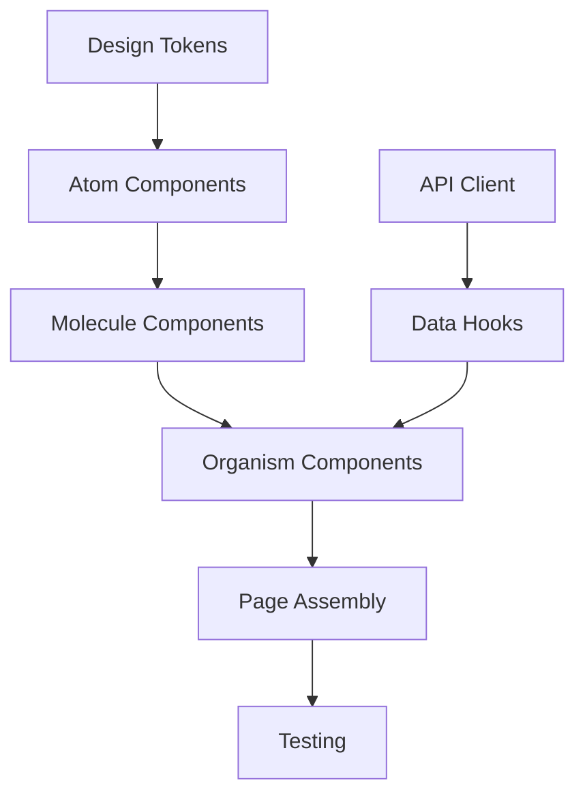

# Frontend Task Breakdown Skill: Complete Framework Research

A UX handoff represents untapped potential—designs filled with implicit states, edge cases, and technical debt waiting to happen. This research establishes a systematic framework for transforming design deliverables into production-ready task breakdowns that eliminate ambiguity, enable parallel work, and prevent the coverage gaps that plague frontend development.

The `dev:fe-task-breakdown` skill addresses a critical gap in frontend workflows: the translation layer between design intent and developer execution. Teams using structured task breakdown methodologies report **up to 60% faster development** through modular component approaches, while those without systematic processes consistently miss loading states, error handling, and accessibility requirements—the invisible work that distinguishes production code from prototypes.

---

## Part I: Industry Standards and Methodologies

### The PMI Work Breakdown Structure foundation

The Project Management Institute's WBS standard provides the theoretical underpinning for task decomposition. The **100% Rule** states that a WBS must capture all deliverables—internal, external, and interim—in terms of work to be completed. For frontend development, this means every component, state, interaction, and test must appear in the breakdown.

PMI distinguishes between **deliverable-oriented** (what we're building) and **phase-oriented** (when we're building it) structures. Frontend task breakdowns benefit from a hybrid: organizing by deliverable (components, features) while sequencing by dependency. The lowest-level WBS items—**work packages**—should be estimable in 3-4 days, matching the ideal frontend task size.

### Modern methodologies that shape frontend task breakdown

**Component-Driven Development (CDD)** anchors the build process around components, starting from atoms and composing upward to pages. Storybook operationalizes CDD by enabling isolated component development, visual testing, and documentation. A CDD task breakdown naturally produces parallelizable work: different developers can build different components simultaneously, merging only when composition begins.

**Atomic Design** (Brad Frost) provides a taxonomy for component complexity that directly maps to task sizing:

| Level | Examples | Typical Task Size |
|-------|----------|-------------------|
| Atoms | Button, Input, Icon | 1-2 hours |
| Molecules | Search form, Form field | 2-4 hours |
| Organisms | Header, Product grid, Footer | 4-8 hours |
| Templates | Page layouts | 1-2 days |
| Pages | Specific instances | 2-3 days |

**Vertical Slice Architecture** (Jimmy Bogard) offers a complementary perspective: "Minimize coupling between slices, maximize coupling within a slice." For frontend, this means a feature like "Add to Cart" contains its own component, hook, and API integration—a complete vertical slice that can be developed, tested, and deployed independently. This pattern excels when features require minimal shared state.

**Shape Up** (Basecamp) challenges traditional task breakdown by arguing against upfront decomposition: "Splitting the project into tasks up front is like putting the pitch through a paper shredder." Instead, teams discover "scopes" during implementation. While unsuitable for client work with fixed timelines, Shape Up's concept of **appetite over estimates** (how much energy does this deserve?) provides useful framing for task prioritization.

**Feature-Sliced Design** represents the 2024-2025 evolution of frontend architecture, organizing code into seven layers: App → Pages → Widgets → Features → Entities → Shared. The key rule—"Modules on one layer can only know about and import from modules strictly below"—translates directly to task dependencies: shared utilities must be built before features that consume them.

---

## Part II: UX Handoff to Task List Transformation

### The five-phase handoff analysis process

Transforming a UX handoff into tasks requires systematic analysis. **Phase 1** involves design review: navigating prototypes to understand flows, checking design system pages for tokens, and enabling Figma's Dev Mode for precise specifications.

**Phase 2** focuses on component identification using atomic design thinking. Walk through each screen asking: What are the smallest reusable elements (atoms)? What combinations appear repeatedly (molecules)? What complex, self-contained sections exist (organisms)?

**Phase 3** enumerates states. For each screen, identify: the default view, what appears during data loading, what success looks like, how errors display, and what empty states show when no data exists. This phase catches **50-70% of commonly missed work**.

**Phase 4** extracts design tokens: colors (primary, secondary, semantic), typography (families, sizes, weights), spacing scales, shadows, and animation specifications. These become infrastructure tasks that unblock component development.

**Phase 5** analyzes API contracts: what data each component needs, which endpoints serve it, expected request/response shapes, and error handling requirements. This phase enables frontend-backend parallel development through mocking.

### Identifying the invisible work not shown in designs

Designs rarely show failure states—yet these consume significant implementation time. A comprehensive implicit task checklist includes:

**Error states**: form validation (inline vs. summary), API failures (500), network connectivity, authentication failures (401/403), session timeouts, rate limiting (429), and not-found states (404).

**Loading states**: initial page load, component-level skeletons, button loading spinners, progress indicators for long operations, optimistic UI updates, background refresh indicators, and infinite scroll loading.

**Empty states**: first-time user (no data yet), search with no results, filtered list with no matches, cleared content, no notifications, and empty cart/wishlist.

**Edge cases**: long text truncation, missing images (fallback placeholders), slow network behavior (3G simulation), very long lists (virtualization needs), maximum character limits, special characters and unicode, and browser back/forward behavior.

### Task hierarchy and naming conventions

The standard agile hierarchy maps to frontend work as:

```
Theme/Initiative (Strategic goal)
  └── Epic (Large feature area, 1-3 months)
       └── Feature (Deliverable capability, 2-4 weeks)
            └── Story (User-focused task, 1-5 days)
                 └── Subtask (Technical work, hours)
```

Frontend-specific task categories include:
- **Infrastructure**: project setup, design tokens, API client, state management, routing
- **Component**: atomic creation, state handling, documentation, testing
- **Screen/Page**: layout, composition, route config, SEO, page-level state
- **Integration**: API endpoints, error boundaries, loading states, authentication

Effective task naming follows the pattern: `[Action Verb] + [Component/Feature] + [Specific Detail]`. Compare "Button" (poor) with "Create Button component with primary, secondary, and ghost variants" (clear). Action verbs signal intent: Create/Build/Implement for new work, Add/Extend for enhancements, Fix/Resolve for bugs, Refactor/Optimize for improvements.

---

## Part III: Coverage, Edge Cases, and Quality Validation

### The 50+ item coverage checklist

Production frontend work extends far beyond visual implementation. Teams consistently miss:

**Accessibility (10 items)**: skip navigation links, focus management after dialogs close, visible focus indicators, keyboard trap prevention, ARIA landmarks, screen reader text alternatives, heading hierarchy, form labels, error announcement, and reduced motion support via `prefers-reduced-motion`.

**Responsive design (7 items)**: all major breakpoints (320-480px, 768px, 1024px+), touch targets (minimum 44×44px), horizontal scroll prevention, content reflow at 200% zoom, responsive images with srcset, typography scaling with relative units, and navigation collapse patterns.

**Interaction states (8 items)**: hover, active/pressed, disabled, loading, error, success, empty, and skeleton/partial loading states.

**Performance (7 items)**: code splitting, image optimization (WebP/AVIF, lazy loading), critical CSS inlining, font loading strategy, third-party script management, bundle size budgets, and Core Web Vitals targets.

**SEO (7 items)**: meta tags, Open Graph tags, semantic HTML, canonical URLs, structured data (JSON-LD), robots.txt, and sitemap generation.

**Infrastructure (7 items)**: CI/CD pipeline, environment variables, feature flags, error monitoring (Sentry/Rollbar), analytics integration, CSP headers, and CORS configuration.

**Testing (7 items)**: unit tests, integration tests, E2E tests, visual regression (Chromatic/Percy), accessibility tests (axe-core), cross-browser testing, and Storybook stories.

### Edge case handling by category

**Data edge cases** require testing with null/undefined/empty values, very long text (100+ characters), special characters (`O'Connor`, `João`, emojis), Unicode/RTL text, max/min boundaries, whitespace, and HTML injection attempts. Handling patterns include empty state UIs, CSS truncation with tooltips, UTF-8 encoding, flexible layouts, and input sanitization.

**Network failure states** encompass offline detection (`navigator.onLine`), slow network (3G timeout detection), request timeouts (30s default), 5xx server errors (automatic retry with exponential backoff), 4xx client errors (specific error messages), and network changes mid-request (cancel and reinitiate).

**Race conditions** emerge from concurrent API calls (use request IDs, AbortController), rapid user input (debounce 300-500ms), optimistic updates (rollback on failure), navigation during fetch (cleanup in useEffect return), and double-click submissions (disable button, idempotency keys).

**Browser compatibility** issues concentrate in Safari iOS (date input formatting, position: fixed in scrolling containers, 100vh inconsistency), Safari Desktop (flexbox gaps, backdrop-filter), Firefox (form autofill styling), and mobile browsers (virtual keyboard layout impacts, touch vs. click events).

### Definition of Done and Definition of Ready templates

**Definition of Done** for frontend tasks should include:

Code Quality: compiles without errors, no console warnings, linter passes, TypeScript errors resolved, no hardcoded values.

Testing: unit tests passing (coverage threshold met), integration tests for interactions, E2E tests for critical flows, visual regression tests updated, accessibility automated tests passing.

Accessibility: keyboard navigation works, screen reader tested, focus management correct, color contrast meets WCAG AA (4.5:1), ARIA attributes properly implemented.

Responsive: tested on mobile (375px), tablet (768px), desktop (1440px), no horizontal scroll, touch targets minimum 44×44px on mobile.

Performance: Lighthouse score ≥90, bundle size within budget, no memory leaks, images optimized.

Documentation: component API documented, Storybook story created, README updated if architecture changed.

**Definition of Ready** ensures tasks are workable before sprint commitment: user story format clear, acceptance criteria specific and testable, visual designs for all screens provided, all interaction states designed, responsive designs for required breakpoints, API contracts defined, blocking dependencies resolved, and team capacity confirmed.

### Anti-patterns that undermine task breakdowns

| Anti-Pattern | Problem | Solution |
|--------------|---------|----------|
| **Too Granular** | "Add padding to button" creates overhead | Group related micro-tasks into 2-4 hour units |
| **Too Coarse** | "Build entire checkout flow" hides complexity | Split by user action or screen section |
| **Missing States** | Only happy path considered | Use coverage matrix: screens × states × breakpoints |
| **No Acceptance Criteria** | "User can login" is ambiguous | Add 3-5 testable criteria per task |
| **Developer-centric stories** | "As a developer, I want an API..." | Focus on end-user value |
| **Solution-prescribed stories** | "I want a dropdown menu" | Describe the need: "I want to select my country" |

---

## Part IV: React 18 and Next.js 14 Specific Patterns

### React 18 concurrent features impact on tasks

React 18's concurrent renderer changes task planning fundamentally. **Suspense boundaries** should be treated as discrete task units—each boundary needs its own fallback UI (skeleton, spinner), and nested boundaries enable progressive streaming:

```typescript
// Task structure: Outer boundary for critical content, nested for deferred
<Suspense fallback={<ProductDetailsSkeleton />}>
  <ProductDetails />
  <Suspense fallback={<ReviewsSkeleton />}>
    <ProductReviews />  {/* Streams in after main content */}
  </Suspense>
</Suspense>
```

**useTransition** and **useDeferredValue** create tasks when building search/filtering UIs with large datasets. These hooks mark state updates as non-urgent, keeping the UI responsive during expensive re-renders. Tasks should specify whether updates are urgent (user typing) or deferrable (search results rendering).

### Server Components vs Client Components task splitting

The default in Next.js 14 is Server Components—only add `'use client'` when interactivity, hooks, or browser APIs are required. This creates a clear task categorization:

**Server Component tasks** (no `'use client'`): data fetching, backend resource access, static content, large dependencies (markdown parsers, date libraries).

**Client Component tasks** (requires `'use client'`): useState/useEffect/useContext usage, event handlers (onClick, onChange), browser APIs (localStorage, window), third-party client-only libraries.

The **composition pattern** enables mixing: a Client Component (modal with state) can receive Server Component children (data-fetching cart), avoiding unnecessary client-side JavaScript.

### Next.js 14 App Router file conventions as tasks

| File | Purpose | Task Considerations |
|------|---------|---------------------|
| `page.tsx` | Route UI | Always required; Server Component by default |
| `layout.tsx` | Shared UI | One per route segment; preserves state across navigation |
| `loading.tsx` | Loading UI | Skeleton/spinner wrapped in Suspense |
| `error.tsx` | Error boundary | Must be Client Component (`'use client'`) |
| `not-found.tsx` | 404 handling | Triggered by `notFound()` function |
| `route.ts` | API endpoints | REST handlers; replaces `/pages/api` |

**Server Actions** are the recommended pattern for mutations. Tasks should include: validation schema definition (Zod), server action implementation with error handling, `revalidatePath()` for cache invalidation, and session verification for sensitive operations.

### NX monorepo task patterns

NX organizes code into apps (deployable) and libs (shareable). Library taxonomy guides task structure:

| Scope | Type | Purpose |
|-------|------|---------|
| `shared` | `ui` | Reusable components (Button, Modal) |
| `shared` | `util` | Utility functions |
| `shared` | `data-access` | API clients, data fetching |
| `feature` | `feature` | Domain-specific (Cart, Checkout) |

The boundary rule—shared libs never import from feature or app scopes—translates to task dependencies: shared infrastructure must complete before feature development begins.

**NX affected commands** optimize CI/CD: `nx affected -t test` runs tests only on projects impacted by changes, determined through Git history and the project dependency graph. This enables efficient parallel work: changes to isolated feature libraries won't trigger unrelated tests.

---

## Part V: State Machine Definitions for Bulletproof UIs

### Why state machines prevent UI glitches

State machines make **impossible states impossible** by explicitly defining every valid state and transition. Without them, boolean flags multiply into combinatorial explosions: `isLoading && isError && isRetrying` creates states the UI may not handle.

### Enumerating states from UX handoffs

For every component, systematically identify:

1. **Initial state**: What appears on first render?
2. **Loading state**: How does it appear during data fetch?
3. **Success state**: Happy path visualization
4. **Error state**: How failures display
5. **Empty state**: No data available
6. **Partial states**: Loading with cached data, refreshing

Document transitions using this format:

```
Component: DataList
States: idle | loading | success | error | empty
Events: FETCH | RETRY | RESET | REFRESH

Transitions:
- idle --FETCH--> loading
- loading --SUCCESS--> success | error | empty
- error --RETRY--> loading
- success --REFRESH--> loading (keep showing stale data)
```

### TanStack Query built-in state management

TanStack Query provides automatic state handling through status values (`isLoading`, `isFetching`, `isError`, `isSuccess`). Tasks should leverage this rather than recreating state logic:

```typescript
const { isLoading, isError, data } = useQuery({
  queryKey: ['todos'],
  queryFn: fetchTodos
});

// Pattern matching for clean handling
if (isLoading) return <Skeleton />;
if (isError) return <ErrorMessage />;
if (!data?.length) return <EmptyState />;
return <TodoList todos={data} />;
```

---

## Part VI: Workflow Integration and Tool Ecosystem

### Where task breakdown fits in the SDLC

Task breakdown occurs between design handoff and sprint planning:

```
Design Phase → Design Handoff → TASK BREAKDOWN → Sprint Planning → Execution
```

**Handoff points** require explicit task coverage:
- Design → Dev: Figma "Ready for dev" status, annotations, component specs
- Frontend → Backend: API contracts, TypeScript interfaces, endpoint specifications
- Dev → QA: Feature complete flag, test cases, acceptance criteria

The ideal relationship: **1 task = 1 PR**. Tasks sized for 2-4 hours of work produce reviewable pull requests that can merge independently.

### Project management tool comparison

| Feature | Linear | Jira | GitHub Issues |
|---------|--------|------|---------------|
| Best for | Developer-first teams | Enterprise, complex workflows | Code-centric teams |
| UI speed | Fast, keyboard-first | Can lag on large setups | Clean, simple |
| Task hierarchy | Issues → Sub-issues | Epics → Stories → Tasks | Issues → Task lists |
| Git integration | GitHub, GitLab (deep) | Bitbucket, GitHub | Native |
| API | GraphQL | REST v2/v3 | REST + GraphQL |
| Learning curve | Minimal | Steep | Easy |

**Linear** excels for small teams with its opinionated workflows and offline desktop app. **Jira** suits enterprises needing audit trails and 3,000+ integrations. **GitHub Issues** with Projects V2 provides native code integration for teams already deep in the GitHub ecosystem.

### Import/export formats for task automation

**YAML format** (human-readable):
```yaml
tasks:
  - title: "Create LoginForm component"
    description: "Implement login form with email/password"
    priority: high
    estimate: 5
    labels: [frontend, auth, component]
    acceptance_criteria:
      - Email validation
      - Password visibility toggle
      - Submit button states
```

**JSON schema** for machine-readable export enables programmatic task creation via Linear GraphQL API, Jira REST API, or GitHub Issues API. Batch operations can import entire task breakdowns from a single JSON file.

---

## Part VII: AI Considerations for Task Generation

### How LLMs can accelerate task breakdown

LLMs process design handoffs through JSON/XML representations of UI hierarchy, identifying components, enumerating states, and mapping dependencies. Vision models (GPT-4V, Claude) can analyze screenshots directly, detecting UI patterns and suggesting missing states.

### Common AI failure modes and mitigations

| Failure Mode | Description | Mitigation |
|--------------|-------------|------------|
| Missing implicit tasks | Omits testing, accessibility, error handling | Use explicit checklist prompts |
| Wrong estimates | Hallucinated times not grounded in team velocity | Always require human validation |
| Ignoring team context | Generic tasks unsuited to tech stack | Include tech stack in prompt |
| Overly granular | 30-minute tasks creating overhead | Specify minimum 2-4 hour task size |
| Cascade errors | One wrong assumption propagates | Multi-step validation checkpoints |

### Prompt template for component identification

```
You are a senior frontend engineer analyzing a UX design handoff.

Given this design description:
<design>{DESIGN_DESCRIPTION}</design>

Identify all UI components needed. For each, provide:
1. Component name (BEM naming)
2. Type (atom/molecule/organism)
3. Props required
4. States (default, hover, active, disabled, loading, error)
5. Accessibility requirements
6. Complexity (simple/medium/complex)

Output as JSON with explicit states array for each component.
```

### Human-in-the-loop validation checklist

Before accepting AI output: verify all user stories covered, no duplicate tasks, dependencies realistic, estimates align with team history, edge cases included, accessibility tasks present, testing tasks included, performance considerations noted.

---

## Part VIII: Performance Budget Tasks

### Core Web Vitals targets (2025)

| Metric | Good | Needs Improvement |
|--------|------|-------------------|
| LCP (Largest Contentful Paint) | ≤2.5s | 2.5-4s |
| INP (Interaction to Next Paint) | ≤200ms | 200-500ms |
| CLS (Cumulative Layout Shift) | ≤0.1 | 0.1-0.25 |

Note: **INP replaced FID** (First Input Delay) in March 2024.

### Performance task categories

**LCP optimization**: use next/image with `priority` for above-fold images, preload critical fonts with next/font, eliminate render-blocking resources, optimize server response time (<200ms TTFB), implement critical CSS inlining.

**INP optimization**: break long JavaScript tasks (>50ms) into smaller chunks, use useTransition for non-urgent updates, debounce/throttle event handlers, reduce third-party script impact, use web workers for heavy computation.

**CLS optimization**: set explicit width/height on all images and videos, reserve space for dynamic content, use CSS aspect-ratio for media, preload fonts to prevent FOIT/FOUT, use transform/opacity for animations (not layout properties).

---

## Part IX: Risk and Dependency Analysis

### Risk categories for frontend tasks

**Technical risks**: third-party API instability (mitigate with circuit breakers), browser compatibility (early cross-browser testing), performance degradation (automated Lighthouse in CI), complex state management (architecture spike), new technology (proof of concept).

**Integration risks**: API contract changes (contract testing, versioned APIs), third-party outages (fallback UI, cached data), authentication integration (early spike with real IdP).

**UX risks**: unclear requirements (3 Amigos sessions, prototypes), design changes mid-sprint (design freeze agreements), accessibility gaps (early audit), localization issues (pseudo-localization testing).

### Dependency mapping with Mermaid



Critical path analysis identifies the longest dependency chain—this determines minimum project duration regardless of team size.

---

## Part X: Complete Output Template

### Markdown template for task breakdown documents

```markdown
# [Feature Name] - Frontend Task Breakdown

## Overview
**Epic:** [Epic Name]  
**Sprint:** [Sprint Number]  
**Owner:** [Developer Name]  
**Generated:** [Date]  

## User Stories
- US-001: As a [user], I want to [action] so that [benefit]

## Design References
- Figma: [Link]
- Prototype: [Link]

## Technical Stack
| Aspect | Detail |
|--------|--------|
| Framework | Next.js 14 |
| State | XState / TanStack Query |
| Styling | Tailwind CSS |
| Testing | Vitest + RTL |

## Component Breakdown

### [Component Name]
**Type:** Organism | **Estimate:** M (3-6h) | **Risk:** Low

**States:**
- Default, Hover, Focus, Active, Disabled
- Loading (skeleton), Error (message + retry), Empty (CTA)

**Tasks:**
| Task | Size | Complexity | Dependencies |
|------|------|------------|--------------|
| Create base component | S | Low | Design tokens |
| Implement state variants | M | Med | Base component |
| Add accessibility | S | Low | State variants |
| Write tests | S | Low | Implementation |

## State Machine
```
States: idle | loading | success | error | empty
Transitions:
- idle --FETCH--> loading
- loading --SUCCESS--> success
- loading --FAILURE--> error
```

## Dependencies (Mermaid)


## Performance Budget
| Metric | Target |
|--------|--------|
| Bundle impact | <15kb |
| LCP impact | Neutral |

## Risks
| Risk | Likelihood | Impact | Mitigation |
|------|------------|--------|------------|
| API delay | Medium | High | Mock data fallback |

## Acceptance Criteria
- [ ] All states implemented
- [ ] Accessibility audit passed
- [ ] Performance budget met
- [ ] Tests passing
```

---

## Conclusion: Key principles for production-ready task breakdowns

Effective frontend task breakdown requires **systematic coverage** (the 50+ item checklist ensures nothing is missed), **appropriate granularity** (2-4 hour tasks that produce reviewable PRs), and **explicit state enumeration** (loading, error, empty states for every component).

The framework established here—combining PMI WBS principles with modern CDD/atomic design methodologies—creates task breakdowns that enable parallel work, surface risks early, and produce accurate estimates. The React 18/Next.js 14 specific patterns ensure tasks account for server/client boundaries, Suspense requirements, and concurrent feature considerations.

AI can accelerate the process but requires human validation at multiple checkpoints. The most reliable approach combines AI-generated initial breakdowns with team review against the coverage checklist, DoR validation, and explicit state machine definitions. The output template provides a consistent format that integrates with Linear, Jira, or GitHub Issues via JSON/YAML export.

The ultimate measure of a task breakdown's quality: if every task were completed as specified, would the result be production-ready code with no gaps in error handling, accessibility, or user experience? Systematic application of this framework ensures the answer is yes.