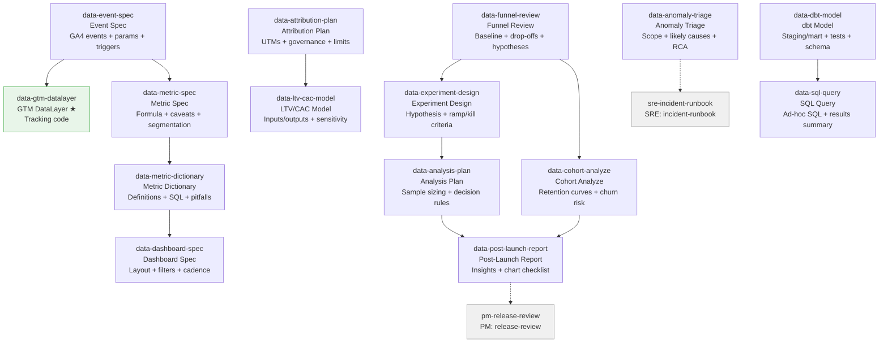

# DATA Skills (14)

> Part of [Role Skills Catalog](../role-skills.md) | Phase 4 + Phase 6

**Chains**: Events → Metrics → Dictionary → Dashboard | Funnel → Experiment → Analysis → Cohort → Report | Attribution → LTV/CAC

## Userflow Schema

**Legend**: Solid = internal | Dashed = cross-role exit | Gray nodes = other roles

### /jaan-to:data-event-spec

- **Logical**: `data-event-spec`
- **Description**: GA4-ready event/param spec: naming, triggers, required properties, GTM implementation notes
- **Quick Win**: Yes - extends gtm-datalayer pattern
- **Key Points**:
  - Events are verbs; properties add context
  - Ensure consistent naming + schema
  - Validate tracking with QA and dashboards
- **→ Next**: `data-gtm-datalayer`, `data-metric-spec`
- **MCP Required**: GA4 (measurement alignment)
- **Input**: [initiative]
- **Output**: `$JAAN_OUTPUTS_DIR/data/events/{slug}/event-spec.md`

### /jaan-to:data-metric-spec

- **Logical**: `data-metric-spec`
- **Description**: Metric definition: formula, caveats, segmentation rules, owner, gaming prevention
- **Quick Win**: Yes - simple definition
- **Key Points**:
  - Define metrics precisely (numerator/denominator)
  - Include guardrails and anomaly callouts
  - Make it "actionable by default"
- **→ Next**: `data-metric-dictionary`
- **MCP Required**: GA4 (dimension/metric checks)
- **Input**: [metric]
- **Output**: `$JAAN_OUTPUTS_DIR/data/metrics/{slug}/metric-spec.md`

### /jaan-to:data-metric-dictionary

- **Logical**: `data-metric-dictionary`
- **Description**: Metric definitions + SQL-like logic description, pitfalls + edge cases, example interpretations
- **Quick Win**: Yes
- **Key Points**:
  - Define metrics precisely (numerator/denominator)
  - Include guardrails and anomaly callouts
  - Make it "actionable by default"
- **→ Next**: `data-dashboard-spec`
- **MCP Required**: None
- **Input**: [metrics]
- **Output**: `$JAAN_OUTPUTS_DIR/data/metrics/{slug}/metric-dictionary.md`

### /jaan-to:data-dashboard-spec

- **Logical**: `data-dashboard-spec`
- **Description**: Dashboard layout + sections, definitions + filters, recommended review cadence
- **Quick Win**: Yes
- **Key Points**:
  - Define metrics precisely (numerator/denominator)
  - Include guardrails and anomaly callouts
  - Make it "actionable by default"
- **→ Next**: —
- **MCP Required**: None
- **Input**: [kpis]
- **Output**: `$JAAN_OUTPUTS_DIR/data/dashboard/{slug}/dashboard-spec.md`

### /jaan-to:data-funnel-review

- **Logical**: `data-funnel-review`
- **Description**: Funnel baseline + top drop-offs + segments + 3-5 hypotheses ranked by impact × confidence
- **Quick Win**: No - needs GA4 MCP
- **Key Points**:
  - Events are verbs; properties add context
  - Ensure consistent naming + schema
  - Validate tracking with QA and dashboards
- **→ Next**: `data-experiment-design`, `data-cohort-analyze`
- **MCP Required**: GA4 (funnel analysis), Clarity (qualitative)
- **Input**: [initiative]
- **Output**: `$JAAN_OUTPUTS_DIR/data/insights/{slug}/funnel-review.md`

### /jaan-to:data-experiment-design

- **Logical**: `data-experiment-design`
- **Description**: Experiment plan: hypothesis, success metric, boundaries, ramp/kill criteria, analysis checklist
- **Quick Win**: No - builds on metric-spec
- **Key Points**:
  - Hypothesis must be falsifiable
  - Predefine success/guardrails and decision rules
  - Track novelty effects and segment impacts
- **→ Next**: `data-analysis-plan`
- **MCP Required**: GA4 (baseline + segments)
- **Input**: [hypothesis]
- **Output**: `$JAAN_OUTPUTS_DIR/data/experiments/{slug}/experiment-design.md`

### /jaan-to:data-analysis-plan

- **Logical**: `data-analysis-plan`
- **Description**: Sample sizing notes (assumptions), decision rules (ship/iterate/stop), bias + data quality checks
- **Quick Win**: Yes
- **Key Points**:
  - Hypothesis must be falsifiable
  - Predefine success/guardrails and decision rules
  - Track novelty effects and segment impacts
- **→ Next**: `data-postlaunch-report`
- **MCP Required**: None
- **Input**: [experiment]
- **Output**: `$JAAN_OUTPUTS_DIR/data/experiments/{slug}/analysis-plan.md`

### /jaan-to:data-cohort-analyze

- **Logical**: `data-cohort-analyze`
- **Description**: Cohort/retention analysis with retention curves and churn risk identification
- **Quick Win**: No - needs window functions expertise
- **AI Score**: 5
- **Key Points**:
  - Combine cohorts + qualitative signals
  - Identify top drop-offs and root causes
  - Output a prioritized action list
- **→ Next**: `data-postlaunch-report`
- **MCP Required**: GA4 (cohort data), BigQuery (optional)
- **Input**: [cohort_type] [retention_event] [periods]
- **Output**: `$JAAN_OUTPUTS_DIR/data/cohorts/{slug}/cohort-analysis.md`
- **Failure Modes**: Incomplete data; timezone issues; not accounting for seasonality
- **Quality Gates**: Early cohorts stable; cross-reference with finance

### /jaan-to:data-postlaunch-report

- **Logical**: `data-postlaunch-report`
- **Description**: Insights summary + interpretation notes, chart checklist (no code), segment highlights
- **Quick Win**: No - needs post-launch data
- **Key Points**:
  - Combine cohorts + qualitative signals
  - Identify top drop-offs and root causes
  - Output a prioritized action list
- **→ Next**: `pm-release-review`
- **MCP Required**: GA4 (post-launch data)
- **Input**: [metrics]
- **Output**: `$JAAN_OUTPUTS_DIR/data/insights/{slug}/postlaunch-report.md`

### /jaan-to:data-attribution-plan

- **Logical**: `data-attribution-plan`
- **Description**: Tracking plan + UTMs, source of truth + governance, limits/risks checklist
- **Quick Win**: No - needs attribution setup
- **Key Points**:
  - Attribution limits (multi-touch vs last-touch)
  - UTM hygiene and naming
  - LTV/CAC models should show assumptions
- **→ Next**: `data-ltv-cac-model`
- **MCP Required**: GA4 (attribution data)
- **Input**: [channels]
- **Output**: `$JAAN_OUTPUTS_DIR/data/growth/{slug}/attribution-plan.md`

### /jaan-to:data-ltv-cac-model

- **Logical**: `data-ltv-cac-model`
- **Description**: Model inputs/outputs table, sensitivity notes (what drives outcomes), data needed to validate
- **Quick Win**: Yes
- **Key Points**:
  - Attribution limits (multi-touch vs last-touch)
  - UTM hygiene and naming
  - LTV/CAC models should show assumptions
- **→ Next**: —
- **MCP Required**: None
- **Input**: [assumptions]
- **Output**: `$JAAN_OUTPUTS_DIR/data/growth/{slug}/ltv-cac-model.md`

### /jaan-to:data-anomaly-triage

- **Logical**: `data-anomaly-triage`
- **Description**: Triage pack: scope, likely causes, next checks, who to pull in, RCA starter template
- **Quick Win**: No - needs multiple MCPs
- **Key Points**:
  - Combine cohorts + qualitative signals
  - Identify top drop-offs and root causes
  - Output a prioritized action list
- **→ Next**: `sre-incident-runbook`
- **MCP Required**: GA4 (anomaly detection), Sentry, Clarity (optional)
- **Input**: [kpi]
- **Output**: `$JAAN_OUTPUTS_DIR/data/monitoring/{slug}/anomaly-triage.md`

### /jaan-to:data-sql-query

- **Logical**: `data-sql-query`
- **Description**: Ad-hoc SQL queries from natural language with results summary
- **Quick Win**: Yes - natural language to SQL
- **AI Score**: 5 | **Rank**: #2 (2nd highest-leverage task)
- **Key Points**:
  - Events are verbs; properties add context
  - Ensure consistent naming + schema
  - Validate tracking with QA and dashboards
- **→ Next**: —
- **MCP Required**: None (schema context provided)
- **Input**: [question] [tables/schema]
- **Output**: `$JAAN_OUTPUTS_DIR/data/queries/{slug}/query.sql`
- **Failure Modes**: Misunderstanding question; wrong joins; incorrect filters
- **Quality Gates**: Row count sanity checks; cross-reference dashboards

### /jaan-to:data-dbt-model

- **Logical**: `data-dbt-model`
- **Description**: dbt staging/mart models with tests, documentation (schema.yml)
- **Quick Win**: No - needs dbt knowledge
- **AI Score**: 5 | **Rank**: #19
- **Key Points**:
  - Events are verbs; properties add context
  - Ensure consistent naming + schema
  - Validate tracking with QA and dashboards
- **→ Next**: `data-sql-query`
- **MCP Required**: dbt Cloud (optional), BigQuery/Snowflake (schema)
- **Input**: [source_table] [model_type]
- **Output**: `$JAAN_OUTPUTS_DIR/data/dbt/{slug}/model.sql`
- **Failure Modes**: Circular dependencies; missing tests; poor documentation
- **Quality Gates**: dbt test passes; row counts match; code review
