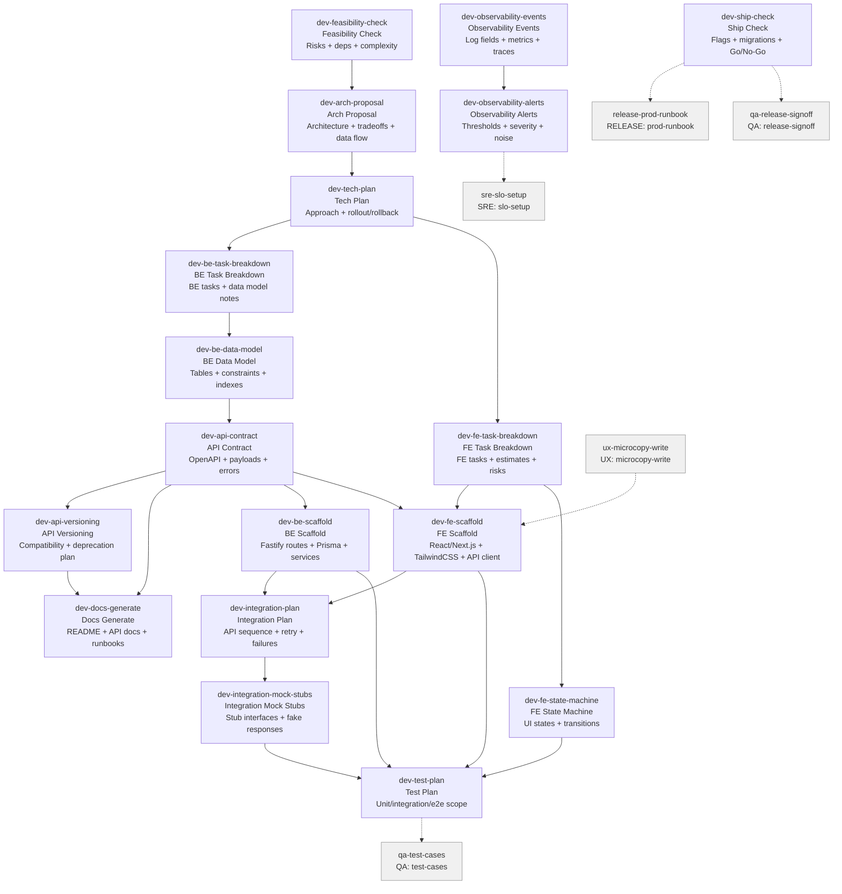

# DEV Skills (19)

> Part of [Role Skills Catalog](../role-skills.md) | Phase 4 + Phase 6

**Chains**: Discovery → Architecture → BE → API → Scaffold (BE/FE) → Integration → Test → Observability → Ship

## Userflow Schema

**Legend**: Solid = internal | Dashed = cross-role exit | Gray nodes = other roles

### /jaan-to:dev-feasibility-check

- **Logical**: `dev-feasibility-check`
- **Description**: Risks + dependencies, unknowns + spike recommendations, rough complexity estimate
- **Quick Win**: Yes
- **Key Points**:
  - Identify dependencies and "unknown unknowns"
  - Call out risky assumptions early
  - Produce options, not just one path
- **→ Next**: `dev-arch-proposal`
- **MCP Required**: None
- **Input**: [prd]
- **Output**: `$JAAN_OUTPUTS_DIR/dev/discovery/{slug}/feasibility-check.md`

### /jaan-to:dev-arch-proposal

- **Logical**: `dev-arch-proposal`
- **Description**: Architecture outline, key choices + tradeoffs, data flow + failure modes
- **Quick Win**: Yes
- **Key Points**:
  - Identify dependencies and "unknown unknowns"
  - Call out risky assumptions early
  - Produce options, not just one path
- **→ Next**: `dev-tech-plan`
- **MCP Required**: None
- **Input**: [feature]
- **Output**: `$JAAN_OUTPUTS_DIR/dev/discovery/{slug}/arch-proposal.md`

### /jaan-to:dev-tech-plan

- **Logical**: `dev-tech-plan`
- **Description**: Tech approach with architecture, tradeoffs, risks, rollout/rollback, unknowns
- **Quick Win**: Yes - extends existing pattern
- **Key Points**:
  - Identify dependencies and "unknown unknowns"
  - Call out risky assumptions early
  - Produce options, not just one path
- **→ Next**: `dev-fe-task-breakdown`, `dev-be-task-breakdown`
- **MCP Required**: GitLab (modules/flags), Figma (optional constraints)
- **Input**: [initiative]
- **Output**: `$JAAN_OUTPUTS_DIR/dev/plan/{slug}/tech-plan.md`

### ✅ /jaan-to:dev-be-task-breakdown

- **Logical**: `dev-be-task-breakdown`
- **Description**: BE tasks list, data model notes, reliability considerations
- **Reference**: [Backend Task Breakdown Skill: Complete Research Guide/jaan-to/outputs/research/52-dev-be-task-breakdown.md)
- **Quick Win**: Yes
- **Key Points**:
  - Data model constraints first (unique, indexes, retention)
  - Idempotency + retries for safety
  - Clear error taxonomy
- **→ Next**: `dev-be-data-model`
- **MCP Required**: None
- **Input**: [prd]
- **Output**: `$JAAN_OUTPUTS_DIR/dev/backend/{slug}/task-breakdown.md`

### ✅ /jaan-to:dev-be-data-model

- **Logical**: `dev-be-data-model`
- **Description**: Tables/collections + fields, constraints + indexes, retention + migration notes
- **Quick Win**: Yes
- **Key Points**:
  - Data model constraints first (unique, indexes, retention)
  - Idempotency + retries for safety
  - Clear error taxonomy
- **→ Next**: `dev-api-contract`
- **MCP Required**: None
- **Input**: [entities]
- **Output**: `$JAAN_OUTPUTS_DIR/dev/backend/{slug}/data-model.md`
- **Reference**: [`60-dev-be-data-model.md`](../../../../jaan-to/outputs/research/60-dev-be-data-model.md)

### ✅ /jaan-to:dev-api-contract

- **Logical**: `dev-api-contract`
- **Description**: OpenAPI contract with payloads, errors, versioning, example requests/responses
- **Quick Win**: No - needs OpenAPI MCP
- **Key Points**:
  - Define schemas with examples
  - Versioning + deprecation strategy
  - Ownership: who maintains, who consumes
- **→ Next**: `dev-api-versioning`, `dev-docs-generate`
- **MCP Required**: OpenAPI/Swagger, Postman (optional)
- **Input**: [entities]
- **Output**: `$JAAN_OUTPUTS_DIR/dev/contract/{slug}/api.yaml`
- **Reference**: [`59-dev-api-contract.md`](../../jaan-to/outputs/research/59-dev-api-contract.md)

### /jaan-to:dev-be-scaffold

- **Logical**: `dev-be-scaffold`
- **Description**: Generate production-ready backend code from specifications: Fastify routes, Prisma schema, service layer, middleware, validation
- **Quick Win**: Yes
- **Key Points**:
  - Map OpenAPI operations to Fastify v4+ route handlers (TypeScript)
  - Generate Prisma models from data model with relations and indexes
  - Include validation schemas (Zod) derived from API contract
  - Generate error handling middleware matching RFC 9457
  - Output includes setup README
- **→ Next**: `dev-integration-plan`, `dev-test-plan`
- **MCP Required**: None
- **Input**: [api-contract, task-breakdown, data-model]
- **Output**: `$JAAN_OUTPUTS_DIR/dev/backend/{slug}/scaffold/`

### /jaan-to:dev-api-versioning

- **Logical**: `dev-api-versioning`
- **Description**: Compatibility strategy, migration notes + timeline, deprecation communication plan
- **Quick Win**: Yes
- **Key Points**:
  - Define schemas with examples
  - Versioning + deprecation strategy
  - Ownership: who maintains, who consumes
- **→ Next**: `dev-docs-generate`
- **MCP Required**: None
- **Input**: [api]
- **Output**: `$JAAN_OUTPUTS_DIR/dev/contract/{slug}/versioning-plan.md`

### ✅ /jaan-to:dev-fe-task-breakdown

- **Logical**: `dev-fe-task-breakdown`
- **Description**: FE tasks list (components, screens, states), estimate bands, risks + dependencies
- **Reference**: [Frontend Task Breakdown Skill: Complete Framework Research](/jaan-to/outputs/research/51-dev-fe-task-breakdown.md)
- **Quick Win**: Yes
- **Key Points**:
  - Explicit state machine prevents "UI glitches"
  - Define caching/loading strategies
  - Performance budgets where needed
- **→ Next**: `dev-fe-state-machine`
- **MCP Required**: None
- **Input**: [ux-handoff]
- **Output**: `$JAAN_OUTPUTS_DIR/dev/frontend/{slug}/task-breakdown.md`

### /jaan-to:dev-fe-state-machine

- **Logical**: `dev-fe-state-machine`
- **Description**: UI states + transitions, events that trigger transitions, edge-case behavior
- **Quick Win**: Yes
- **Key Points**:
  - Explicit state machine prevents "UI glitches"
  - Define caching/loading strategies
  - Performance budgets where needed
- **→ Next**: `dev-test-plan`
- **MCP Required**: None
- **Input**: [screen]
- **Output**: `$JAAN_OUTPUTS_DIR/dev/frontend/{slug}/state-machine.md`

### /jaan-to:dev-fe-scaffold

- **Logical**: `dev-fe-scaffold`
- **Description**: Convert HTML design previews to React v19 / Next.js v15 components with TailwindCSS v4, TypeScript, and state management
- **Quick Win**: Yes
- **Key Points**:
  - Extract semantic HTML structure and preserve accessibility
  - Convert to TailwindCSS v4 utility classes
  - Generate TypeScript interfaces from API contract schemas
  - Create composable component hierarchy with loading/error/empty states
  - Generate typed API client hooks
- **→ Next**: `dev-integration-plan`, `dev-test-plan`
- **MCP Required**: None
- **Input**: [fe-design, fe-task-breakdown, api-contract]
- **Output**: `$JAAN_OUTPUTS_DIR/dev/frontend/{slug}/scaffold/`

### /jaan-to:dev-integration-plan

- **Logical**: `dev-integration-plan`
- **Description**: API call sequence, retry policy + failure modes, observability events
- **Quick Win**: Yes
- **Key Points**:
  - Define retries + backoff + idempotency
  - Plan for partial failures and timeouts
  - Provide mocks/stubs for local dev
- **→ Next**: `dev-integration-mock-stubs`
- **MCP Required**: None
- **Input**: [provider] [use-case]
- **Output**: `$JAAN_OUTPUTS_DIR/dev/integration/{slug}/integration-plan.md`

### /jaan-to:dev-integration-mock-stubs

- **Logical**: `dev-integration-mock-stubs`
- **Description**: Stub interfaces, fake responses (success/fail), test harness guidance
- **Quick Win**: Yes
- **Key Points**:
  - Define retries + backoff + idempotency
  - Plan for partial failures and timeouts
  - Provide mocks/stubs for local dev
- **→ Next**: `dev-test-plan`
- **MCP Required**: None
- **Input**: [provider]
- **Output**: `$JAAN_OUTPUTS_DIR/dev/integration/{slug}/mock-stubs.md`

### /jaan-to:dev-test-plan

- **Logical**: `dev-test-plan`
- **Description**: Dev-owned test plan: unit/integration/e2e scope, fixtures, mocks, highest-risk scenarios
- **Quick Win**: Yes - simple test plan
- **Key Points**:
  - Identify dependencies and "unknown unknowns"
  - Call out risky assumptions early
  - Produce options, not just one path
- **→ Next**: `qa-test-cases`
- **MCP Required**: GitLab (diff impact)
- **Input**: [initiative]
- **Output**: `$JAAN_OUTPUTS_DIR/dev/test/{slug}/test-plan.md`

### /jaan-to:dev-observability-events

- **Logical**: `dev-observability-events`
- **Description**: Log fields + metric names, trace spans suggestions, dashboard checklist
- **Quick Win**: Yes
- **Key Points**:
  - Define structured logs and consistent fields
  - Metrics for latency/error/throughput
  - Alerts should map to user impact
- **→ Next**: `dev-observability-alerts`
- **MCP Required**: None
- **Input**: [feature]
- **Output**: `$JAAN_OUTPUTS_DIR/dev/observability/{slug}/events.md`

### /jaan-to:dev-observability-alerts

- **Logical**: `dev-observability-alerts`
- **Description**: Suggested alerts + thresholds, severity levels, noise reduction ideas
- **Quick Win**: Yes
- **Key Points**:
  - Define structured logs and consistent fields
  - Metrics for latency/error/throughput
  - Alerts should map to user impact
- **→ Next**: `sre-slo-setup`
- **MCP Required**: None
- **Input**: [service]
- **Output**: `$JAAN_OUTPUTS_DIR/dev/observability/{slug}/alert-rules.md`

### /jaan-to:dev-docs-generate

- **Logical**: `dev-docs-generate`
- **Description**: Technical documentation: README files, API docs, runbooks, architecture decisions
- **Reference**: [Building a Production-Ready Documentation Generation Framework](../../../$JAAN_OUTPUTS_DIR/research/48-dev-docs-generate.md)
- **Quick Win**: Yes - draft generation, format standardization
- **AI Score**: 5 | **Rank**: #14
- **Key Points**:
  - Define schemas with examples
  - Versioning + deprecation strategy
  - Ownership: who maintains, who consumes
- **→ Next**: —
- **MCP Required**: GitLab (code context, optional)
- **Input**: [component] [doc_type]
- **Output**: `$JAAN_OUTPUTS_DIR/dev/docs/{slug}/{doc_type}.md`
- **Failure Modes**: Documentation stale; inconsistent formatting; missing context
- **Quality Gates**: Up-to-date with code; follows style guide; onboarding-friendly

### ✅ /jaan-to:dev-pr-review

- **Logical**: `dev-pr-review`
- **Description**: PR review pack: summary, risky files, security/perf hints, missing tests, CI failures
- **Reference**: [Building a Production-Ready PR/MR Code Review Skill/jaan-to/outputs/research/53-dev-pr-review.md)
- **Quick Win**: No - needs GitLab MCP
- **Key Points**:
  - Define schemas with examples
  - Versioning + deprecation strategy
  - Ownership: who maintains, who consumes
- **→ Next**: —
- **MCP Required**: GitLab (MR + pipeline), Sentry (optional regressions)
- **Input**: [pr-link-or-branch]
- **Output**: `$JAAN_OUTPUTS_DIR/dev/review/{slug}/pr-review.md`

### /jaan-to:dev-ship-check

- **Logical**: `dev-ship-check`
- **Description**: Pre-ship checklist: flags, migrations, monitoring, rollback, Go/No-Go recommendation
- **Quick Win**: No - needs multiple MCPs
- **Key Points**:
  - Feature flags with targeting and kill switch
  - Gradual rollout with monitoring gates
  - Data migrations planned for rollback
- **→ Next**: `release-prod-runbook`, `qa-release-signoff`
- **MCP Required**: GitLab (pipelines), Sentry (health)
- **Input**: [initiative]
- **Output**: `$JAAN_OUTPUTS_DIR/dev/release/{slug}/ship-check.md`
