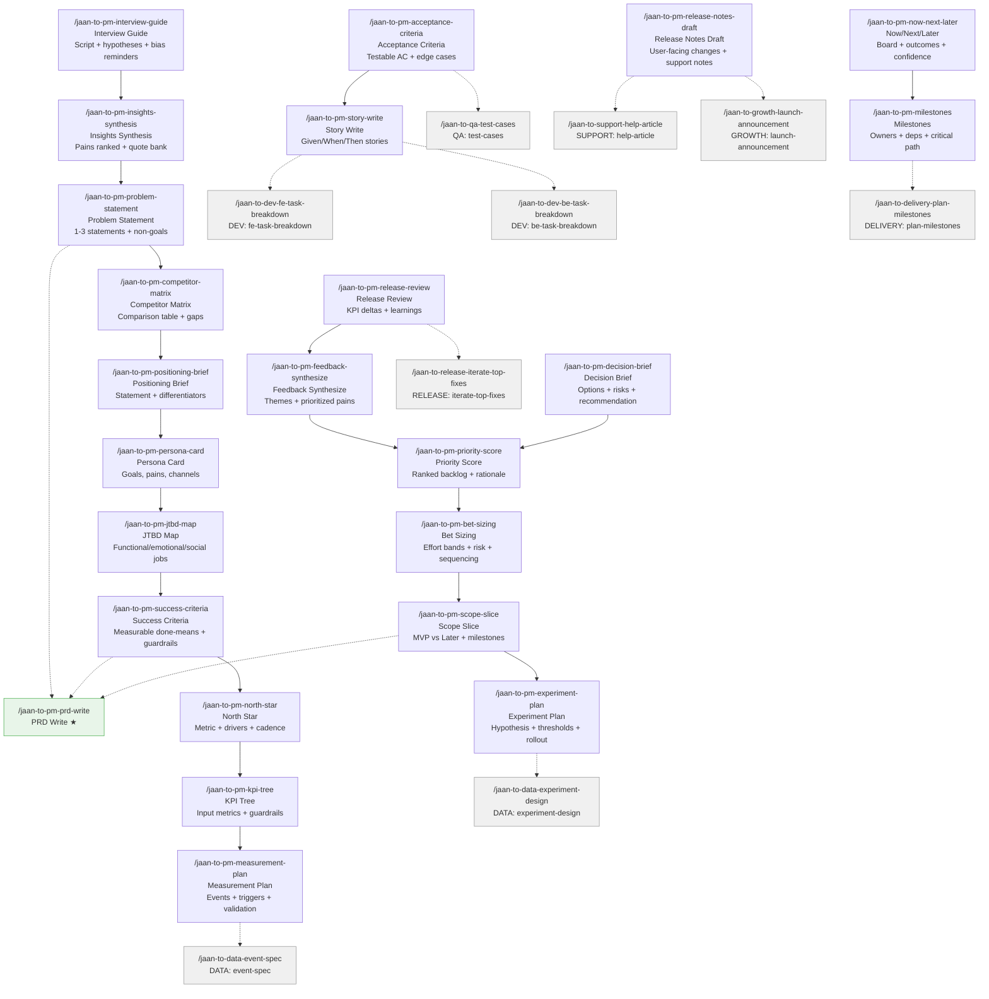

# PM Skills (23)

> Part of [Role Skills Catalog](../role-skills.md) | Phase 4 + Phase 6

**Chains**: Discovery → Market → User → Metrics → Prioritize → Scope → PRD → Roadmap → Post-launch

## Userflow Schema

**Legend**: Solid = internal | Dashed = cross-role exit | Gray nodes = other roles

### /jaan-to-pm-interview-guide

- **Logical**: `pm:interview-guide`
- **Description**: 30-min interview script with hypotheses, key probes, and bias-avoidance reminders
- **Quick Win**: Yes
- **Key Points**:
  - Keep questions open + behavioral ("tell me about the last time…")
  - Capture verbatim quotes + context (who/when/where)
  - Tag notes into pain / workaround / trigger / desired outcome
  - End with a hypotheses checklist to validate next
- **→ Next**: `pm-insights-synthesis`
- **MCP Required**: None
- **Input**: [persona] [topic]
- **Output**: `jaan-to/outputs/pm/discovery/{slug}/interview-guide.md`

### /jaan-to-pm-insights-synthesis

- **Logical**: `pm:insights-synthesis`
- **Description**: Top pains ranked by frequency/impact, quote bank by theme, frequency table + unknowns
- **Quick Win**: Yes
- **Reference**: [Product Manager User Research Synthesis: Implementation Guide](../../../../jaan-to/outputs/research/45-pm-insights-synthesis.md)
- **Key Points**:
  - Keep questions open + behavioral ("tell me about the last time…")
  - Capture verbatim quotes + context (who/when/where)
  - Tag notes into pain / workaround / trigger / desired outcome
- **→ Next**: `pm-problem-statement`
- **MCP Required**: None
- **Input**: [notes]
- **Output**: `jaan-to/outputs/pm/discovery/{slug}/insights-synthesis.md`

### /jaan-to-pm-problem-statement

- **Logical**: `pm:problem-statement`
- **Description**: 1–3 crisp problem statements (who/what/why) with explicit non-goals and assumptions to validate
- **Quick Win**: Yes
- **Key Points**:
  - Keep questions open + behavioral ("tell me about the last time…")
  - Capture verbatim quotes + context (who/when/where)
  - Tag notes into pain / workaround / trigger / desired outcome
- **→ Next**: `pm-competitor-matrix`, `pm-prd-write`
- **MCP Required**: None
- **Input**: [insights]
- **Output**: `jaan-to/outputs/pm/discovery/{slug}/problem-statement.md`

### /jaan-to-pm-competitor-matrix

- **Logical**: `pm:competitor-matrix`
- **Description**: Comparison table (criteria × competitors) with gaps/opportunities and "so what?" takeaways
- **Quick Win**: Yes
- **Key Points**:
  - Compare against user alternatives, not just direct competitors
  - Use consistent criteria (pricing, UX, coverage, latency, trust, etc.)
  - Look for differentiation wedges (distribution, content, workflow fit)
  - Call out risks and "copy traps"
- **→ Next**: `pm-positioning-brief`
- **MCP Required**: None
- **Input**: [competitors] [criteria]
- **Output**: `jaan-to/outputs/pm/market/{slug}/competitor-matrix.md`

### /jaan-to-pm-positioning-brief

- **Logical**: `pm:positioning-brief`
- **Description**: Positioning statement + core promise, differentiators + proof points, risks and open questions
- **Quick Win**: Yes
- **Key Points**:
  - Compare against user alternatives, not just direct competitors
  - Use consistent criteria (pricing, UX, coverage, latency, trust, etc.)
  - Look for differentiation wedges (distribution, content, workflow fit)
- **→ Next**: `pm-persona-card`
- **MCP Required**: None
- **Input**: [product] [audience]
- **Output**: `jaan-to/outputs/pm/market/{slug}/positioning-brief.md`

### /jaan-to-pm-persona-card

- **Logical**: `pm:persona-card`
- **Description**: Persona card (goals, pains, constraints, channels) with top jobs/gains and recognition signals
- **Quick Win**: Yes
- **Key Points**:
  - Personas should include context + constraints, not demographics only
  - JTBD should include trigger → job → desired outcome
  - Success criteria should be measurable, not "users like it"
- **→ Next**: `pm-jtbd-map`
- **MCP Required**: None
- **Input**: [segment]
- **Output**: `jaan-to/outputs/pm/user/{slug}/persona-card.md`

### /jaan-to-pm-jtbd-map

- **Logical**: `pm:jtbd-map`
- **Description**: JTBD map (functional/emotional/social) with triggers, current workarounds, desired outcomes
- **Quick Win**: Yes
- **Key Points**:
  - Personas should include context + constraints, not demographics only
  - JTBD should include trigger → job → desired outcome
  - Success criteria should be measurable, not "users like it"
- **→ Next**: `pm-success-criteria`
- **MCP Required**: None
- **Input**: [use-case]
- **Output**: `jaan-to/outputs/pm/user/{slug}/jtbd-map.md`

### /jaan-to-pm-success-criteria

- **Logical**: `pm:success-criteria`
- **Description**: Measurable "done means" criteria with key guardrails and edge cases to include/exclude
- **Quick Win**: Yes
- **Key Points**:
  - Personas should include context + constraints, not demographics only
  - JTBD should include trigger → job → desired outcome
  - Success criteria should be measurable, not "users like it"
- **→ Next**: `pm-north-star`, `pm-prd-write`
- **MCP Required**: None
- **Input**: [persona] [goal]
- **Output**: `jaan-to/outputs/pm/user/{slug}/success-criteria.md`

### /jaan-to-pm-north-star

- **Logical**: `pm:north-star`
- **Description**: North star metric + drivers + boundaries + cadence (weekly/monthly)
- **Quick Win**: No - needs baseline data
- **Key Points**:
  - North Star = value delivered, not vanity
  - KPI tree: inputs → outputs with guardrails
  - Measurement plan must define event/property ownership
- **→ Next**: `pm-kpi-tree`
- **MCP Required**: GA4 (baselines/segments)
- **Input**: [product]
- **Output**: `jaan-to/outputs/pm/metrics/{slug}/north-star.md`

### /jaan-to-pm-kpi-tree

- **Logical**: `pm:kpi-tree`
- **Description**: KPI tree: input metrics + leading indicators + guardrails (quality, latency, churn, cost)
- **Quick Win**: Yes
- **Key Points**:
  - North Star = value delivered, not vanity
  - KPI tree: inputs → outputs with guardrails
  - Measurement plan must define event/property ownership
- **→ Next**: `pm-measurement-plan`
- **MCP Required**: None
- **Input**: [north-star]
- **Output**: `jaan-to/outputs/pm/metrics/{slug}/kpi-tree.md`

### /jaan-to-pm-measurement-plan

- **Logical**: `pm:measurement-plan`
- **Description**: Events/properties to track + triggers, source of truth per event, validation checklist (QA for analytics)
- **Quick Win**: Yes
- **Key Points**:
  - North Star = value delivered, not vanity
  - KPI tree: inputs → outputs with guardrails
  - Measurement plan must define event/property ownership
- **→ Next**: `data-event-spec`
- **MCP Required**: None
- **Input**: [feature]
- **Output**: `jaan-to/outputs/pm/metrics/{slug}/measurement-plan.md`

### /jaan-to-pm-feedback-synthesize

- **Logical**: `pm:feedback-synthesize`
- **Description**: Synthesize customer feedback into categorized themes with prioritized pain points
- **Quick Win**: Yes - pattern recognition, summarization
- **AI Score**: 5 | **Rank**: #15
- **Key Points**:
  - Separate impact vs confidence vs effort
  - Include learning value (risk reduction)
  - Multiple sources triangulated; connected to segments
- **→ Next**: `pm-priority-score`
- **MCP Required**: None (text input), Jira/Intercom (optional)
- **Input**: [feedback_sources] [date_range] [segment]
- **Output**: `jaan-to/outputs/pm/feedback/{slug}/synthesis.md`
- **Failure Modes**: Feedback silos; recency bias; loud customers over-represented
- **Quality Gates**: Multiple sources triangulated; connected to segments

### /jaan-to-pm-decision-brief

- **Logical**: `pm:decision-brief`
- **Description**: 1-page decision record with options, recommendation, risks, open questions
- **Quick Win**: Yes - simple artifact, minimal MCP
- **Key Points**:
  - Separate impact vs confidence vs effort
  - Include learning value (risk reduction)
  - Document why something is not prioritized
- **→ Next**: `pm-priority-score`
- **MCP Required**: GA4, Clarity (optional for evidence)
- **Input**: [initiative]
- **Output**: `jaan-to/outputs/pm/decision/{slug}/brief.md`

### /jaan-to-pm-priority-score

- **Logical**: `pm:priority-score`
- **Description**: Ranked backlog with scoring, rationale per item (drivers + uncertainty), sensitivity notes
- **Quick Win**: Yes
- **Key Points**:
  - Separate impact vs confidence vs effort
  - Include learning value (risk reduction)
  - Document why something is not prioritized
- **→ Next**: `pm-bet-sizing`
- **MCP Required**: None
- **Input**: [ideas] [framework]
- **Output**: `jaan-to/outputs/pm/priority/{slug}/priority-score.md`

### /jaan-to-pm-bet-sizing

- **Logical**: `pm:bet-sizing`
- **Description**: Effort bands (S/M/L or weeks), risk notes + unknowns, suggested sequencing
- **Quick Win**: Yes
- **Key Points**:
  - Separate impact vs confidence vs effort
  - Include learning value (risk reduction)
  - Document why something is not prioritized
- **→ Next**: `pm-scope-slice`
- **MCP Required**: None
- **Input**: [top-ideas]
- **Output**: `jaan-to/outputs/pm/priority/{slug}/bet-sizing.md`

### /jaan-to-pm-scope-slice

- **Logical**: `pm:scope-slice`
- **Description**: MVP vs Later slicing with milestones and dependency list
- **Quick Win**: No - pairs with PRD
- **Key Points**:
  - MVP = smallest slice that tests core assumption
  - Include must-have states (empty/error/loading)
  - Define exit criteria (iterate/kill/scale)
- **→ Next**: `pm-experiment-plan`, `pm-prd-write`
- **MCP Required**: Jira (backlog), GitLab (complexity)
- **Input**: [idea]
- **Output**: `jaan-to/outputs/pm/plan/{slug}/scope.md`

### /jaan-to-pm-experiment-plan

- **Logical**: `pm:experiment-plan`
- **Description**: What to learn + hypothesis, success thresholds + guardrails, timeline + segments + rollout plan
- **Quick Win**: Yes
- **Key Points**:
  - MVP = smallest slice that tests core assumption
  - Include must-have states (empty/error/loading)
  - Define exit criteria (iterate/kill/scale)
- **→ Next**: `data-experiment-design`
- **MCP Required**: None
- **Input**: [mvp]
- **Output**: `jaan-to/outputs/pm/plan/{slug}/experiment-plan.md`

### /jaan-to-pm-acceptance-criteria

- **Logical**: `pm:acceptance-criteria`
- **Description**: Testable acceptance criteria with edge cases + failure handling and analytics requirements
- **Reference**: [Acceptance Criteria Best Practices: A Production-Ready Research Guide](../../../../jaan-to/outputs/research/49-pm-acceptance-criteria.md)
- **Quick Win**: Yes
- **Key Points**:
  - Start from problem + success metrics, not solutions
  - Make scope explicit: in/out
  - Acceptance criteria must be testable and include edge cases
- **→ Next**: `qa-test-cases`, `pm-story-write`
- **MCP Required**: None
- **Input**: [prd]
- **Output**: `jaan-to/outputs/pm/prd/{slug}/acceptance-criteria.md`

### /jaan-to-pm-story-write

- **Logical**: `pm:story-write`
- **Description**: User stories in standard format with Given/When/Then acceptance criteria
- **Reference**: [Production-Ready PM Story-Write Skill: A Comprehensive Framework](../../../../jaan-to/outputs/research/45-pm-insights-synthesis.md)
- **Quick Win**: Yes - highly structured, template-based
- **AI Score**: 5 | **Rank**: #6
- **Key Points**:
  - Start from problem + success metrics, not solutions
  - Make scope explicit: in/out
  - Acceptance criteria must be testable and include edge cases
- **→ Next**: `dev-fe-task-breakdown`, `dev-be-task-breakdown`
- **MCP Required**: Jira (optional backlog context)
- **Input**: [feature] [persona] [goal]
- **Output**: `jaan-to/outputs/pm/stories/{slug}/stories.md`
- **Failure Modes**: Too technical; missing "so that"; AC not testable
- **Quality Gates**: INVEST criteria met; QA confirms testability

### /jaan-to-pm-release-notes-draft

- **Logical**: `pm:release-notes-draft`
- **Description**: User-facing release notes, what changed + who benefits, support notes / known limitations
- **Quick Win**: Yes
- **Key Points**:
  - Start from problem + success metrics, not solutions
  - Make scope explicit: in/out
  - Acceptance criteria must be testable and include edge cases
- **→ Next**: `support-help-article`, `growth-launch-announcement`
- **MCP Required**: None
- **Input**: [prd]
- **Output**: `jaan-to/outputs/pm/prd/{slug}/release-notes.md`

### /jaan-to-pm-now-next-later

- **Logical**: `pm:now-next-later`
- **Description**: Now/Next/Later board with outcome per initiative and confidence level notes
- **Quick Win**: Yes
- **Key Points**:
  - Prefer outcome-based initiatives, not feature lists
  - Include dependencies + constraints
  - Keep a "Now/Next/Later" to reduce false certainty
- **→ Next**: `pm-milestones`
- **MCP Required**: None
- **Input**: [initiatives]
- **Output**: `jaan-to/outputs/pm/roadmap/{slug}/now-next-later.md`

### /jaan-to-pm-milestones

- **Logical**: `pm:milestones`
- **Description**: Milestones + owners, dependencies + critical path, risks + mitigation plan
- **Quick Win**: Yes
- **Key Points**:
  - Prefer outcome-based initiatives, not feature lists
  - Include dependencies + constraints
  - Keep a "Now/Next/Later" to reduce false certainty
- **→ Next**: `delivery-plan-milestones`
- **MCP Required**: None
- **Input**: [initiative]
- **Output**: `jaan-to/outputs/pm/roadmap/{slug}/milestones.md`

### /jaan-to-pm-release-review

- **Logical**: `pm:release-review`
- **Description**: Post-release review: KPI deltas, unexpected outcomes, learnings, follow-ups
- **Quick Win**: No - needs post-launch data
- **Key Points**:
  - Compare to expected impact + guardrails
  - Combine quant + qual (tickets, comments, usability)
  - Output should drive next actions, not just insights
- **→ Next**: `pm-feedback-synthesize`, `release-iterate-top-fixes`
- **MCP Required**: GA4 (KPI deltas), Clarity (UX regressions), Sentry (optional)
- **Input**: [initiative]
- **Output**: `jaan-to/outputs/pm/release/{slug}/review.md`
