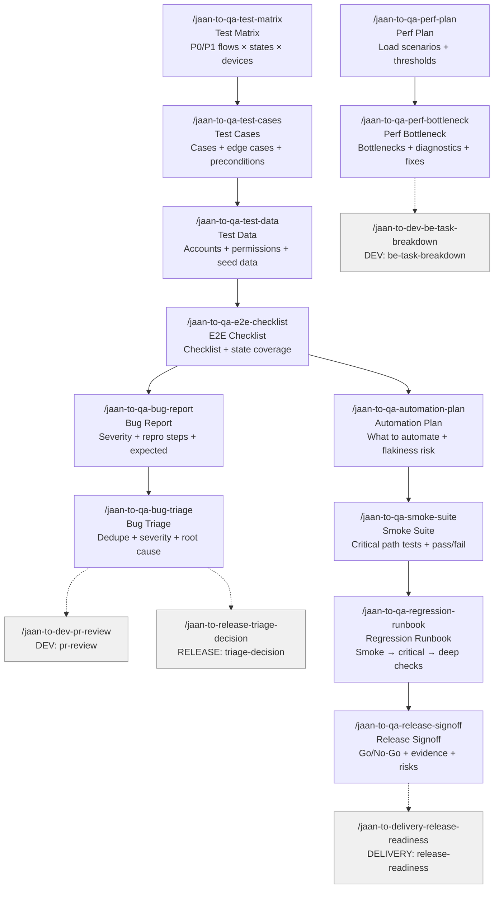

# QA Skills (12)

> Part of [Role Skills Catalog](../role-skills.md) | Phase 4 + Phase 6

**Chains**: Matrix → Cases → Data → E2E → Bug → Triage | Perf → Bottleneck | Automation → Smoke → Regression → Signoff

## Userflow Schema

**Legend**: Solid = internal | Dashed = cross-role exit | Gray nodes = other roles

### /jaan-to-qa-test-matrix

- **Logical**: `qa:test-matrix`
- **Description**: Risk-based matrix: P0/P1 flows × states × devices × env (staging/prod-like)
- **Quick Win**: Yes - structured output
- **Key Points**:
  - Test matrix across roles/devices/states
  - Prioritize by risk/impact
  - Include analytics validation when needed
- **→ Next**: `qa-test-cases`
- **MCP Required**: Figma (flow-states), GitLab (impacted areas)
- **Input**: [initiative]
- **Output**: `jaan-to/outputs/qa/matrix/{slug}/test-matrix.md`

### /jaan-to-qa-test-cases

- **Logical**: `qa:test-cases`
- **Description**: Test cases from acceptance criteria with edge cases, preconditions, expected results
- **Reference**: [Production-Ready QA Test Case Generation: A Comprehensive Standards and Methodology Guide](../../../../jaan-to/outputs/research/50-qa-test-cases.md)
- **Quick Win**: Yes - highly structured, template-based
- **AI Score**: 5 | **Rank**: #1 (highest-leverage task)
- **Key Points**:
  - Reproducible steps and expected results
  - Validate error/empty states
  - Confirm recovery paths
- **→ Next**: `qa-test-data`
- **MCP Required**: Jira (user story context, optional)
- **Input**: [user_story_id] or [acceptance_criteria]
- **Output**: `jaan-to/outputs/qa/cases/{slug}/test-cases.md`
- **Failure Modes**: Vague steps; missing edge cases; not traceable to requirements
- **Quality Gates**: Peer review; traceable to requirements; reusable format

### /jaan-to-qa-test-data

- **Logical**: `qa:test-data`
- **Description**: Test accounts + permissions, seed data requirements, edge-case data set list
- **Quick Win**: Yes
- **Key Points**:
  - Test matrix across roles/devices/states
  - Prioritize by risk/impact
  - Include analytics validation when needed
- **→ Next**: `qa-e2e-checklist`
- **MCP Required**: None
- **Input**: [feature]
- **Output**: `jaan-to/outputs/qa/data/{slug}/test-data.md`

### /jaan-to-qa-e2e-checklist

- **Logical**: `qa:e2e-checklist`
- **Description**: E2E checklist + expected results, preconditions + postconditions, state coverage
- **Quick Win**: Yes
- **Key Points**:
  - Reproducible steps and expected results
  - Validate error/empty states
  - Confirm recovery paths
- **→ Next**: `qa-automation-plan`, `qa-bug-report`
- **MCP Required**: None
- **Input**: [flow]
- **Output**: `jaan-to/outputs/qa/e2e/{slug}/e2e-checklist.md`

### /jaan-to-qa-bug-report

- **Logical**: `qa:bug-report`
- **Description**: Structured bug reports with severity, priority, steps to reproduce, expected vs actual
- **Quick Win**: Yes - structured output
- **AI Score**: 5 | **Rank**: #10
- **Key Points**:
  - Reproducible steps and expected results
  - Validate error/empty states
  - Confirm recovery paths
- **→ Next**: `qa-bug-triage`
- **MCP Required**: Jira (duplicate detection, optional), Sentry (stack traces, optional)
- **Input**: [observation] [test_case_id]
- **Output**: `jaan-to/outputs/qa/bugs/{slug}/bug-report.md`
- **Failure Modes**: Vague descriptions; missing repro steps; incorrect severity
- **Quality Gates**: Developer can reproduce in <5 min; linked to test case

### /jaan-to-qa-bug-triage

- **Logical**: `qa:bug-triage`
- **Description**: Dedupe + severity + repro hints + next action per issue, cluster by root cause
- **Quick Win**: Yes - simple triage logic
- **Key Points**:
  - Separate severity (user harm) from priority (when to fix)
  - Cluster duplicates and patterns
  - Tie decisions to metrics and impact
- **→ Next**: `dev-pr-review`, `release-triage-decision`
- **MCP Required**: Jira (bug list), Sentry (optional context)
- **Input**: [issue-list]
- **Output**: `jaan-to/outputs/qa/triage/{slug}/bug-triage.md`

### /jaan-to-qa-perf-plan

- **Logical**: `qa:perf-plan`
- **Description**: Load scenarios + thresholds, tooling checklist, monitoring requirements
- **Quick Win**: Yes
- **Key Points**:
  - Define load profiles (steady, spike, soak)
  - Pass/fail thresholds tied to user experience
  - Identify bottlenecks with data
- **→ Next**: `qa-perf-bottleneck`
- **MCP Required**: None
- **Input**: [service]
- **Output**: `jaan-to/outputs/qa/perf/{slug}/perf-plan.md`

### /jaan-to-qa-perf-bottleneck

- **Logical**: `qa:perf-bottleneck`
- **Description**: Suspected bottlenecks + checks, next diagnostic steps, quick remediation ideas
- **Quick Win**: Yes
- **Key Points**:
  - Define load profiles (steady, spike, soak)
  - Pass/fail thresholds tied to user experience
  - Identify bottlenecks with data
- **→ Next**: `dev-be-task-breakdown`
- **MCP Required**: None
- **Input**: [metrics]
- **Output**: `jaan-to/outputs/qa/perf/{slug}/bottleneck-hypotheses.md`

### /jaan-to-qa-automation-plan

- **Logical**: `qa:automation-plan`
- **Description**: Automation plan: what to automate now vs later, flakiness risk, testability changes needed
- **Quick Win**: No - planning artifact
- **Key Points**:
  - Smoke suite = minimal critical path checks
  - Target regressions based on what changed
  - Keep suites maintainable
- **→ Next**: `qa-smoke-suite`
- **MCP Required**: Playwright (direction), GitLab (automation MRs)
- **Input**: [initiative]
- **Output**: `jaan-to/outputs/qa/automation/{slug}/automation-plan.md`

### /jaan-to-qa-smoke-suite

- **Logical**: `qa:smoke-suite`
- **Description**: Smoke tests list (critical paths), environment prerequisites, pass/fail criteria
- **Quick Win**: Yes
- **Key Points**:
  - Smoke suite = minimal critical path checks
  - Target regressions based on what changed
  - Keep suites maintainable
- **→ Next**: `qa-regression-runbook`
- **MCP Required**: None
- **Input**: [product]
- **Output**: `jaan-to/outputs/qa/regression/{slug}/smoke-suite.md`

### /jaan-to-qa-regression-runbook

- **Logical**: `qa:regression-runbook`
- **Description**: Step-by-step regression runbook: smoke → critical → deep checks with timing/owners
- **Quick Win**: No - reusable checklist
- **Key Points**:
  - Smoke suite = minimal critical path checks
  - Target regressions based on what changed
  - Keep suites maintainable
- **→ Next**: `qa-release-signoff`
- **MCP Required**: GitLab (release branch), Playwright (optional)
- **Input**: [release]
- **Output**: `jaan-to/outputs/qa/regression/{slug}/runbook.md`

### /jaan-to-qa-release-signoff

- **Logical**: `qa:release-signoff`
- **Description**: Go/No-Go summary with evidence, open risks, mitigations, rollback readiness
- **Quick Win**: No - needs multiple MCPs
- **Key Points**:
  - Smoke suite = minimal critical path checks
  - Target regressions based on what changed
  - Keep suites maintainable
- **→ Next**: `delivery-release-readiness`
- **MCP Required**: GitLab (pipeline), Jira (test evidence)
- **Input**: [initiative]
- **Output**: `jaan-to/outputs/qa/signoff/{slug}/release-signoff.md`
