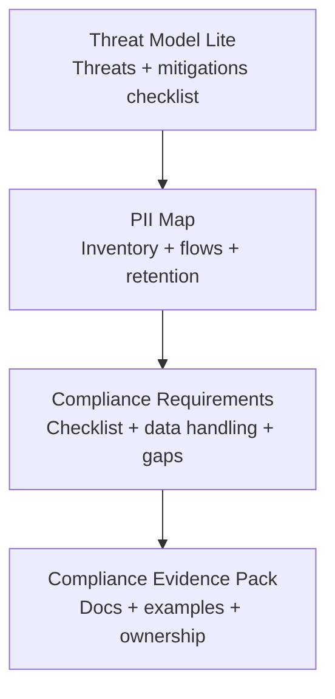

# SEC Skills (4)

> Part of [Role Skills Catalog](../role-skills.md) | Phase 4 + Phase 6

**Chain**: Threat Model → PII Map → Compliance → Evidence

## Userflow Schema

**Legend**: Solid = internal | Dashed = cross-role exit | Gray nodes = other roles

### /jaan-to-sec-threat-model-lite

- **Logical**: `sec:threat-model-lite`
- **Description**: Threats + mitigations checklist, high-risk areas callout, verification steps
- **Quick Win**: Yes
- **Key Points**:
  - Identify PII and its lifecycle (collect/store/share/delete)
  - Least privilege for access
  - Threat model "lite" for common attack paths
- **→ Next**: `sec-pii-map`
- **MCP Required**: None
- **Input**: [feature]
- **Output**: `jaan-to/outputs/sec/review/{slug}/threat-model.md`

### /jaan-to-sec-pii-map

- **Logical**: `sec:pii-map`
- **Description**: PII inventory + where it flows, retention + deletion rules, access controls checklist
- **Quick Win**: Yes
- **Key Points**:
  - Identify PII and its lifecycle (collect/store/share/delete)
  - Least privilege for access
  - Threat model "lite" for common attack paths
- **→ Next**: `sec-compliance-requirements`
- **MCP Required**: None
- **Input**: [data]
- **Output**: `jaan-to/outputs/sec/review/{slug}/pii-map.md`

### /jaan-to-sec-compliance-requirements

- **Logical**: `sec:compliance-requirements`
- **Description**: Compliance checklist, data handling requirements, gaps + next steps
- **Quick Win**: Yes
- **Key Points**:
  - Map obligations by region/domain
  - Evidence pack should be audit-friendly
  - Keep controls traceable
- **→ Next**: `sec-compliance-evidence-pack`
- **MCP Required**: None
- **Input**: [region] [domain]
- **Output**: `jaan-to/outputs/sec/compliance/{slug}/requirements.md`

### /jaan-to-sec-compliance-evidence-pack

- **Logical**: `sec:compliance-evidence-pack`
- **Description**: What to document + where stored, evidence examples, ownership and review cadence
- **Quick Win**: Yes
- **Key Points**:
  - Map obligations by region/domain
  - Evidence pack should be audit-friendly
  - Keep controls traceable
- **→ Next**: —
- **MCP Required**: None
- **Input**: [controls]
- **Output**: `jaan-to/outputs/sec/compliance/{slug}/evidence-pack.md`
