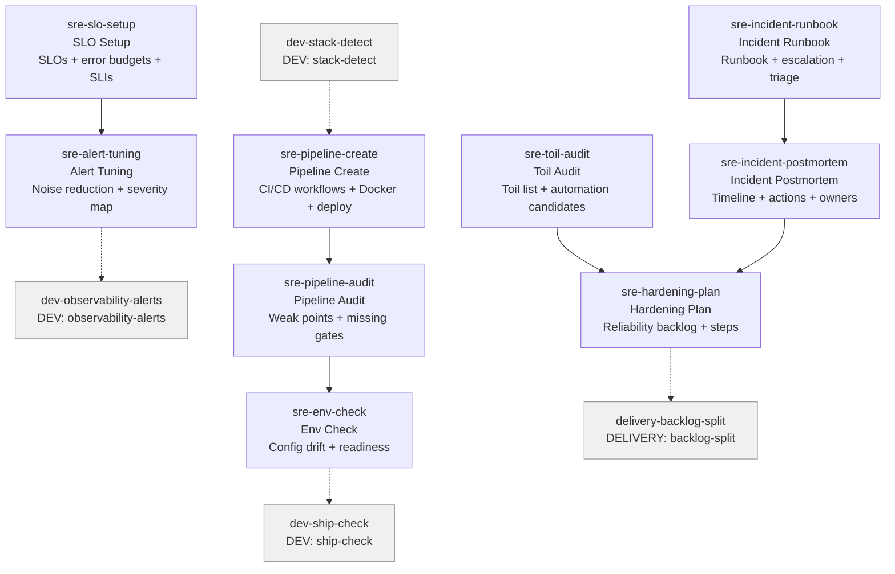

# SRE Skills (9)

> Part of [Role Skills Catalog](../role-skills.md) | Phase 4 + Phase 6

**Chains**: SLO → Alerts | Pipeline Create → Pipeline Audit → Env | Toil → Hardening | Runbook → Postmortem

## Userflow Schema

**Legend**: Solid = internal | Dashed = cross-role exit | Gray nodes = other roles

### /jaan-to-sre-slo-setup

- **Logical**: `sre-slo-setup`
- **Description**: SLOs + error budgets, suggested SLIs (latency, errors, uptime), reporting cadence
- **Quick Win**: No - needs monitoring data
- **Key Points**:
  - Define SLOs and error budgets
  - Alerts should reflect user impact
  - Tune noise and prioritize
- **→ Next**: `sre-alert-tuning`
- **MCP Required**: Monitoring tools (Datadog/Grafana)
- **Input**: [service]
- **Output**: `$JAAN_OUTPUTS_DIR/sre/monitor/{slug}/slo-setup.md`

### /jaan-to-sre-alert-tuning

- **Logical**: `sre-alert-tuning`
- **Description**: Noise reduction plan, priorities + severity mapping, missing alerts checklist
- **Quick Win**: No - needs alert history
- **Key Points**:
  - Define SLOs and error budgets
  - Alerts should reflect user impact
  - Tune noise and prioritize
- **→ Next**: `dev-observability-alerts`
- **MCP Required**: Monitoring tools (Datadog/Grafana)
- **Input**: [alerts]
- **Output**: `$JAAN_OUTPUTS_DIR/sre/monitor/{slug}/alert-tuning.md`

### /jaan-to:sre-pipeline-create

- **Logical**: `sre-pipeline-create`
- **Description**: Generate CI/CD pipeline configuration: GitHub Actions workflows, Dockerfile, deployment manifests, testing stages
- **Quick Win**: Yes
- **Key Points**:
  - Multi-stage Docker builds for optimization
  - Parallel test/lint/type-check jobs
  - Environment-specific deployment with approval gates
  - Secrets management pattern (GitHub Secrets)
- **→ Next**: `sre-pipeline-audit`
- **MCP Required**: None
- **Input**: [tech-stack, project-structure, deployment-target]
- **Output**: `$JAAN_OUTPUTS_DIR/sre/cicd/{slug}/pipeline/`
- **Note**: Complements existing `sre-pipeline-audit` (audit-only)

### /jaan-to-sre-pipeline-audit

- **Logical**: `sre-pipeline-audit`
- **Description**: Weak points + quick fixes, missing gates checklist, reliability improvements backlog
- **Quick Win**: No - needs GitLab MCP
- **Key Points**:
  - Identify weak gates and flaky tests
  - Ensure env parity and secret management
  - Make rollbacks routine
- **→ Next**: `sre-env-check`
- **MCP Required**: GitLab (pipeline config)
- **Input**: [repo]
- **Output**: `$JAAN_OUTPUTS_DIR/sre/cicd/{slug}/pipeline-audit.md`

### /jaan-to-sre-env-check

- **Logical**: `sre-env-check`
- **Description**: Config drift + readiness checklist, missing secrets/configs, "safe to deploy?" hints
- **Quick Win**: No - needs GitLab MCP
- **Key Points**:
  - Identify weak gates and flaky tests
  - Ensure env parity and secret management
  - Make rollbacks routine
- **→ Next**: `dev-ship-check`
- **MCP Required**: GitLab (env config)
- **Input**: [env]
- **Output**: `$JAAN_OUTPUTS_DIR/sre/cicd/{slug}/env-check.md`

### /jaan-to-sre-toil-audit

- **Logical**: `sre-toil-audit`
- **Description**: Toil list + automation candidates, time spent estimates, top ROI opportunities
- **Quick Win**: Yes
- **Key Points**:
  - Track toil weekly; automate repeatable work
  - Maintain reliability backlog
  - Prioritize hardening with measurable outcomes
- **→ Next**: `sre-hardening-plan`
- **MCP Required**: None
- **Input**: [week]
- **Output**: `$JAAN_OUTPUTS_DIR/sre/ops/{slug}/toil-audit.md`

### /jaan-to-sre-hardening-plan

- **Logical**: `sre-hardening-plan`
- **Description**: Reliability improvement backlog, sequenced steps, verification metrics
- **Quick Win**: Yes
- **Key Points**:
  - Track toil weekly; automate repeatable work
  - Maintain reliability backlog
  - Prioritize hardening with measurable outcomes
- **→ Next**: `delivery-backlog-split`
- **MCP Required**: None
- **Input**: [service]
- **Output**: `$JAAN_OUTPUTS_DIR/sre/ops/{slug}/hardening-plan.md`

### /jaan-to-sre-incident-runbook

- **Logical**: `sre-incident-runbook`
- **Description**: Runbook + escalation steps, triage checklist, "if X then Y" actions
- **Quick Win**: Yes
- **Key Points**:
  - Runbooks should be actionable and short
  - Clear escalation paths
  - Postmortems must yield backlog items
- **→ Next**: `sre-incident-postmortem`
- **MCP Required**: None
- **Input**: [service]
- **Output**: `$JAAN_OUTPUTS_DIR/sre/incident/{slug}/runbook.md`

### /jaan-to-sre-incident-postmortem

- **Logical**: `sre-incident-postmortem`
- **Description**: Blameless retro template filled, timeline + contributing factors, action items + owners
- **Quick Win**: Yes
- **Key Points**:
  - Runbooks should be actionable and short
  - Clear escalation paths
  - Postmortems must yield backlog items
- **→ Next**: `sre-hardening-plan`
- **MCP Required**: None
- **Input**: [incident]
- **Output**: `$JAAN_OUTPUTS_DIR/sre/incident/{slug}/postmortem.md`
