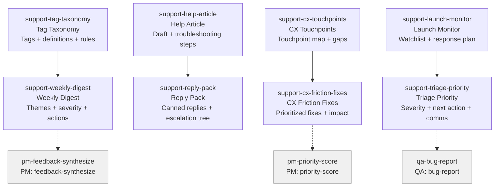

# SUPPORT Skills (8)

> Part of [Role Skills Catalog](../role-skills.md) | Phase 4 + Phase 6

**Chains**: Taxonomy → Digest | Article → Reply | CX Touchpoints → Friction | Monitor → Triage

## Userflow Schema

**Legend**: Solid = internal | Dashed = cross-role exit | Gray nodes = other roles

### /jaan-to-support-tag-taxonomy

- **Logical**: `support:tag-taxonomy`
- **Description**: Support tags + definitions, tagging rules + examples, "do not use" cases
- **Quick Win**: Yes
- **Key Points**:
  - Build a stable tag taxonomy
  - Summaries must include frequency and severity
  - Include example quotes/tickets
- **→ Next**: `support-weekly-digest`
- **MCP Required**: None
- **Input**: [product]
- **Output**: `$JAAN_OUTPUTS_DIR/support/feedback/{slug}/tag-taxonomy.md`

### /jaan-to-support-help-article

- **Logical**: `support:help-article`
- **Description**: Help-center article draft, step-by-step troubleshooting, "when to contact support" section
- **Quick Win**: Yes
- **Key Points**:
  - Articles should match user language, not internal terms
  - Macros need clear escalation rules
  - Keep troubleshooting steps ordered and testable
- **→ Next**: `support-reply-pack`
- **MCP Required**: None
- **Input**: [feature]
- **Output**: `$JAAN_OUTPUTS_DIR/support/docs/{slug}/help-article.md`

### /jaan-to-support-reply-pack

- **Logical**: `support:reply-pack`
- **Description**: Canned replies + tone rules, decision tree for escalation, required fields to collect
- **Quick Win**: Yes
- **Key Points**:
  - Articles should match user language, not internal terms
  - Macros need clear escalation rules
  - Keep troubleshooting steps ordered and testable
- **→ Next**: —
- **MCP Required**: None
- **Input**: [issue-type]
- **Output**: `$JAAN_OUTPUTS_DIR/support/docs/{slug}/reply-pack.md`

### /jaan-to-support-weekly-digest

- **Logical**: `support:weekly-digest`
- **Description**: Themes + top asks, severity + trend notes, suggested product actions
- **Quick Win**: Yes
- **Key Points**:
  - Build a stable tag taxonomy
  - Summaries must include frequency and severity
  - Include example quotes/tickets
- **→ Next**: `pm-feedback-synthesize`
- **MCP Required**: None
- **Input**: [tickets]
- **Output**: `$JAAN_OUTPUTS_DIR/support/feedback/{slug}/weekly-digest.md`

### /jaan-to-support-cx-touchpoints

- **Logical**: `support:cx-touchpoints`
- **Description**: Touchpoint map + gaps, ownership per touchpoint, risk points
- **Quick Win**: Yes
- **Key Points**:
  - Map touchpoints end-to-end
  - Identify friction and ownership gaps
  - Prioritize fixes by impact
- **→ Next**: `support-cx-friction-fixes`
- **MCP Required**: None
- **Input**: [journey]
- **Output**: `$JAAN_OUTPUTS_DIR/support/cx/{slug}/touchpoints.md`

### /jaan-to-support-cx-friction-fixes

- **Logical**: `support:cx-friction-fixes`
- **Description**: Prioritized CX fixes, expected impact + effort band, coordination needs
- **Quick Win**: Yes
- **Key Points**:
  - Map touchpoints end-to-end
  - Identify friction and ownership gaps
  - Prioritize fixes by impact
- **→ Next**: `pm-priority-score`
- **MCP Required**: None
- **Input**: [feedback]
- **Output**: `$JAAN_OUTPUTS_DIR/support/cx/{slug}/friction-fixes.md`

### /jaan-to-support-launch-monitor

- **Logical**: `support:launch-monitor`
- **Description**: Watchlist + response plan, roles + escalation steps, daily summary template
- **Quick Win**: Yes
- **Key Points**:
  - Define a watchlist (metrics + sentiment + tickets)
  - Set response SLAs
  - Close the loop with product/engineering
- **→ Next**: `support-triage-priority`
- **MCP Required**: None
- **Input**: [release]
- **Output**: `$JAAN_OUTPUTS_DIR/support/watch/{slug}/launch-monitor.md`

### /jaan-to-support-triage-priority

- **Logical**: `support:triage-priority`
- **Description**: Severity + next action, escalation rules, suggested user messaging
- **Quick Win**: Yes
- **Key Points**:
  - Define a watchlist (metrics + sentiment + tickets)
  - Set response SLAs
  - Close the loop with product/engineering
- **→ Next**: `qa-bug-report`
- **MCP Required**: None
- **Input**: [ticket]
- **Output**: `$JAAN_OUTPUTS_DIR/support/triage/{slug}/priority.md`
