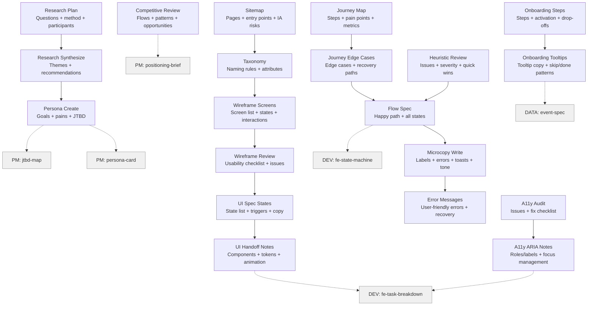

# UX Skills (20)

> Part of [Role Skills Catalog](../role-skills.md) | Phase 4 + Phase 6

**Chains**: Research → Synthesize → Persona | Journey → Edge Cases → Flow | IA: Sitemap → Taxonomy | Wireframe → Review → UI → Handoff | Copy → Errors | A11y → ARIA | Onboarding → Tooltips

## Userflow Schema

**Legend**: Solid = internal | Dashed = cross-role exit | Gray nodes = other roles

### /jaan-to-ux-research-plan

- **Logical**: `ux:research-plan`
- **Description**: Research plan: questions, method, participants, script outline, timeline, deliverables
- **Quick Win**: No - planning artifact
- **Key Points**:
  - Include entry points and handoffs (email/push/search/support)
  - Identify moments of doubt and decision points
  - Capture emotions + frictions
- **→ Next**: `ux-research-synthesize`
- **MCP Required**: Clarity (pain signals), Figma (flow context)
- **Input**: [initiative]
- **Output**: `jaan-to/outputs/ux/research/{slug}/research-plan.md`

### /jaan-to-ux-research-synthesize

- **Logical**: `ux:research-synthesize`
- **Description**: Synthesize research findings into themes, executive summary, and recommendations
- **Quick Win**: Yes - pattern recognition, summarization
- **AI Score**: 5 | **Rank**: #8
- **Key Points**:
  - Include entry points and handoffs (email/push/search/support)
  - Identify moments of doubt and decision points
  - Capture emotions + frictions
- **→ Next**: `ux-persona-create`
- **MCP Required**: None (raw data input)
- **Input**: [study_name] [data_sources]
- **Output**: `jaan-to/outputs/ux/research/{slug}/synthesis.md`
- **Failure Modes**: Too long reports; no actionable recommendations
- **Quality Gates**: Stakeholder feedback positive; action items tracked

### /jaan-to-ux-persona-create

- **Logical**: `ux:persona-create`
- **Description**: User personas with goals, pain points, behaviors, and Jobs-to-be-Done
- **Quick Win**: Yes - synthesize data, identify patterns
- **AI Score**: 5 | **Rank**: #16
- **Key Points**:
  - Include entry points and handoffs (email/push/search/support)
  - Identify moments of doubt and decision points
  - Capture emotions + frictions
- **→ Next**: `pm-jtbd-map`, `pm-persona-card`
- **MCP Required**: None (research data input), Clarity (optional)
- **Input**: [research_data] [segment]
- **Output**: `jaan-to/outputs/ux/personas/{slug}/persona.md`
- **Failure Modes**: Based on assumptions; not validated; too many personas
- **Quality Gates**: Validation interviews; periodic reviews; design decisions reference personas

### /jaan-to-ux-competitive-review

- **Logical**: `ux:competitive-review`
- **Description**: Competitive teardown: step-by-step flows, patterns, strengths/weaknesses, opportunities
- **Quick Win**: No - needs Figma MCP
- **Key Points**:
  - Include entry points and handoffs (email/push/search/support)
  - Identify moments of doubt and decision points
  - Capture emotions + frictions
- **→ Next**: `pm-positioning-brief`
- **MCP Required**: Figma (optional), GA4/Clarity (validate assumptions)
- **Input**: [initiative]
- **Output**: `jaan-to/outputs/ux/benchmark/{slug}/competitive-review.md`

### /jaan-to-ux-journey-map

- **Logical**: `ux:journey-map`
- **Description**: Step-by-step journey map, pain points + opportunities, metrics to watch per step
- **Quick Win**: Yes
- **Key Points**:
  - Include entry points and handoffs (email/push/search/support)
  - Identify moments of doubt and decision points
  - Capture emotions + frictions
- **→ Next**: `ux-journey-edge-cases`
- **MCP Required**: None
- **Input**: [persona] [task]
- **Output**: `jaan-to/outputs/ux/journey/{slug}/journey-map.md`

### /jaan-to-ux-journey-edge-cases

- **Logical**: `ux:journey-edge-cases`
- **Description**: Edge-case list, recovery paths + UI requirements, "must not happen" failures
- **Quick Win**: Yes
- **Key Points**:
  - Include entry points and handoffs (email/push/search/support)
  - Identify moments of doubt and decision points
  - Capture emotions + frictions
- **→ Next**: `ux-flow-spec`
- **MCP Required**: None
- **Input**: [flow]
- **Output**: `jaan-to/outputs/ux/journey/{slug}/edge-cases.md`

### /jaan-to-ux-sitemap

- **Logical**: `ux:sitemap`
- **Description**: Sitemap + page responsibilities, entry points + cross-links, IA risks (deep nesting, duplicates)
- **Quick Win**: Yes
- **Key Points**:
  - Group by user intent, not internal org
  - Define page responsibilities
  - Create naming rules to avoid drift
- **→ Next**: `ux-taxonomy`
- **MCP Required**: None
- **Input**: [feature]
- **Output**: `jaan-to/outputs/ux/ia/{slug}/sitemap.md`

### /jaan-to-ux-taxonomy

- **Logical**: `ux:taxonomy`
- **Description**: Naming + grouping rules, attribute set (what metadata matters), examples + anti-examples
- **Quick Win**: Yes
- **Key Points**:
  - Group by user intent, not internal org
  - Define page responsibilities
  - Create naming rules to avoid drift
- **→ Next**: `ux-wireframe-screens`
- **MCP Required**: None
- **Input**: [content-types]
- **Output**: `jaan-to/outputs/ux/ia/{slug}/taxonomy.md`

### /jaan-to-ux-wireframe-screens

- **Logical**: `ux:wireframe-screens`
- **Description**: Screen list by step, required states per screen, interaction notes
- **Quick Win**: Yes
- **Key Points**:
  - Specify key states early (empty/error/loading)
  - Validate primary task completion
  - Include content hierarchy (what matters first)
- **→ Next**: `ux-wireframe-review`
- **MCP Required**: None
- **Input**: [journey]
- **Output**: `jaan-to/outputs/ux/wireframe/{slug}/screens.md`

### /jaan-to-ux-wireframe-review

- **Logical**: `ux:wireframe-review`
- **Description**: Usability checklist, heuristic issues to look for, missing-state detector
- **Quick Win**: Yes
- **Key Points**:
  - Specify key states early (empty/error/loading)
  - Validate primary task completion
  - Include content hierarchy (what matters first)
- **→ Next**: `ux-ui-spec-states`
- **MCP Required**: None
- **Input**: [wireframes]
- **Output**: `jaan-to/outputs/ux/wireframe/{slug}/review-checklist.md`

### /jaan-to-ux-flow-spec

- **Logical**: `ux:flow-spec`
- **Description**: Flow spec: happy path + empty/loading/error states + edge cases + implementation notes
- **Quick Win**: Yes - flow documentation
- **Key Points**:
  - Specify key states early (empty/error/loading)
  - Validate primary task completion
  - Include content hierarchy (what matters first)
- **→ Next**: `ux-microcopy-write`, `dev-fe-state-machine`
- **MCP Required**: Figma (flow/state extraction)
- **Input**: [initiative]
- **Output**: `jaan-to/outputs/ux/flows/{slug}/flow-spec.md`

### /jaan-to-ux-heuristic-review

- **Logical**: `ux:heuristic-review`
- **Description**: Heuristic review: issues, severity, recommended fixes, quick wins, usability principles
- **Quick Win**: No - structured review
- **Key Points**:
  - Specify key states early (empty/error/loading)
  - Validate primary task completion
  - Include content hierarchy (what matters first)
- **→ Next**: `ux-flow-spec`
- **MCP Required**: Clarity (behavior evidence), Figma (screens)
- **Input**: [initiative]
- **Output**: `jaan-to/outputs/ux/review/{slug}/heuristic-review.md`

### /jaan-to-ux-ui-spec-states

- **Logical**: `ux:ui-spec-states`
- **Description**: State list + triggers, copy requirements per state, visual priority guidance
- **Quick Win**: No - needs Figma
- **Key Points**:
  - Ensure state coverage: success/error/empty/loading
  - Document component usage to reduce custom builds
  - Align spacing/typography with system tokens
- **→ Next**: `ux-ui-handoff-notes`
- **MCP Required**: Figma (screens/states)
- **Input**: [screen]
- **Output**: `jaan-to/outputs/ux/ui/{slug}/spec-states.md`

### /jaan-to-ux-ui-handoff-notes

- **Logical**: `ux:ui-handoff-notes`
- **Description**: Dev handoff notes, components + tokens used, interaction + animation guidance
- **Quick Win**: No - needs Figma
- **Key Points**:
  - Ensure state coverage: success/error/empty/loading
  - Document component usage to reduce custom builds
  - Align spacing/typography with system tokens
- **→ Next**: `dev-fe-task-breakdown`
- **MCP Required**: Figma (design specs)
- **Input**: [design]
- **Output**: `jaan-to/outputs/ux/ui/{slug}/handoff-notes.md`

### /jaan-to-ux-microcopy-write

- **Logical**: `ux:microcopy-write`
- **Description**: Microcopy pack: labels, helper text, errors, toasts, confirmations, empty states, tone rules
- **Quick Win**: Yes - simple content
- **Key Points**:
  - Use verbs, be specific, avoid blame
  - Error messages: what happened + what to do next
  - Maintain tone rules and consistency
- **→ Next**: `ux-error-messages`
- **MCP Required**: Figma (components + strings)
- **Input**: [initiative]
- **Output**: `jaan-to/outputs/ux/content/{slug}/microcopy.md`

### /jaan-to-ux-error-messages

- **Logical**: `ux:error-messages`
- **Description**: User-friendly errors, next steps + recovery actions, logging hints (error codes mapping)
- **Quick Win**: Yes
- **Key Points**:
  - Use verbs, be specific, avoid blame
  - Error messages: what happened + what to do next
  - Maintain tone rules and consistency
- **→ Next**: —
- **MCP Required**: None
- **Input**: [errors]
- **Output**: `jaan-to/outputs/ux/content/{slug}/error-messages.md`

### /jaan-to-ux-a11y-audit

- **Logical**: `ux:a11y-audit`
- **Description**: Issues + severity, fix checklist, quick wins vs structural changes
- **Quick Win**: Yes
- **Key Points**:
  - Contrast, focus order, keyboard operability
  - Labels for inputs, meaningful headings
  - Don't rely on color alone
- **→ Next**: `ux-a11y-aria-notes`
- **MCP Required**: None
- **Input**: [screens]
- **Output**: `jaan-to/outputs/ux/a11y/{slug}/audit.md`

### /jaan-to-ux-a11y-aria-notes

- **Logical**: `ux:a11y-aria-notes`
- **Description**: ARIA roles/labels guidance, focus management notes, accessible patterns reminders
- **Quick Win**: Yes
- **Key Points**:
  - Contrast, focus order, keyboard operability
  - Labels for inputs, meaningful headings
  - Don't rely on color alone
- **→ Next**: `dev-fe-task-breakdown`
- **MCP Required**: None
- **Input**: [components]
- **Output**: `jaan-to/outputs/ux/a11y/{slug}/aria-notes.md`

### /jaan-to-ux-onboarding-steps

- **Logical**: `ux:onboarding-steps`
- **Description**: Onboarding steps + activation event, drop-off risks, measurement plan pointers
- **Quick Win**: Yes
- **Key Points**:
  - Define activation event clearly
  - Use progressive disclosure (don't teach everything)
  - Tooltips must be contextual and skippable
- **→ Next**: `ux-onboarding-tooltips`
- **MCP Required**: None
- **Input**: [product]
- **Output**: `jaan-to/outputs/ux/onboarding/{slug}/steps.md`

### /jaan-to-ux-onboarding-tooltips

- **Logical**: `ux:onboarding-tooltips`
- **Description**: Tooltip copy set, tone rules + character limits, "skip/done" patterns
- **Quick Win**: Yes
- **Key Points**:
  - Define activation event clearly
  - Use progressive disclosure (don't teach everything)
  - Tooltips must be contextual and skippable
- **→ Next**: `data-event-spec`
- **MCP Required**: None
- **Input**: [steps]
- **Output**: `jaan-to/outputs/ux/onboarding/{slug}/tooltips.md`
