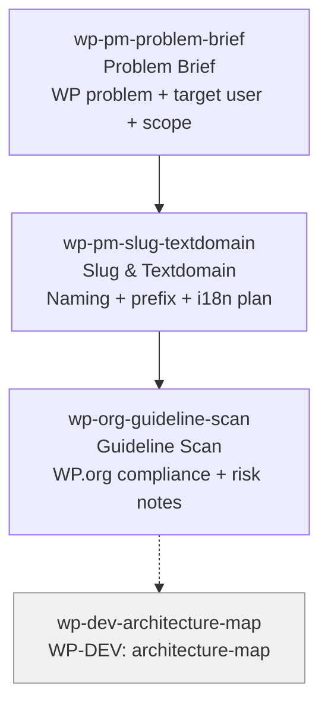

# WP-PM Skills (3)

> Part of [WP Role Skills Catalog](../roles-wp-skills.md) | Phase 4

**Chain**: Problem Brief → Slug/Textdomain → Guideline Scan

## Userflow Schema

**Legend**: Solid = internal | Dashed = cross-role exit | Gray nodes = other roles

### /jaan-to-wp-pm-problem-brief

- **Logical**: `wp-pm:problem-brief`
- **Description**: WP-specific problem statement + target user + scope boundaries (admin/front/editor, multisite, roles) + measurable outcomes
- **Quick Win**: Yes
- **Cross-ref**: Extends [pm-problem-statement](../role-skills/pm.md#jaan-to-pm-problem-statement) with WP surface + interop concerns
- **Key Points**:
  - Define the "WP surface" (wp-admin vs frontend vs block editor) and where value is delivered
  - Identify collision/interop risks early (names, hooks, assets, settings)
  - Capture constraints that affect feasibility (capabilities, network mode, uninstall expectations)
- **→ Next**: `wp-pm-slug-textdomain`
- **MCP Required**: None
- **Input**: [audience] [pain] [surface]
- **Output**: `$JAAN_OUTPUTS_DIR/wp/pm/{slug}/problem-brief.md`

### /jaan-to-wp-pm-slug-textdomain

- **Logical**: `wp-pm:slug-textdomain`
- **Description**: Naming, slug, prefix + text-domain plan (translation-ready + directory compatibility)
- **Quick Win**: Yes
- **Key Points**:
  - Ensure slug/text-domain alignment for portability and WordPress.org expectations
  - Define a consistent prefix strategy to avoid naming collisions
  - Document stable identifiers (option keys, hook prefixes, asset handles)
- **→ Next**: `wp-org-guideline-scan`
- **MCP Required**: None
- **Input**: [plugin-name]
- **Output**: `$JAAN_OUTPUTS_DIR/wp/pm/{slug}/naming-and-textdomain.md`
- **Reference**: Internationalization: text domains must match slug

### /jaan-to-wp-org-guideline-scan

- **Logical**: `wp-org:guideline-scan`
- **Description**: WordPress.org directory compliance scan + risk notes + "must change" checklist
- **Quick Win**: Yes
- **Key Points**:
  - Validate directory-fit and disclosure requirements before building distribution assumptions
  - Flag common rejection triggers and required policy items
  - Produce a remediation checklist mapped to guidelines
- **→ Next**: `wp-dev-architecture-map`
- **MCP Required**: None
- **Input**: [plugin-idea] [distribution-model]
- **Output**: `$JAAN_OUTPUTS_DIR/wp/org/{slug}/guideline-scan.md`
- **Reference**: Detailed Plugin Guidelines (WordPress.org)
