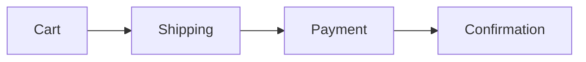

# detect-ux

> Repo-driven UX audit with journeys, pain-points, and heuristic-based findings.

## Context Files

- `$JAAN_LEARN_DIR/jaan-to:detect-ux.learn.md` - Past lessons (loaded in Pre-Execution)
- `$JAAN_CONTEXT_DIR/tech.md` - Tech stack (for framework-aware route detection)
- `$JAAN_TEMPLATES_DIR/jaan-to:detect-ux.template.md` - Output template

**Output path exception**: This skill writes to `docs/current/ux/` in the target project, NOT to `$JAAN_OUTPUTS_DIR`. Detect outputs are living project documentation (overwritten each run), not versioned artifacts.

## Input

**Repository**: $ARGUMENTS

If a repository path is provided, scan that repo. Otherwise, scan the current working directory.

---

## Pre-Execution: Apply Past Lessons

**MANDATORY FIRST ACTION** — Before any other step, use the Read tool to read:
`$JAAN_LEARN_DIR/jaan-to:detect-ux.learn.md`

If the file exists, apply its lessons throughout this execution.

If the file does not exist, continue without it.

### Language Settings

**Read language preference** from `jaan-to/config/settings.yaml`:

1. Check for per-skill override: `language_detect-ux` field
2. If no override, use the global `language` field
3. Resolve:

| Value | Action |
|-------|--------|
| Language code (`en`, `fa`, `tr`, etc.) | Use that language immediately |
| `"ask"` or field missing | Prompt: "What language do you prefer for conversation and reports?" — then save choice to `jaan-to/config/settings.yaml` |

**Keep in English always**: technical terms, code snippets, file paths, variable names, YAML keys, evidence blocks.

---

## Standards Reference

### Evidence Format (SARIF-compatible)

```yaml
evidence:
  id: E-UX-001
  type: code-location
  confidence: 0.80
  location:
    uri: "src/pages/checkout/index.tsx"
    startLine: 15
    snippet: |
      <Route path="/checkout" element={<CheckoutPage />} />
  method: pattern-match
```

Evidence IDs use namespace `E-UX-NNN` to prevent collisions in pack-detect.

### Confidence Levels (4-level)

| Level | Label | Range | Criteria |
|-------|-------|-------|----------|
| 4 | **Confirmed** | 0.95-1.00 | Multiple independent methods agree |
| 3 | **Firm** | 0.80-0.94 | Single high-precision method with clear evidence |
| 2 | **Tentative** | 0.50-0.79 | Pattern match without full analysis |
| 1 | **Uncertain** | 0.20-0.49 | Absence-of-evidence reasoning |

### Frontmatter Schema (Universal)

```yaml
---
title: "{document title}"
id: "{AUDIT-YYYY-NNN}"
version: "1.0.0"
status: draft
date: {YYYY-MM-DD}
target:
  name: "{repo-name}"
  commit: "{git HEAD hash}"
  branch: "{current branch}"
tool:
  name: "detect-ux"
  version: "1.0.0"
  rules_version: "2024.1"
confidence_scheme: "four-level"
findings_summary:
  critical: 0
  high: 0
  medium: 0
  low: 0
  informational: 0
overall_score: 0.0
lifecycle_phase: post-build
---
```

### Document Structure (Diataxis)

1. Executive Summary
2. Scope and Methodology
3. Findings (ID/severity/confidence/evidence)
4. Recommendations
5. Appendices

---

# PHASE 1: Detection (Read-Only)

## Thinking Mode

ultrathink

Use extended reasoning for:
- Route/screen mapping from framework-specific patterns
- Journey flow construction from navigation patterns
- Nielsen heuristic assessment from code signals
- Pain-point inference from error handling patterns

## Step 1: Route / Screen Mapping

Detect framework and extract routes:

### Framework-Specific Route Extraction

**React Router**:
- Grep: `useRoutes(`, `<Route`, `<Outlet`, `createBrowserRouter`
- Extract: path, element/component, nested routes, layout routes

**Next.js**:
- Glob: `app/**/page.{tsx,jsx,ts,js}` — app router pages
- Glob: `pages/**/*.{tsx,jsx,ts,js}` — pages router
- Detect dynamic routes: `[slug]`, `[...catchAll]`, `[[...optional]]`
- Detect route groups: `(group)/`
- Detect layouts: `layout.{tsx,jsx}`

**Vue Router**:
- Grep: `routes` array definitions, `<RouterView`, `<router-view`
- Glob: `**/router/**/*.{ts,js}` — router config files

**Angular**:
- Glob: `**/*routing.module.ts`, `**/*-routes.ts`
- Grep: `canActivate`, `canDeactivate` guards
- Extract: path, component, guards, lazy-loaded modules

**Express / API backends**:
- Grep: `app.get(`, `app.post(`, `app.put(`, `app.delete(`
- Grep: `router.get(`, `router.post(`, `router.put(`
- Grep: `@Get(`, `@Post(` — NestJS decorators

### Screen Inventory

For each route/page, extract:
- Route path and name
- Component file location
- Auth requirement (guards, middleware, redirect patterns)
- Layout parent
- Query parameters / dynamic segments

## Step 2: Infer User Personas

From route structure and component analysis, infer personas:

- **Authenticated vs unauthenticated** routes -> at least 2 persona types
- **Admin/dashboard routes** -> admin/power user persona
- **Onboarding flows** -> new user persona
- **API-only routes** -> developer/integrator persona
- **Settings/profile routes** -> returning user persona

Mark all personas as **Tentative** confidence — these are inferred from code structure, not validated user research.

## Step 3: Infer Jobs-to-be-Done (JTBD)

From features and flows detected:
- Group related routes into functional areas (auth, billing, content, settings)
- For each area, construct JTBD statement: "When {situation}, I want to {motivation}, so I can {expected outcome}"
- Link to route evidence

Mark all JTBD as **Tentative** — inferred from code, not user research.

## Step 4: Map User Flows

Trace navigation paths through the application:

- Detect navigation components: `<Link`, `<NavLink`, `useNavigate`, `router.push`
- Map which pages link to which other pages
- Identify entry points (landing, login, deep links)
- Identify exit points (logout, external links)
- Detect multi-step flows (wizards, checkout, onboarding)

For multi-step flows, construct Mermaid flow diagrams:


## Step 5: Detect Pain Points

Scan for UX friction signals:

### Error Handling Patterns
- Grep: `<ErrorBoundary`, `ErrorFallback`, `errorElement`
- Check for error states in forms: validation messages, inline errors
- Look for generic error pages vs contextual error handling
- Detect retry patterns: `retry`, `refetch`, `onError`

### Loading Patterns
- Grep: `isLoading`, `isPending`, `<Skeleton`, `<Spinner`, `<Suspense`
- Check for loading states on data-fetching pages
- Detect missing loading states (data fetch without loading indicator)

### Form Complexity
- Count form fields per form component
- Detect multi-step forms vs single-page forms
- Check for form validation: `validate`, `yup`, `zod`, `formik`
- Look for autosave patterns

### Dead Ends
- Routes without navigation back
- Error states without recovery actions
- Empty states without CTAs

## Step 6: Nielsen's 10 Heuristics Assessment

Evaluate each heuristic from code evidence:

| # | Heuristic | Code Signals to Scan |
|---|-----------|---------------------|
| 1 | **Visibility of system status** | `isLoading`, `<Skeleton>`, `<Spinner>`, `<Progress>`, status messages, optimistic updates |
| 2 | **Match between system and real world** | Domain terminology consistency in component names, labels, and copy |
| 3 | **User control and freedom** | Undo patterns, cancel buttons, back navigation, `useNavigate(-1)`, confirmation dialogs |
| 4 | **Consistency and standards** | Component naming conventions, prop patterns, shared UI components, design token usage |
| 5 | **Error prevention** | `<ConfirmDialog>`, `validate()`, type constraints, `disabled` states, `maxLength` |
| 6 | **Recognition rather than recall** | Navigation labels, breadcrumbs, search, autocomplete, recent items, `<Select>` vs text input |
| 7 | **Flexibility and efficiency** | Keyboard shortcuts, customization options, bulk actions, saved preferences |
| 8 | **Aesthetic and minimalist design** | Component complexity (prop count, nesting depth), information density per page |
| 9 | **Error recovery** | Error messages with solutions, retry buttons, "try again" patterns, support links |
| 10 | **Help and documentation** | `<Tooltip>`, `<HelpText>`, documentation links, `?` icons, help pages, FAQ routes |

For each heuristic:
- Scan for positive signals (good practices found)
- Scan for negative signals (violations found)
- Rate: Strong / Adequate / Weak / Unknown
- Cite evidence for each rating

**Important**: Missing code evidence does NOT equal a violation. Mark as "Unknown" when evidence is insufficient.

## Step 7: Accessibility Assessment (Repo-Scoped)

**Scope**: Code-level only. Cannot make runtime behavior claims.

- Grep: ARIA attributes (`aria-label`, `aria-describedby`, `aria-live`, `role=`)
- Check semantic HTML usage
- Detect keyboard navigation patterns: `onKeyDown`, `tabIndex`, focus management
- Look for skip links: `#main-content`, `skipToContent`
- Check for a11y testing: `jest-axe`, `@axe-core`, `cypress-axe`, `pa11y`
- Check for reduced motion: `prefers-reduced-motion`

Mark findings as "Unknown" for runtime behavior that can't be verified from code.

---

# HARD STOP — Detection Summary & User Approval

## Step 8: Present Detection Summary

```
UX DETECTION COMPLETE
----------------------

ROUTES/SCREENS: {n} routes mapped
PERSONAS (inferred): {n} personas
JTBD (inferred): {n} jobs-to-be-done
USER FLOWS: {n} flows mapped

NIELSEN HEURISTICS
  Strong:   {n}/10
  Adequate: {n}/10
  Weak:     {n}/10
  Unknown:  {n}/10

PAIN POINTS: {n} detected
ACCESSIBILITY: {n} findings (repo-scoped)
UX GAPS: {n} identified

SEVERITY SUMMARY
  Critical: {n}  |  High: {n}  |  Medium: {n}  |  Low: {n}  |  Info: {n}

OVERALL SCORE: {score}/10

OUTPUT FILES (7):
  docs/current/ux/personas.md       - Inferred personas
  docs/current/ux/jtbd.md           - Jobs-to-be-done
  docs/current/ux/flows.md          - User flows with diagrams
  docs/current/ux/pain-points.md    - UX friction and pain points
  docs/current/ux/heuristics.md     - Nielsen 10 heuristics assessment
  docs/current/ux/accessibility.md  - A11y findings (repo-scoped)
  docs/current/ux/gaps.md           - UX gaps and recommendations
```

> "Proceed with writing 7 output files to docs/current/ux/? [y/n]"

**Do NOT proceed to Phase 2 without explicit approval.**

---

# PHASE 2: Write Output Files

## Step 9: Write to docs/current/ux/

Create directory `docs/current/ux/` if it does not exist.

Write 7 output files:

| File | Content |
|------|---------|
| `docs/current/ux/personas.md` | Inferred personas from route/auth analysis |
| `docs/current/ux/jtbd.md` | Jobs-to-be-done statements linked to features |
| `docs/current/ux/flows.md` | User flows with Mermaid diagrams |
| `docs/current/ux/pain-points.md` | UX friction signals and dead ends |
| `docs/current/ux/heuristics.md` | Nielsen 10 heuristics assessment table |
| `docs/current/ux/accessibility.md` | A11y findings (scoped to repo evidence) |
| `docs/current/ux/gaps.md` | UX gaps and improvement recommendations |

Each file MUST include:
1. Universal YAML frontmatter
2. Executive Summary
3. Scope and Methodology
4. Findings with evidence blocks (using E-UX-NNN IDs)
5. Recommendations

---

## Step 10: Capture Feedback

> "Any feedback on the UX audit? [y/n]"

If yes:
- Run `/jaan-to:learn-add detect-ux "{feedback}"`

---

## Definition of Done

- [ ] All 7 output files written to `docs/current/ux/`
- [ ] Universal YAML frontmatter in every file
- [ ] Every finding has evidence block with E-UX-NNN ID
- [ ] Routes/screens mapped from framework-specific patterns
- [ ] Personas and JTBD marked as Tentative (inferred)
- [ ] Nielsen heuristics assessed with code evidence
- [ ] Accessibility findings scoped to repo (no runtime claims)
- [ ] Mermaid flow diagrams for multi-step flows
- [ ] Confidence scores assigned to all findings
- [ ] User approved output
