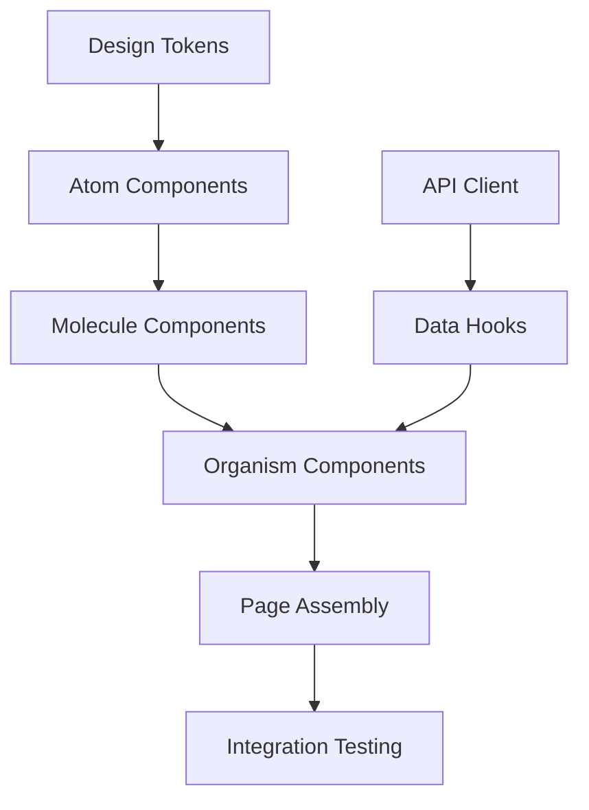

# frontend-task-breakdown

> Transform UX design handoffs into production-ready frontend task breakdowns.

## Context Files

- `$JAAN_CONTEXT_DIR/tech.md` - Tech stack context (optional, auto-imported if exists)
  - Uses sections: `#current-stack`, `#frameworks`, `#constraints`
- `$JAAN_CONTEXT_DIR/config.md` - Project configuration
- `$JAAN_TEMPLATES_DIR/jaan-to:frontend-task-breakdown.template.md` - Output template
- `$JAAN_LEARN_DIR/jaan-to:frontend-task-breakdown.learn.md` - Past lessons (loaded in Pre-Execution)
- `${CLAUDE_PLUGIN_ROOT}/docs/extending/language-protocol.md` - Language resolution protocol

## Input

**UX Handoff**: $ARGUMENTS

Accepts any of:
- **Figma link** — URL to design file or prototype
- **Design description** — Free text describing screens and flows
- **Screenshot path** — Path to screenshot image(s)
- **PRD reference** — Path to PRD file with frontend requirements
- **Feature name** — Brief feature description for breakdown

If no input provided, ask: "What feature or UX handoff should I break down?"

---

## Pre-Execution Protocol
**MANDATORY** — Read and execute ALL steps in: `${CLAUDE_PLUGIN_ROOT}/docs/extending/pre-execution-protocol.md`
Skill name: `frontend-task-breakdown`
Execute: Step 0 (Init Guard) → A (Load Lessons) → B (Resolve Template) → C (Offer Template Seeding)

Also read tech context if available:
- `$JAAN_CONTEXT_DIR/tech.md` - Know the tech stack for framework-specific patterns

### Language Settings
Read and apply language protocol: `${CLAUDE_PLUGIN_ROOT}/docs/extending/language-protocol.md`
Override field for this skill: `language_frontend-task-breakdown`

---

# PHASE 1: Analysis (Read-Only)

## Thinking Mode

ultrathink

Use extended reasoning for:
- Analyzing UX handoff to extract components and flows
- Mapping components to atomic design levels
- Enumerating states and edge cases
- Building dependency graphs
- Assessing risks

## Step 1: Parse UX Handoff Input

Analyze the provided input to extract:

**If Figma link:**
1. Note the URL
2. Ask user to describe key screens/flows (Claude cannot access Figma directly)
3. Ask for screenshot exports if available

**If design description / feature name:**
1. Extract screens mentioned
2. Extract user flows and interactions
3. Identify data requirements
4. Note any specified components

**If screenshot path:**
1. Read the image file(s)
2. Identify visible components and layout structure
3. Infer interaction patterns from visual cues
4. Note areas needing clarification

**If PRD reference:**
1. Read the PRD file
2. Extract frontend-relevant user stories
3. Identify screens and flows from acceptance criteria
4. Note technical constraints mentioned

Build an initial understanding:
```
INPUT SUMMARY
─────────────
Type:     {figma/description/screenshot/prd}
Screens:  {list of identified screens}
Flows:    {list of user flows}
Data:     {data requirements identified}
Unknown:  {areas needing clarification}
```

## Step 2: Clarify Scope

Ask up to 5 smart questions based on what's unclear from Step 1. Skip questions already answered by the input.

**Scope questions** (ask if ambiguous):
1. "Which screens/flows should I break down?" — only if input covers multiple areas
2. "Is this a new feature or extending existing UI?" — affects component reuse

**Framework questions** (ask if tech.md unavailable or incomplete):
3. "Any specific framework constraints? (React, Vue, Next.js, etc.)" — if not in tech.md

**Depth question** (always ask):
4. Use AskUserQuestion:
   - Question: "What's the target scope for this breakdown?"
   - Header: "Scope"
   - Options:
     - "MVP" — Core functionality, happy path, basic states
     - "Production" — Full states, a11y, performance budgets, edge cases
     - "In between" — Core + error/loading states, basic a11y

**Coverage question** (ask if scope is Production or In between):
5. Use AskUserQuestion:
   - Question: "Include accessibility + performance task details?"
   - Header: "Coverage"
   - Options:
     - "Full coverage" — All 50+ checklist items evaluated
     - "Essential only" — Key a11y + core performance
     - "Skip" — Focus on functional tasks only

## Step 3: Component Identification

For each screen/flow, identify components using **Atomic Design taxonomy**:

> **Reference**: Full taxonomy table with estimate bands in [`docs/extending/frontend-task-breakdown-reference.md` → Atomic Design Taxonomy](${CLAUDE_PLUGIN_ROOT}/docs/extending/frontend-task-breakdown-reference.md).

For each component, record:
- **Name** (descriptive, BEM-style)
- **Atomic level**
- **Estimate band** (T-shirt size)
- **Reusable?** (yes = shared component, no = feature-specific)
- **Exists already?** (check against known design system if tech.md describes one)

Present component inventory:
```
COMPONENT INVENTORY
───────────────────
Atoms:      {count} ({reusable}/{new})
Molecules:  {count} ({reusable}/{new})
Organisms:  {count} ({reusable}/{new})
Templates:  {count}
Pages:      {count}
Total:      {total_count} components
```

## Step 4: State Enumeration

For **every component** at molecule level and above, enumerate states:

| State | What to Define | UI Element |
|-------|---------------|------------|
| **Default** | Initial render appearance | Standard view |
| **Loading** | During data fetch | Skeleton shimmer or spinner |
| **Success** | Happy path with data | Populated view |
| **Error** | API failure or validation error | Error message + retry action |
| **Empty** | No data available | Illustration + CTA |
| **Partial** | Cached data while refreshing | Stale data + refresh indicator |

For **screens/pages**, also enumerate:

**Edge cases:**
- Long text (100+ characters) — truncation with tooltip
- Missing images — fallback placeholder
- Slow network (3G) — timeout handling
- Very long lists — virtualization consideration
- Special characters / unicode — encoding handling
- Browser back/forward — navigation state

**Browser compatibility** (if scope includes it):
- Safari iOS: position:fixed in scroll containers, 100vh, date inputs
- Safari Desktop: flexbox gaps, backdrop-filter
- Firefox: form autofill styling

Build a **state matrix**:
```
STATE MATRIX (screens x states)
───────────────────────────────
                Default  Loading  Success  Error  Empty  Partial
Screen A:       [x]      [x]      [x]      [x]    [x]    [ ]
Screen B:       [x]      [x]      [x]      [x]    [ ]    [x]
...
```

## Step 5: Coverage Analysis

Apply the coverage checklist based on scope selected in Step 2.

> **Reference**: Full coverage checklist (53 items across 7 domains: Accessibility, Responsive, Interaction, Performance, SEO, Infrastructure, Testing) in [`docs/extending/frontend-task-breakdown-reference.md` → Coverage Checklist](${CLAUDE_PLUGIN_ROOT}/docs/extending/frontend-task-breakdown-reference.md).

For each item, mark: **Included** / **Not applicable** / **Deferred**

Count coverage:
```
COVERAGE SUMMARY
────────────────
Included:       {n} tasks
Not applicable: {n} items
Deferred:       {n} items (list reasons)
```

## Step 6: Dependency Mapping

Build the dependency graph for all identified components:

**Standard dependency chains:**
1. Design tokens → Atom components → Molecule components → Organism components → Page assembly
2. API client setup → Data fetching hooks → Components that consume data
3. Shared state (context/store) → Components that read/write state
4. Route configuration → Page components

**Identify:**
- **Critical path** — longest chain of sequential dependencies (determines minimum duration)
- **Parallel tracks** — independent component groups that different developers can build simultaneously
- **Shared infrastructure** — tasks that unblock multiple downstream components

Format as Mermaid:


## Step 7: Risk Assessment

Categorize and rate risks:

**Technical risks:**
- New framework features (React Server Components, Suspense boundaries)
- Complex state management (cross-component, optimistic updates)
- Performance targets (large datasets, real-time updates)
- Browser compatibility requirements

**Integration risks:**
- API contracts not yet defined (frontend blocked)
- Third-party dependency instability
- Authentication/authorization integration
- Backend not ready for frontend consumption

**UX risks:**
- Unclear requirements (missing design states)
- Design changes during development
- Accessibility gaps in designs
- Localization/i18n requirements unclear

Rate each: **Likelihood** (Low/Medium/High) x **Impact** (Low/Medium/High)

Propose mitigation for every Medium+ impact risk.

---

# HARD STOP — Review Breakdown Plan

Present the complete analysis summary:

```
TASK BREAKDOWN PLAN
═══════════════════

COMPONENTS
──────────
Atoms:      {count} (XS)     Molecules: {count} (S)
Organisms:  {count} (M)      Templates: {count} (L)
Pages:      {count} (XL)     Total:     {total}

ESTIMATES
─────────
Total tasks:     {task_count}
Critical path:   {n} sequential tasks
Parallel tracks: {n} independent streams

COVERAGE
────────
Scope:    {MVP/Production/In between}
Included: {n} coverage items
Deferred: {n} items

TOP RISKS
─────────
1. {risk_1} — {likelihood}/{impact} — {mitigation_summary}
2. {risk_2} — {likelihood}/{impact} — {mitigation_summary}
3. {risk_3} — {likelihood}/{impact} — {mitigation_summary}
```

Use AskUserQuestion:
- Question: "Proceed with generating the task breakdown document?"
- Header: "Generate"
- Options:
  - "Yes" — Generate the full task breakdown
  - "No" — Cancel
  - "Edit" — Let me revise the scope or components first

**Do NOT proceed to Phase 2 without explicit approval.**

---

# PHASE 2: Generation (Write Phase)

## Step 8: Generate Task Breakdown Document

1. Read template: `$JAAN_TEMPLATES_DIR/jaan-to:frontend-task-breakdown.template.md`
2. If tech stack needed, extract sections from tech.md:
   - Current Stack: `#current-stack`
   - Frameworks: `#frameworks`
   - Constraints: `#constraints`

3. Fill all template sections with analysis from Phase 1:

**Overview section:**
- Feature name, epic (if provided), scope level, date

**Component Inventory section:**
- If screenshots were provided as input, embed them in the Component Inventory using `` alongside relevant component groups
- For each component: name, atomic level, estimate band, risk level
- States table (6 states per component)
- Tasks table with: task description, size, complexity, dependencies, acceptance criteria

**Task naming convention:**
`[Action Verb] + [Component/Feature] + [Specific Detail]`
- Create/Build/Implement → new work
- Add/Extend → enhancements
- Configure/Setup → infrastructure

**Estimate bands** (T-shirt sizes, not hours):

> **Reference**: Full estimate bands table (XS–XL with meanings and typical work) in [`docs/extending/frontend-task-breakdown-reference.md` → Estimate Bands](${CLAUDE_PLUGIN_ROOT}/docs/extending/frontend-task-breakdown-reference.md).

**State Machine stubs** (for organisms and above):

> **Reference**: State machine stub template (states, events, transitions format) in [`docs/extending/frontend-task-breakdown-reference.md` → State Machine Stubs](${CLAUDE_PLUGIN_ROOT}/docs/extending/frontend-task-breakdown-reference.md).

**Dependency Graph** — Mermaid diagram from Step 6

**Performance Budget** (if scope = Production or In between):

> **Reference**: Performance budget table (LCP, INP, CLS, Bundle targets and optimization tasks) in [`docs/extending/frontend-task-breakdown-reference.md` → Performance Budget](${CLAUDE_PLUGIN_ROOT}/docs/extending/frontend-task-breakdown-reference.md).

**Risk Register** — table from Step 7

**Coverage Checklist** — applicable items from Step 5

**Definition of Ready / Definition of Done:**

> **Reference**: Full checklists (6 Ready items, 8 Done items) in [`docs/extending/frontend-task-breakdown-reference.md` → Definition of Ready / Definition of Done](${CLAUDE_PLUGIN_ROOT}/docs/extending/frontend-task-breakdown-reference.md).

## Step 9: Quality Check

Before preview, verify:

- [ ] Every component (molecule+) has all 6 states listed
- [ ] No component without an estimate band
- [ ] Dependency graph is acyclic (no circular dependencies)
- [ ] At least 1 accessibility task per organism-level component
- [ ] Performance budget present (if scope = Production or In between)
- [ ] Risk register has mitigation for every High-impact risk
- [ ] Task names follow verb + component + detail pattern
- [ ] No hardcoded paths (all use `$JAAN_*` variables)
- [ ] State machine stubs present for complex components
- [ ] Definition of Ready and Done sections populated
- [ ] If screenshots provided: images embedded with `` syntax and URL-encoded paths

If any check fails, fix before preview.

## Step 10: Preview & Approval

Show the complete task breakdown document.

Use AskUserQuestion:
- Question: "Write task breakdown to output?"
- Header: "Write"
- Options:
  - "Yes" — Write the file
  - "No" — Cancel

## Step 10.5: Generate ID and Folder Structure

If approved, set up the output structure:

1. Source ID generator utility:
```bash
source "${CLAUDE_PLUGIN_ROOT}/scripts/lib/id-generator.sh"
```

2. Generate sequential ID and output paths:
```bash
# Define subdomain directory
SUBDOMAIN_DIR="$JAAN_OUTPUTS_DIR/frontend/task-breakdown"
mkdir -p "$SUBDOMAIN_DIR"

# Generate next ID
NEXT_ID=$(generate_next_id "$SUBDOMAIN_DIR")

# Create folder and file paths (slug from feature name)
slug="{lowercase-hyphenated-feature-name}"
OUTPUT_FOLDER="${SUBDOMAIN_DIR}/${NEXT_ID}-${slug}"
MAIN_FILE="${OUTPUT_FOLDER}/${NEXT_ID}-${slug}.md"
```

3. Preview output configuration:
> **Output Configuration**
> - ID: {NEXT_ID}
> - Folder: $JAAN_OUTPUTS_DIR/frontend/task-breakdown/{NEXT_ID}-{slug}/
> - Main file: {NEXT_ID}-{slug}.md

## Step 10.7: Resolve & Copy Assets

If screenshot paths were provided as input:

> **Reference**: See `${CLAUDE_PLUGIN_ROOT}/docs/extending/asset-embedding-reference.md` for the asset resolution protocol (path detection, copy rules, markdown embedding).

Source `${CLAUDE_PLUGIN_ROOT}/scripts/lib/asset-handler.sh`. For each screenshot: check `is_jaan_path` — if inside `$JAAN_*`, reference in-place; if external, ask user before copying. Use `resolve_asset_path` for markdown-relative paths.

## Step 11: Write Output

1. Create output folder:
```bash
mkdir -p "$OUTPUT_FOLDER"
```

2. Write task breakdown to main file:
```bash
cat > "$MAIN_FILE" <<'EOF'
{generated task breakdown with Executive Summary}
EOF
```

3. Update subdomain index:
```bash
source "${CLAUDE_PLUGIN_ROOT}/scripts/lib/index-updater.sh"
add_to_index \
  "$SUBDOMAIN_DIR/README.md" \
  "$NEXT_ID" \
  "${NEXT_ID}-${slug}" \
  "{Feature Title}" \
  "{1-2 sentence summary: frontend task breakdown for feature}"
```

4. Confirm completion:
> ✓ Task breakdown written to: $JAAN_OUTPUTS_DIR/frontend/task-breakdown/{NEXT_ID}-{slug}/{NEXT_ID}-{slug}.md
> ✓ Index updated: $JAAN_OUTPUTS_DIR/frontend/task-breakdown/README.md

## Step 12: Suggest Next Skill

> "Task breakdown complete."
>
> *Note: For detailed state machine definitions skill (`/jaan-to:frontend-state-machine`), see roadmap - coming in future release.*

## Step 13: Capture Feedback

Use AskUserQuestion:
- Question: "Any feedback on the task breakdown?"
- Header: "Feedback"
- Options:
  - "No" — All good, done
  - "Fix now" — Update something in the breakdown
  - "Learn" — Save lesson for future runs
  - "Both" — Fix now AND save lesson

- **Fix now**: Update the output file, re-preview, re-write
- **Learn**: Run `/jaan-to:learn-add frontend-task-breakdown "{feedback}"`
- **Both**: Do both

---

## Definition of Done

- [ ] UX handoff parsed and scope confirmed with user
- [ ] Components identified with atomic design levels
- [ ] States enumerated for every component (molecule+)
- [ ] Coverage checklist applied per scope level
- [ ] Dependencies mapped with Mermaid diagram
- [ ] Risks assessed with mitigations for High-impact items
- [ ] Task breakdown document written to `$JAAN_OUTPUTS_DIR/frontend/task-breakdown/{id}-{slug}/{id}-{slug}.md`
- [ ] Quality checks passed
- [ ] User approved final result
